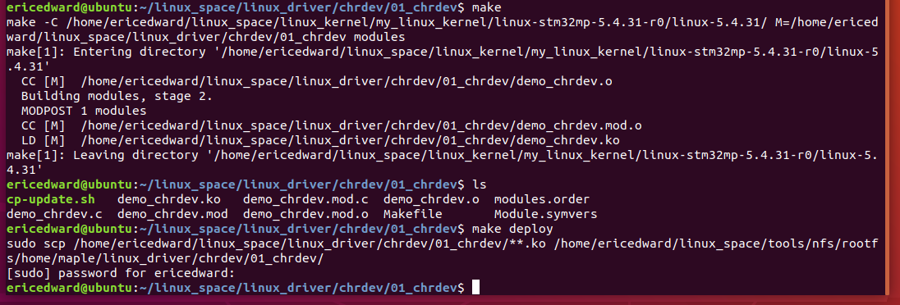
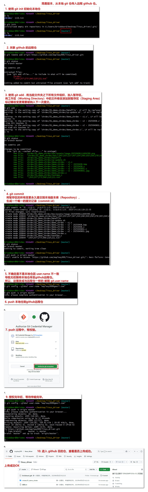
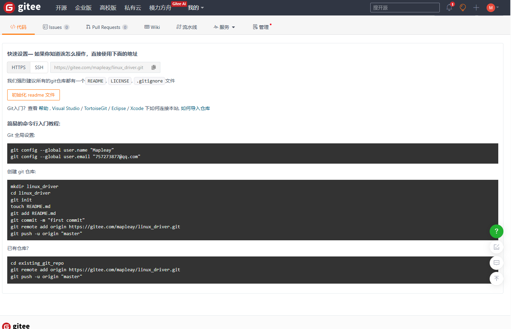
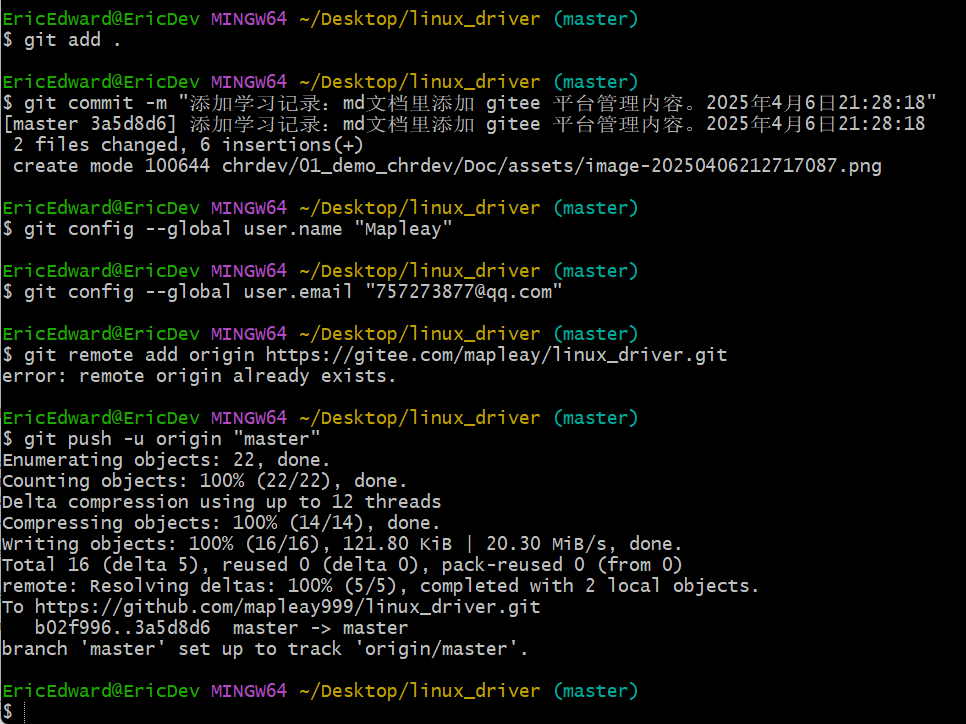
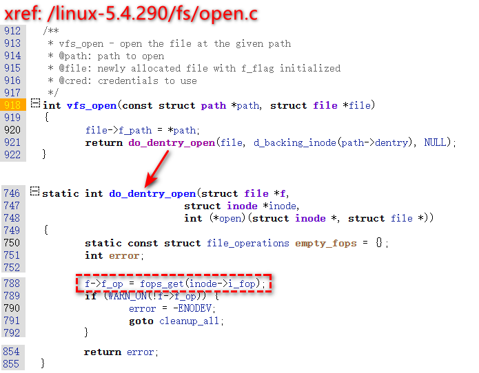

/*
** 代码分析
【1】 class_create 与 device_create 有什么区别与联系？
在Linux驱动开发中，class_create和device_create是自动创建设备节点的核心函数，它们的作用及关联如下：
1. class_create()
作用：在/sys/class/目录下动态创建设备类（逻辑分类），为后续设备节点的创建提供分类容器。
参数：
	owner：模块所有者（通常为THIS_MODULE）
	name：类名（如"my_chrdev"），对应/sys/class/下的子目录
	返回值：指向struct class的指针，失败返回错误指针（需用IS_ERR检查）
	底层实现：调用__class_create()初始化类结构体，并注册到sysfs中
	资源释放：卸载模块时需调用class_destroy()删除类

2. device_create()
	作用：在已创建的类下生成设备节点，并触发udev机制在/dev/目录下自动创建设备文件。
	参数：
	class：class_create()返回的类指针
	parent：父设备（通常为NULL）
	devt：设备号（通过MKDEV(major, minor)生成）
	fmt：设备节点名称（如"mydevice"，对应/dev/mydevice）
	返回值：指向struct device的指针，失败返回错误指针
	依赖关系：必须已调用class_create()创建类，否则无法生成设备节点
	资源释放：卸载模块时需先调用device_destroy()再销毁类
	

class_create	逻辑分类		/sys/class/	无
device_create	物理设备节点	/dev/		需先创建类

注意：两者需配合使用，单独调用device_create无法生成设备节点。现代驱动开发中，这种机制替代了手动mknod，通过udev/mdev实现动态设备管理。

【2】llseek 调整 write/read 的 offset, 字符设备驱动要从内核自定义数据变量里拷贝数据到应用层空间，必须使用内核安全的拷贝方式，且必须实现 字符设备的 llseek 的 file_operations.llseek 接口，不然连续的read、write后，offset只能顺序叠加，无法调整读写位置。


*/

## 部署编译产出的 .ko 文件到开发板

为了方便讲编译后产出的 .ko 文件放入 STM32MP157d 开发板的 linux 文件系统内的合适路径下，进行后续的 insmod 。需要有一个拷贝操作。这里既可以编写一个 shell 脚本文件独立执行，更推荐在 Makefile 文件内添加一个 名为 deploy 的伪目标执行。

shell 脚本经过验证OK，代码如下：

```shell
#!/bin/bash

#验证通过OK。2025年4月6日11:14:10,主要就是实现代码拷贝。
# sudo cp -f /home/ericedward/linux_space/linux_driver/chrdev/01_chrdev/**.ko /home/ericedward/linux_space/tools/nfs/rootfs/home/maple/linux_driver/chrdev/01_chrdev/

# 配置源目录和目标目录
SOURCE_DIR="/home/ericedward/linux_space/linux_driver/chrdev/01_chrdev"
TARGET_DIR="/home/ericedward/linux_space/tools/nfs/rootfs/home/maple/linux_driver/chrdev/01_chrdev"
FILE_EXT=".ko"  # 明确指定文件类型

# 日志记录
LOG_FILE="/var/log/ko_file_copy_$(date +%Y%m%d).log"
exec > >(tee -a "$LOG_FILE") 2>&1  # 同时输出到屏幕和日志文件

echo "===== 开始执行 $(date) ====="

# 检查目录有效性
check_directory() {
    if [ ! -d "$1" ]; then
        echo "错误：目录 $1 不存在"
        return 1
    fi
    return 0
}

# 主执行函数
copy_ko_files() {
    echo "正在复制 $FILE_EXT 文件..."
    
    # 使用find命令确保精确匹配
    find "$SOURCE_DIR" -maxdepth 1 -type f -name "*$FILE_EXT" -print0 | while IFS= read -r -d $'\0' file; do
        echo "正在处理: $(basename "$file")"
        sudo cp -fv "$file" "$TARGET_DIR/"
    done
    
    echo "复制操作完成"
}

# 主程序
main() {
    check_directory "$SOURCE_DIR" || exit 1
    check_directory "$TARGET_DIR" || {
        echo "尝试创建目标目录..."
        sudo mkdir -p "$TARGET_DIR" || {
            echo "无法创建目标目录"
            exit 1
        }
    }
    
    copy_ko_files
}

main

echo "===== 执行结束 $(date) ====="

```

Makefile的代码如下：

```makefile
#验证通过OK。2025年4月6日11:14:10。
# 临时禁用模块签名验证功能
CONFIG_MODULE_SIG = n

# KDIR 是开发板所使用的源代码的 Linux 内核源码的根目录
KDIR := /home/ericedward/linux_space/linux_kernel/my_linux_kernel/linux-stm32mp-5.4.31-r0/linux-5.4.31/
CURRENT_PATH := $(shell pwd)
TARGET_PATH  := /home/ericedward/linux_space/tools/nfs/rootfs/home/maple/linux_driver/chrdev/01_chrdev/

# 指定生成模块目标
obj-m += demo_chrdev.o

all:
# modules 不是 Makefile 关键字，但在 Linux 内核驱动开发中常用作目标名称，用于编译内核模块（生成 .ko 文件）
# M 表示模块的源码目录。“make modules”命令根据M指定的路径，编码模块源码。
	$(MAKE) -C $(KDIR) M=$(CURRENT_PATH) modules

clean:
# clean 是 Makefile 中常见的伪目标（phony target），用于清理编译生成的文件。
# clean不是关键字，但广泛用于伪目标声明，需通过 .PHONY: clean 声明为伪目标，避免与同名文件冲突。
	$(MAKE) -C $(KDIR) M=$(CURRENT_PATH) clean

deploy:
# 将编译产出的 .ko 可执行文件，复制到STM32MP157d开发板对应的linux文件系统内的合适的路径下。
# scp 是安全拷贝命令，security cp，跨主机拷贝命令。不跨主机直接使用 cp 。
# sudo scp $(CURRENT_PATH)/**.ko $(TARGET_PATH)
	sudo cp $(CURRENT_PATH)/**.ko $(TARGET_PATH)
```



所以，以后可以不用执行 cp-update.sh 脚本文件，直接执行 make deploy 即可。

注意：CONFIG_MODULE_SIG = n 临时关闭警告以后，开机后第一次执行 insmod xxx.ko 文件时，会提示签名警告，后续不会提示了。

### **补充：linux shell 命令 cp 和 scp 的区别？**

`cp` 和 `scp` 是 Linux 中用于文件复制的两个命令，但它们的用途和功能有显著区别：

### 1. **cp（本地复制）**
- **作用范围**：仅用于**同一台主机**上的文件或目录复制。
- **语法**：
  ```bash
  cp [选项] 源文件 目标文件
  cp [选项] 源文件... 目标目录
  ```
- **常用选项**：
  - `-r`：递归复制目录。
  - `-i`：覆盖前提示确认。
  - `-a`：保留文件属性（权限、时间戳等）并递归复制。
- **示例**：
  ```bash
  cp file.txt /backup/          # 复制文件到目录
  cp -r dir1/ dir2/             # 递归复制目录
  ```

### 2. **scp（安全远程复制）**
- **作用范围**：用于**不同主机之间**通过 SSH 加密传输文件。
- **依赖条件**：需要目标主机的 SSH 服务正常运行。
- **语法**：
  ```bash
  scp [选项] 源文件 目标主机:目标路径
  ```
- **常用选项**：
  - `-r`：递归复制目录。
  - `-P 端口号`：指定 SSH 端口（默认 22）。
  - `-i 私钥文件`：指定认证密钥。
- **示例**：
  ```bash
  scp file.txt user@remote:/path/   # 本地→远程
  scp user@remote:/file.txt ./      # 远程→本地
  ```

### 3. **核心区别**
| **特性**     | **cp**             | **scp**                    |
| ------------ | ------------------ | -------------------------- |
| **传输范围** | 仅限本地           | 跨主机（本地↔远程）        |
| **安全性**   | 无加密             | 基于 SSH 加密传输          |
| **依赖服务** | 无需额外服务       | 需远程主机开启 SSH         |
| **典型用途** | 本地备份、文件整理 | 服务器间文件迁移、远程备份 |

### 4. **注意事项**
- **权限问题**：`scp` 需要远程主机的登录权限（用户名/密码或密钥）。
- **性能差异**：`scp` 因加密和网络开销，速度可能慢于本地 `cp`。
- **替代工具**：大文件传输或增量同步可考虑 `rsync`（更高效）。

根据需求选择：本地操作用 `cp`，跨主机传输用 `scp`。


## register_chrdev 是旧的方式注册吗？

是的，`register_chrdev` 是 Linux 内核早期版本（如 2.4 和早期 2.6 内核）中使用的字符设备注册方式，属于**旧版 API**。以下是关键分析：

### 1. **旧版 API 的特点**
- **功能范围**：  
  `register_chrdev` 会一次性注册主设备号及其对应的**所有次设备号（0~255）**，导致设备号浪费。
- **静态依赖**：  
  需开发者手动确认主设备号是否可用，易引发冲突。
- **简化接口**：  
  仅需主设备号、设备名和 `file_operations` 结构体，但灵活性差。

### 2. **新版替代方案**
Linux 推荐使用以下组合替代 `register_chrdev`：  
- **动态分配设备号**：`alloc_chrdev_region`  
- **静态指定设备号**：`register_chrdev_region`  
- **配合 `cdev` 结构体**：通过 `cdev_init` 和 `cdev_add` 注册设备。

### 3. **新旧对比**
| **特性**         | `register_chrdev` (旧)    | 新版 API (`cdev` + `*_chrdev_region`) |
| ---------------- | ------------------------- | ------------------------------------- |
| **设备号管理**   | 占用全部次设备号（0~255） | 按需分配指定数量的次设备号            |
| **灵活性**       | 低，需手动管理主设备号    | 高，支持动态分配和精确控制            |
| **内核版本适配** | 仅兼容旧内核              | 适用于现代内核（2.6+）                |

### 4. **代码迁移建议**
若需升级旧驱动，应将 `register_chrdev` 替换为：  
```c
// 动态分配示例
alloc_chrdev_region(&dev, 0, 1, "my_device");
cdev_init(&my_cdev, &fops);
cdev_add(&my_cdev, dev, 1);
```

### 总结
`register_chrdev` 已逐渐被淘汰，现代驱动开发应使用 `cdev` 结合 `alloc_chrdev_region`/`register_chrdev_region`，以提高资源利用率和兼容性。


## class_create 函数

```c
#define class_create(owner, name)		\
({						\
	static struct lock_class_key __key;	\
	__class_create(owner, name, &__key);	\
})

/**
 * class_create - create a struct class structure
 * @owner: pointer to the module that is to "own" this struct class
 * @name: pointer to a string for the name of this class.
 * @key: the lock_class_key for this class; used by mutex lock debugging
 *
 * This is used to create a struct class pointer that can then be used
 * in calls to device_create().
 *
 * Returns &struct class pointer on success, or ERR_PTR() on error.
 *
 * Note, the pointer created here is to be destroyed when finished by
 * making a call to class_destroy().
 */
struct class *__class_create(struct module *owner, const char *name,
			     struct lock_class_key *key)
{
	struct class *cls;
	int retval;

	cls = kzalloc(sizeof(*cls), GFP_KERNEL); /* 申请存储空间 */
	if (!cls) {
		retval = -ENOMEM;
		goto error;
	}

	cls->name = name;
	cls->owner = owner;
	cls->class_release = class_create_release; /* 构造结构体变量 */
   
	retval = __class_register(cls, key);  /* 注册操作 */

	return cls;
}

int __class_register(struct class *cls, struct lock_class_key *key)  /* 实际的注册函数 */
{
	struct subsys_private *cp;
	int error;

	pr_debug("device class '%s': registering\n", cls->name);

	cp = kzalloc(sizeof(*cp), GFP_KERNEL);
	if (!cp)
		return -ENOMEM;
	klist_init(&cp->klist_devices, klist_class_dev_get, klist_class_dev_put);
	INIT_LIST_HEAD(&cp->interfaces);
	kset_init(&cp->glue_dirs);
	__mutex_init(&cp->mutex, "subsys mutex", key);
	error = kobject_set_name(&cp->subsys.kobj, "%s", cls->name);
	if (error) {
		kfree(cp);
		return error;
	}

	/* set the default /sys/dev directory for devices of this class */
	if (!cls->dev_kobj)
		cls->dev_kobj = sysfs_dev_char_kobj;

#if defined(CONFIG_BLOCK)
	/* let the block class directory show up in the root of sysfs */
	if (!sysfs_deprecated || cls != &block_class)
		cp->subsys.kobj.kset = class_kset;
#else
	cp->subsys.kobj.kset = class_kset;
#endif
	cp->subsys.kobj.ktype = &class_ktype;
	cp->class = cls;
	cls->p = cp;

	error = kset_register(&cp->subsys);
	if (error) {
		kfree(cp);
		return error;
	}
	error = class_add_groups(class_get(cls), cls->class_groups);
	class_put(cls);
	if (error) {
		kobject_del(&cp->subsys.kobj);
		kfree_const(cp->subsys.kobj.name);
		kfree(cp);
	}
	return error;
}
```

**返回值**

内核驱动与用户态程序不同，局部变量的作用域和生命周期需严格匹配内核对象的持久性要求。

1. 内核对象的生命周期
class_create 返回的 struct class* 指针是内核动态分配的对象，其生命周期需与模块一致（即模块加载时创建，卸载时销毁）。若存储为局部变量，函数退出后指针将丢失，导致无法在模块卸载时通过 class_destroy 正确释放资源，引发内存泄漏或内核错误。
2. 错误处理要求
返回值需通过 IS_ERR() 检查是否创建失败。若为局部变量，错误处理逻辑（如返回错误码）将无法传递指针到模块的其他函数（如 device_create 或退出函数）。


## device_create 函数

```c
/** xref: /linux-5.4.290/drivers/base/core.c
 * device_create - creates a device and registers it with sysfs
 * @class: pointer to the struct class that this device should be registered to
 * @parent: pointer to the parent struct device of this new device, if any
 * @devt: the dev_t for the char device to be added
 * @drvdata: the data to be added to the device for callbacks
 * @fmt: string for the device's name
 *
 * This function can be used by char device classes.  A struct device
 * will be created in sysfs, registered to the specified class.
 *
 * A "dev" file will be created, showing the dev_t for the device, if
 * the dev_t is not 0,0.
 * If a pointer to a parent struct device is passed in, the newly created
 * struct device will be a child of that device in sysfs.
 * The pointer to the struct device will be returned from the call.
 * Any further sysfs files that might be required can be created using this
 * pointer.
 *
 * Returns &struct device pointer on success, or ERR_PTR() on error.
 *
 * Note: the struct class passed to this function must have previously
 * been created with a call to class_create().
 */
struct device *device_create(struct class *class, struct device *parent,
			     dev_t devt, void *drvdata, const char *fmt, ...)
{
	va_list vargs;
	struct device *dev;

	va_start(vargs, fmt);
	dev = device_create_vargs(class, parent, devt, drvdata, fmt, vargs);
	va_end(vargs);
	return dev;
}
EXPORT_SYMBOL_GPL(device_create);
```

`device_create()` 是 Linux 内核中用于动态创建设备节点的关键函数，其核心功能是通过 `sysfs` 和 `udev` 机制自动在 `/dev` 目录下生成设备文件。以下是详细分析：

---

### **1. 函数原型与参数**
```c
struct device *device_create(
    struct class *class,    // 所属设备类（需先通过 class_create 创建）
    struct device *parent,  // 父设备指针（通常为 NULL）
    dev_t devt,             // 设备号（主设备号+次设备号）
    void *drvdata,         // 驱动私有数据（可传递到回调函数）
    const char *fmt, ...    // 设备名称格式（支持 printf 风格）
);
```
- **返回值**：成功返回 `struct device*` 指针，失败返回错误编码指针（需用 `IS_ERR()` 检查）。

---

### **2. 核心功能**
1. **设备对象创建**  
   - 在 `sysfs` 中（如 `/sys/class/myclass/mydevice`）创建设备对象，记录设备号、驱动数据等信息。
2. **触发 udev 规则**  
   - 通过 `sysfs` 变化通知 `udev`，自动在 `/dev` 下生成设备节点（如 `/dev/mydevice`）。
3. **动态设备号支持**  
   - 结合 `alloc_chrdev_region()` 动态分配设备号，避免硬编码。

---

### **3. 典型使用流程**
```c
// 1. 创建设备类
struct class *my_class = class_create(THIS_MODULE, "myclass");
if (IS_ERR(my_class)) {
    return PTR_ERR(my_class);
}

// 2. 创建设备节点
dev_t devno = MKDEV(major, minor);  // 或动态分配
struct device *dev = device_create(my_class, NULL, devno, NULL, "mydevice");
if (IS_ERR(dev)) {
    class_destroy(my_class);
    return PTR_ERR(dev);
}
```
- **卸载时逆序销毁**：先调用 `device_destroy()`，再 `class_destroy()`。

---

### **4. 关键注意事项**
- **错误处理**：必须检查 `IS_ERR()`，并通过 `PTR_ERR()` 获取错误码（如 `-ENOMEM`）。
- **设备号有效性**：若 `devt` 为 `0`（如 `MKDEV(0,0)`），不会生成 `/dev` 节点，仅创建 `sysfs` 对象。
- **全局存储**：返回值必须保存为全局变量，否则模块卸载时无法正确释放资源。

---

### **5. 与 `mknod` 的对比**
| 特性           | `device_create`         | `mknod`                          |
| -------------- | ----------------------- | -------------------------------- |
| **操作层级**   | 内核 API（触发 `udev`） | 用户空间工具（直接调用系统调用） |
| **设备号管理** | 动态分配（推荐）        | 需手动指定                       |
| **自动化程度** | 高（自动生成节点）      | 低（完全手动）                   |
| **适用场景**   | 现代驱动开发            | 调试或传统驱动                   |


---

### **6. 常见问题**
- **节点未生成**：检查 `udev` 服务是否运行，或 `sysfs` 权限是否正确。
- **内存泄漏**：未调用 `device_destroy()` 会导致 `sysfs` 残留条目。

通过合理使用 `device_create()`，开发者可以简化设备管理，实现动态、自动化的设备节点生成。

**tips:**

device_create 函数的返回值，推荐保存为 全局变量，但是也可以保存为局部变量。


## IS_ERR()  - linux内核API

`IS_ERR(cd)` 是 Linux 内核中的一个宏，用于判断指针 `cd` 是否是一个**错误编码的指针**。以下是详细解析：

---

### 1. **核心功能**
- **作用**：检测内核函数返回的指针是否实际表示错误（如内存分配失败、设备未找到等）。
- **原理**：内核将错误码（如 `-ENOMEM`）编码为指针值（通过 `ERR_PTR` 宏），这些指针位于内核虚拟地址空间的最后一个 page（例如 32 位系统的 `0xFFFFF000~0xFFFFFFFF`）。`IS_ERR` 通过检查指针是否落在此区间来判断是否为错误。

---

### 2. **典型使用场景**
- **设备驱动开发**：当调用内核函数（如 `ioremap`、`devm_clk_get`）返回指针时，需用 `IS_ERR` 检查是否出错：
  ```c
  struct clk *clk = devm_clk_get(dev, "uart_clk");
  if (IS_ERR(clk)) {
      int err = PTR_ERR(clk);  // 提取错误码
      printk("Failed to get clock: %d\n", err);
      return err;
  }
  ```
- **错误处理**：若 `IS_ERR(cd)` 返回 `true`，需通过 `PTR_ERR(cd)` 获取原始错误码（如 `-ENODEV`）。

---

### 3. **相关宏**
- `ERR_PTR(long error)`：将错误码转换为指针（如 `return ERR_PTR(-ENOMEM);`）。
- `PTR_ERR(const void *ptr)`：从错误指针中提取错误码。

---

### 4. **注意事项**
- **仅用于内核函数**：`IS_ERR` 仅适用于返回指针的内核函数（如 `kmalloc` 失败返回 `NULL`，不可用 `IS_ERR` 检测）。
- **调试技巧**：若误用，可通过 `printk` 打印 `PTR_ERR(cd)` 或使用 `dump_stack()` 定位问题。

---

### 示例代码
```c
void *ptr = some_kernel_function();
if (IS_ERR(ptr)) {
    int err = PTR_ERR(ptr);
    printk(KERN_ERR "Operation failed: %d\n", err);
    return err;
}
```

通过 `IS_ERR`，内核开发者可以统一处理指针和错误码，简化错误逻辑。

## 使用 git 管理代码

### 将本地 git 仓传入远程 github 仓



## 使用 gitee 管理



```
Git 全局设置:

git config --global user.name "Mapleay"
git config --global user.email "757273877@qq.com"

创建 git 仓库:
mkdir linux_driver
cd linux_driver
git init 
touch README.md
git add README.md
git commit -m "first commit"
git remote add origin https://gitee.com/mapleay/linux_driver.git
git push -u origin "master"

已有仓库?
cd existing_git_repo
git remote add origin https://gitee.com/mapleay/linux_driver.git
git push -u origin "master"
```



## 如何切换远程仓

要将 GitHub 仓库切换到 Gitee，可以通过以下步骤完成：

### **1. 在 Gitee 上创建仓库**
- 登录 [Gitee](https://gitee.com)，点击 **「新建仓库」**，填写仓库名称（如 `linux_driver`），并选择是否公开。
- 或者直接使用 Gitee 的 **「导入 GitHub 仓库」** 功能（在仓库创建页面选择 **「从 GitHub 导入」**）。

### **2. 本地 Git 仓库修改远程地址**
如果你的本地仓库已经关联了 GitHub，现在要切换到 Gitee，执行：
```bash
git remote set-url origin https://gitee.com/mapleay/linux_driver.git
```
或者，如果你想保留 GitHub 的远程仓库，可以新增一个 Gitee 的远程源：
```bash
git remote add gitee https://gitee.com/mapleay/linux_driver.git
```
之后推送代码时，可以分别推送到 GitHub 和 Gitee：
```bash
git push origin master   # 推送到 GitHub
git push gitee master    # 推送到 Gitee
```

### **3. 自动同步（可选）**
如果你希望 GitHub 的改动自动同步到 Gitee，可以使用 **GitHub Actions**：
1. 在 GitHub 仓库的 **Settings > Secrets** 添加：
   - `GITEE_USER`（你的 Gitee 用户名）
   - `GITEE_PRIVATE_KEY`（SSH 私钥）
   - `GITEE_TOKEN`（Gitee 个人访问令牌）
2. 创建 `.github/workflows/sync2gitee.yml`，内容如下：
   ```yaml
   name: Sync to Gitee
   on: push
   jobs:
     sync:
       runs-on: ubuntu-latest
       steps:
         - uses: actions/checkout@v2
         - name: Mirror to Gitee
           uses: Yikun/hub-mirror-action@master
           with:
             src: github/${{ github.repository_owner }}
             dst: gitee/${{ secrets.GITEE_USER }}
             dst_key: ${{ secrets.GITEE_PRIVATE_KEY }}
             dst_token: ${{ secrets.GITEE_TOKEN }}
   ```
3. 提交后，GitHub 的每次 `push` 都会自动同步到 Gitee。

### **总结**
- **直接切换远程地址**：`git remote set-url origin <gitee-url>`
- **保留双远程**：`git remote add gitee <gitee-url>`，然后分别 `push`
- **自动同步**：使用 GitHub Actions 实现自动镜像

这样，你的代码就可以顺利从 GitHub 迁移到 Gitee 了！


## Git 创建新分支

在完成某个版本后，需要将当下项目文件保存为一个固定的分支，这样可以保存在此刻的版本状态。

1. 在创建分支前，先确认你当前所在的分支和代码状态：

   ```
   git status       # 查看本地修改状态（确保没有未提交的变更）
   git branch       # 查看本地分支列表（当前分支前会标 * 号）
   git log --oneline -n 3 # 查看最近3条提交记录（确认基准版本）
   ```

2. 基于当前版本创建新分支

   2.1 直接创建并切换到新分支

   ```
   git checkout -b new-feature  # 创建名为 new-feature 的分支，并立即切换过去
   或者
   git switch -c new-feature  # 更语义化的命令（推荐）
   ```

   2.2 创建分支但不切换

   ```
   git branch new-feature       # 仅创建分支，不切换
   git checkout new-feature     # 手动切换到新分支
   # 或
   git switch new-feature       # (Git 2.23+)
   ```

3. 推送新分支到远程仓库（可选）

   ```
   git push -u origin new-feature  # 推送并建立本地与远程分支的追踪关系 origin = gitee/github
   后续只需 git push 即可推送变更。
   ```

4. 验证分支是否创建成功

   ```
   git branch -a                # 查看所有分支（本地+远程）
   git log --oneline --graph    # 查看分支树（确认新分支起点）
   ```

   

  


## file_operation 这些接口函数 比如 open read write release 这些函数的参数分别有什么作用？请详细解析。

函数原型：

```c
//xref: /linux-5.4.290/include/linux/fs.h
struct file_operations {
    struct module *owner;
    loff_t (*llseek) (struct file *, loff_t, int);
  	ssize_t (*read)  (struct file *, char __user *, size_t, loff_t *);
  	ssize_t (*write) (struct file *, const char __user *, size_t, loff_t *);
    int (*open) (struct inode *, struct file *);
    int (*release) (struct inode *, struct file *);
    /* 还有很多接口函数，省略。 */
}
```

这些接口函数的参数列表中，最典型的也是最重要的就是，struct file * 和 struct inode * 这俩。C语言语法规定，定义函数时，其参数类型必须有，参数名称可以省略，所以语法没问题。接着考虑这俩货干嘛的，其实我知道他们很重要，感性或者笼统地讲，“struct file * ” 关联进程；struct inode * 关联字符设备文件（内含设备号等信息）。

**struct inode**（索引节点）
**作用**：表示文件系统中的一个文件或目录的元数据（如权限、所有者、大小、时间戳等），与具体进程无关。
**关键成员**：

- i_ino：inode号，唯一标识文件系统中的文件。
- i_rdev：设备号（主设备号+次设备号），用于标识字符/块设备文件。
- i_fop：指向file_operations结构体，定义文件操作函数（如open、read等）。

**特点**：
一个文件只有一个inode，即使被多个进程打开。
设备文件的inode会通过i_rdev或i_cdev关联到具体的驱动。

**struct file**（文件对象）
**作用**：表示进程打开文件的上下文信息（如读写位置、访问模式等），与进程绑定。
**关键成员**：

- f_flags：文件打开模式（如O_RDONLY）。
- f_pos：当前读写偏移量。
- private_data：驱动私有数据，常用于存储设备状态。

**特点**：
每个进程打开同一文件会创建独立的file对象，但共享同一个inode。
通过filp->f_op调用驱动操作（如read/write）。


以下是应用程序调用 `open()` 时关联 `inode` 和 `file_operations` 的完整流程及关键函数分析：

---

### **1. 系统调用入口：`sys_open`**
应用程序调用 `open("/dev/xxx", O_RDWR)` 后，内核通过系统调用表进入 `sys_open`（或 `sys_openat`），其核心逻辑在 `do_sys_open()` 中实现：
```c
long do_sys_open(int dfd, const char __user *filename, int flags, umode_t mode) {
    struct open_flags op;
    int fd = build_open_flags(flags, mode, &op);
    struct file *f = do_filp_open(dfd, filename, &op); // 关键：创建file对象并关联inode
    fd_install(fd, f); // 将file对象绑定到进程的文件描述符表
    return fd;
}
```

---

### **2. 关联 `inode` 和 `file_operations` 的核心步骤**
#### **(1) 路径解析与 `inode` 查找**
- **`do_filp_open()`**：调用 `path_openat()` 解析路径，通过 `link_path_walk()` 逐级查找目录项（`dentry`），最终获取目标文件的 `inode`。
- **`inode` 关键字段**：
  - `i_rdev`：设备号（主设备号+次设备号）。
  - `i_cdev`：指向字符设备对象 `struct cdev`（驱动通过 `cdev_add()` 注册时关联）。

#### **(2) 关联 `file_operations`**
- **`cdev` 的作用**：`inode->i_cdev` 指向驱动注册的 `cdev` 结构体，其中 `cdev->ops` 存储了驱动定义的 `file_operations`。
- **赋值给 `file` 对象**：
  ```c
  struct file *f = alloc_file(); // 分配file对象
  f->f_op = inode->i_cdev->ops; // 关键：将驱动的file_operations赋给file->f_op
  ```
  此操作在 `do_filp_open()` 内部的 `open_last_lookups()` 或具体文件系统（如 `ext4_file_open()`）中完成。

#### **(3) 调用驱动的 `open()`**
- 内核检查 `file->f_op->open` 是否存在，若存在则调用：
  ```c
  int (*open)(struct inode *, struct file *);
  ```
  驱动可在该函数中初始化设备，例如：
  ```c
  static int my_open(struct inode *inode, struct file *filp) {
      struct my_dev *dev = container_of(inode->i_cdev, struct my_dev, cdev);
      filp->private_data = dev; // 存储设备私有数据
      return 0;
  }
  ```

---

### **3. 关键函数调用链**
1. **用户态**：`open()` → `syscall(SYS_openat)`  
2. **内核态**：
   - `sys_openat` → `do_sys_open()`  
   - `do_filp_open()` → `path_openat()` → `link_path_walk()`（解析路径，获取 `inode`）  
   - `vfs_open()` → 调用 `file->f_op->open()`（若驱动实现）  
   - `fd_install()`：将 `file` 对象绑定到进程的 `files_struct->fd_array[fd]`.

---

### **4. 参数 `struct inode *` 和 `struct file *` 的用途**
| 参数             | 用途                                                         | 典型场景                                                     |
| ---------------- | ------------------------------------------------------------ | ------------------------------------------------------------ |
| `struct inode *` | 提供设备文件的元数据（如设备号 `i_rdev`），用于定位驱动和设备实例 | 通过 `iminor(inode)` 获取次设备号，区分多设备实例            |
| `struct file *`  | 记录进程对文件的操作状态（如读写位置 `f_pos`），存储驱动私有数据 | 在 `open()` 中初始化 `filp->private_data`，供后续 `read/write` 使用 |

---

### **5. 完整流程图**
```
用户态 open()
    ↓
内核态 sys_openat()
    ↓
do_sys_open()
    ├─ get_unused_fd()          // 分配文件描述符
    ├─ do_filp_open()           // 创建file对象
    │   ├─ path_openat()        // 路径解析
    │   │   └─ link_path_walk() // 查找inode
    │   └─ vfs_open()           // 关联file_operations
    │       └─ file->f_op->open() // 驱动自定义open()
    └─ fd_install()             // 绑定fd和file对象
```

通过上述流程，用户态的 `open()` 最终关联到驱动的 `file_operations`，实现硬件操作.


## 驱动的 .open 函数，在应用程序 open 后，是被内核关联好以后自动调用的，对吗？再细述驱动接口函数与进程的操作函数的关联细节。

是的，当应用程序调用 `open()` 系统调用打开设备文件（如 `/dev/xxx`）时，内核会自动关联并调用驱动中实现的 `.open` 函数。以下是详细流程：

---

### **1. 内核如何关联驱动的 `.open` 函数？**
1. **应用程序调用 `open()`**  
   用户态调用 `open("/dev/xxx", O_RDWR)`，触发系统调用 `sys_open`（或 `sys_openat`）。

2. **路径解析与 `inode` 查找**  
   内核通过虚拟文件系统（VFS）层解析路径，找到设备文件对应的 `inode`。关键字段：
   - `inode->i_rdev`：设备号（主设备号+次设备号）。
   - `inode->i_cdev`：指向驱动注册的字符设备对象 `struct cdev`（通过 `cdev_add()` 关联）。

3. **关联 `file_operations`**  
   内核从 `inode->i_cdev` 获取驱动注册的 `cdev` 结构体，将其中的 `cdev->ops`（即驱动定义的 `file_operations`）赋值给 `file->f_op`。  
   **关键代码路径**：  
   - `do_filp_open()` → `dentry_open()` → `vfs_open()` → 设置 `file->f_op = inode->i_fop`（通常指向 `cdev->ops`）。

4. **调用驱动的 `.open` 函数**  
   若 `file->f_op->open` 非空，内核调用驱动实现的 `.open` 函数，传入 `inode` 和 `file` 参数。

---

### **2. 关键点验证**
- **自动调用**：驱动的 `.open` 由内核在 `vfs_open()` 中主动调用，无需应用层显式触发。
- **关联时机**：在 `file` 对象创建后、返回文件描述符前完成关联。
- **默认行为**：若驱动未实现 `.open`，`file->f_op` 仍指向驱动的 `file_operations`，但调用时默认成功。

---

### **3. 典型驱动代码示例**
```c
static int my_open(struct inode *inode, struct file *filp) {
    struct my_dev *dev = container_of(inode->i_cdev, struct my_dev, cdev);
    filp->private_data = dev; // 存储设备私有数据
    return 0;
}

static struct file_operations my_fops = {
    .open = my_open,
    .read = my_read,
    // ...
};

// 驱动注册时
cdev_init(&my_dev.cdev, &my_fops);
cdev_add(&my_dev.cdev, devno, 1);
```

---

### **4. 总结**
- **内核自动完成关联**：通过 `inode->i_cdev` 找到驱动注册的 `file_operations`，并调用 `.open`。
- **参数用途**：  
  - `inode`：标识设备文件（如设备号）。  
  - `file`：管理进程的打开实例（如读写位置、私有数据）。
- **用户层透明**：应用程序仅调用标准 `open()`，无需感知驱动细节。

## do_dentry_open 函数中，f->f_op = fops_get(inode->i_fop); 这行代码，进行精确解析。



在Linux内核的`do_dentry_open()`函数中，`f->f_op = fops_get(inode->i_fop);`这行代码的作用是**将文件操作函数集从inode关联到file对象**，具体解析如下：

---

### **1. 代码作用解析**
- **`inode->i_fop`**：  
  存储文件系统或设备驱动预先注册的`file_operations`结构体指针（例如ext4文件系统的`ext4_file_operations`或字符设备的驱动操作集）。  
  - 对于设备文件（如`/dev/xxx`），`i_fop`通常由驱动通过`cdev_add()`注册时设置。
  - 对于普通文件，由文件系统初始化（如ext4在`ext4_iget()`中设置）。

- **`fops_get(inode->i_fop)`**：  
  - **引用计数增加**：`fops_get()`会对`file_operations`结构体的模块所有者（`struct module *owner`）增加引用计数，防止模块被卸载时操作集被误用。  
  - **返回操作集**：若操作集无模块依赖（如内置文件系统），则直接返回`i_fop`。

- **`f->f_op`赋值**：  
  将获取的`file_operations`赋值给`file`对象的`f_op`字段，后续所有文件操作（如`read/write`）均通过`f->f_op->xxx`调用驱动或文件系统的具体实现。

---

### **2. 典型场景**
1. **设备文件打开流程**：  
   - 应用程序调用`open("/dev/xxx")`，内核通过`inode->i_rdev`或`i_cdev`找到驱动注册的`cdev`，其`cdev->ops`即为`i_fop`。  
   - `do_dentry_open()`将`cdev->ops`赋给`f->f_op`，后续操作（如`chrdev_open`）可能进一步调整`f_op`。

2. **文件系统打开流程**：  
   - 文件系统（如ext4）在挂载时初始化`inode->i_fop`（如`ext4_file_operations`）。  
   - `do_dentry_open()`直接继承该操作集，无需修改。

---

### **3. 关键细节**
- **模块安全**：  
  若`file_operations`属于可卸载模块（如驱动），`fops_get()`通过`try_module_get(owner)`确保模块在使用期间不被卸载。

- **错误处理**：  
  若`fops_get()`失败（如模块卸载中），`do_dentry_open()`会返回错误，中断文件打开流程。

- **性能优化**：  
  内置文件系统的`i_fop`通常无`owner`字段，`fops_get()`直接返回指针，无额外开销。

---

### **4. 代码调用链示例**
```c
do_sys_open()
  → do_filp_open()
    → path_openat()
      → do_last()
        → vfs_open()
          → do_dentry_open()
            → f->f_op = fops_get(inode->i_fop);  // 关键赋值
            → if (f->f_op->open) f->f_op->open(inode, f);  // 调用驱动或文件系统的open()
```

---

### **5. 总结**
这行代码是**VFS（虚拟文件系统）的核心桥梁**，通过`inode->i_fop`将具体的文件操作集动态绑定到`file`对象，实现：  
1. **统一接口**：用户态`open/read/write`通过`f->f_op`透明调用底层实现。  
2. **模块化支持**：安全管理驱动模块的生命周期。  
3. **多态性**：不同文件系统或设备可自定义操作集。


### 6.个人总结 [重要]

在 xref: /linux-5.4.290/include/linux/fs.h 文件里定义的 struct inode 里存在

```
struct inode {
    /* 此处省略不关心的代码 */
    union {
  		const struct file_operations	*i_fop;	/* former ->i_op->default_file_ops */
  		void (*free_inode)(struct inode *);
  	};
    /* 此处省略不关心的代码 */
}
```

通过inode->i_fop获取file_operations的核心步骤：

- 驱动注册：cdev_add()将cdev与设备号绑定，并设置inode->i_fop = cdev->ops。
- 文件打开：fops_get(inode->i_fop)安全引用驱动操作集，赋值给file->f_op。
- 模块安全：fops_get()通过引用计数确保模块不被意外卸载。


**6.1 关键数据结构关系**

**struct inode**

- i_rdev：设备号（主/次设备号）。
- i_cdev：指向驱动注册的cdev（通过cdev_add()关联）。
- i_fop：文件操作集（初始为def_chr_fops，驱动注册后更新为cdev->ops）。

**struct cdev**

- ops：驱动定义的file_operations（如my_fops）。
- owner：指向驱动模块（用于引用计数管理）。

**struct file**

- f_op：最终指向驱动提供的file_operations，通过fops_get(inode->i_fop)关联。


**6.2 完整流程：从`inode`到`file_operations`**

1. **字符设备注册阶段**

- 驱动调用cdev_init(&cdev, &my_fops)初始化cdev，并绑定自定义的file_operations（如my_fops）。
- 调用cdev_add(&cdev, devno, count)将设备号与cdev关联，此时内核会：
  - 根据设备号在chrdevs数组中记录cdev。
  - 当设备文件被访问时，通过inode->i_rdev找到对应的cdev，并设置inode->i_cdev = cdev。
  - 将inode->i_fop指向cdev->ops（覆盖默认的def_chr_fops）。

2. **文件打开阶段**

- 应用程序调用open("/dev/xxx")，内核通过路径解析找到设备的inode。
- 在do_dentry_open()中执行：

```c
f->f_op = fops_get(inode->i_fop);  // 获取驱动注册的file_operations
if (f->f_op->open) 
    f->f_op->open(inode, f);      // 调用驱动的open()
```

- 若驱动未实现open，f->f_op仍保留驱动的操作集，但无open调用。


**6.3 再总结**

注册后，内核通过`inode->i_cdev`找到`my_cdev`，并将`inode->i_fop`设为`my_fops`。
通过inode->i_fop获取file_operations的核心步骤：

- 驱动注册：cdev_add()将cdev与设备号绑定，并设置inode->i_fop = cdev->ops。
- 文件打开：fops_get(inode->i_fop)安全引用驱动操作集，赋值给file->f_op。
- 模块安全：fops_get()通过引用计数确保模块不被意外卸载。


