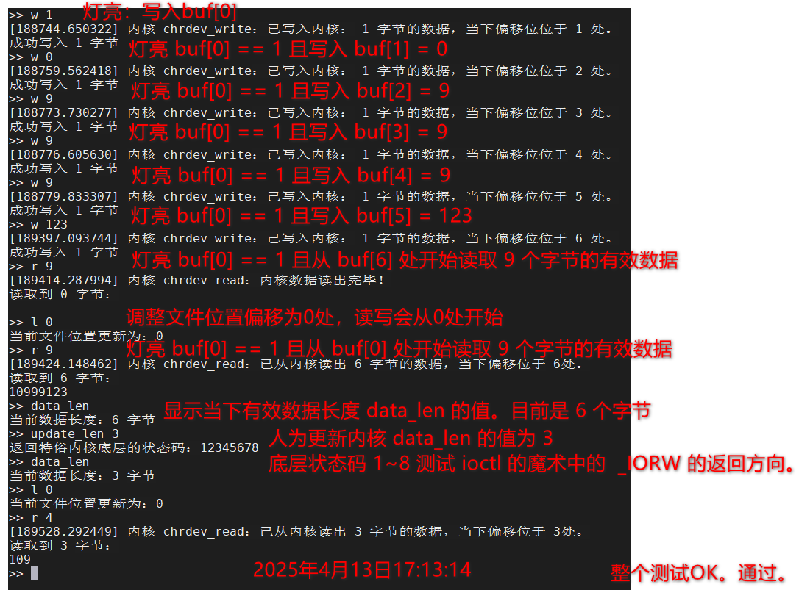

# 关于 Makefile 

## 问题1 执行 make 命令时，怎么知道目标？需要编译的对象？

```makefile
# 临时禁用模块签名验证功能
CONFIG_MODULE_SIG = n

# KDIR 是开发板所使用的源代码的 Linux 内核源码的根目录
KDIR := /home/ericedward/linux_space/linux_kernel/my_linux_kernel/linux-stm32mp-5.4.31-r0/linux-5.4.31/
CURRENT_PATH := $(shell pwd)
TARGET_PATH  := /home/ericedward/linux_space/tools/nfs/rootfs/home/maple/linux_driver/chrdev/01_chrdev/
WORKING_PATH := /home/ericedward/linux_space/linux_driver/chrdev/01_chrdev

# 指定生成模块目标
obj-m += demo_chrdev.o
# 内核模块的构建系统（Kbuild）要求通过 `<module_name>-objs` 指定模块的依赖对象文件，而非直接赋值给模块名。
# 错误写法：demo_chrdev := chrdev.o stm32mp157.o 
demo_chrdev-objs := chrdev.o stm32mp157.o # 定义demo_chrdev目标的依赖，注意：是 -objs 别少s！

# 在模块的 Makefile 中，使用 ccflags-y 或 CFLAGS_MODULE 指定自定义头文件路径
# 添加自定义头文件路径（相对于 Makefile 的路径）
#$(info CURRENT_PATH is $(CURRENT_PATH)) # 确保 CURRENT_PATH 正确展开（调试用）
ccflags-y += -I$(WORKING_PATH)/include #Kbuild语法限制：-IPath，-I后直接加路径，无空格！！

all:
# modules 不是 Makefile 关键字，但在 Linux 内核驱动开发中常用作目标名称，用于编译内核模块（生成 .ko 文件）
# M 表示模块的源码目录。“make modules”命令根据M指定的路径，编码模块源码。
	$(MAKE) -C $(KDIR) M=$(CURRENT_PATH) modules

clean:
# clean 是 Makefile 中常见的伪目标（phony target），用于清理编译生成的文件。
# clean不是关键字，但广泛用于伪目标声明，需通过 .PHONY: clean 声明为伪目标，避免与同名文件冲突。
	$(MAKE) -C $(KDIR) M=$(CURRENT_PATH) clean # 正在删除 Linux 字符设备驱动的编译产出文件……
	rm -f **.out **.a  # 正在删除应用程序的编译产出文件……

testapp:testapp.c
# "-I[path]"命令配置选项，指定自定义头文件路径。比如下面的：-I$(WORKING_PATH)/include
	arm-none-linux-gnueabihf-gcc -I$(WORKING_PATH)/include $(WORKING_PATH)/testapp.c -o $(WORKING_PATH)/testapp.out

deploy:
# 将编译产出的 .ko 可执行文件，复制到STM32MP157d开发板对应的linux文件系统内的合适的路径下。
# scp 是安全拷贝命令，security cp，跨主机拷贝命令。不跨主机直接使用 cp 。
# sudo scp $(CURRENT_PATH)/**.ko $(TARGET_PATH)
	sudo cp $(CURRENT_PATH)/**.ko  $(TARGET_PATH)
	sudo cp $(CURRENT_PATH)/**.out $(TARGET_PATH)

# 在上面Makefile中没有直接调用编译器（如gcc或arm-none-linux-gnueabihf-gcc）编译源代码。
# 这是因为 Linux 内核的模块构建系统（Kbuild系统）会间接执行编译过程。
# 内核模块编译通过$(MAKE) -C $(KDIR) M=$(CURRENT_PATH) modules命令触发内核顶层的Kbuild系统，该系统会自动：
# 1. 调用内核配置的交叉编译器（通过$(CC)变量）
# 2. 应用内核的编译规则（如-Wall、-O2等标志）
# 3. 处理模块签名、版本检查等内核特有流程

# 下面这个执行OK：
# ericedward@ubuntu:~/linux_space/linux_driver/chrdev/01_chrdev$ arm-none-linux-gnueabihf-gcc testapp.c -o testapp.out
# 下面这个被注释的2行脚本执行失败：
#testapp:testapp.c
#	$(MAKE) $(CURRENT_PATH)/testapp.c -o $(CURRENT_PATH)/testapp.out
# 默认情况下，make只处理Makefile中定义的目标。如果没有对应规则，它会认为"无事可做"
# 默认规则缺失：Makefile中没有定义如何从.c文件生成.out文件的规则
# 命令格式错误：你尝试的Makefile规则$(MAKE) $(CURRENT_PATH)/testapp.c -o ...是错误的语法。make不能直接编译源文件，除非明确指定规则

# $(MAKE)是GNU Make的内置变量，展开为当前使用的make命令路径（如/usr/bin/make）。它本身不专属于Kbuild系统，而是Make工具的标准特性。
# linux 的 Kbuild系统（内核构建系统）强制要求使用$(MAKE)进行递归调用。
# 普通应用程序同样可通过$(MAKE)实现递归构建。

# 验证通过OK的 2025年4月11日14:40:20
```

在 Linux 内核模块的 Makefile 中，**目标（编译对象）的确定主要依赖于以下机制**：

---

### 1. **默认目标的选择**
- 当直接运行 `make` 命令时，Makefile 会执行 **第一个定义的目标**（这里是 `all`）。
- 在用户提供的 Makefile 中，`all` 是默认目标，它的任务是编译内核模块。

---

### 2. **模块目标的定义**
通过 `obj-m` 指定要编译的内核模块对象：
```makefile
obj-m += demo_chrdev.o   # 告诉内核构建系统，要编译生成 demo_chrdev.ko 模块
```
- **规则解释**：
  - `obj-m` 表示将模块编译为可加载的 `.ko` 文件。
  - `demo_chrdev.o` 是模块的目标文件名，内核构建系统会自动查找同名的 `.c` 文件（如 `demo_chrdev.c`）进行编译。
  - 如果模块由多个源文件组成，需通过 `demo_chrdev-objs` 显式指定所有 `.o` 文件（例如 `demo_chrdev-objs = main.o helper.o`）。

---

### 3. **内核构建系统的调用**
在 `all` 目标中，通过以下命令调用内核的构建系统：
```makefile
$(MAKE) -C $(KDIR) M=$(CURRENT_PATH) modules
```
- **关键参数**：
  - `-C $(KDIR)`：进入内核源码目录（`KDIR`），使用内核顶层的 Makefile 和构建规则。
  - `M=$(CURRENT_PATH)`：告诉内核构建系统，模块的源码位于当前目录（`CURRENT_PATH`）。
  - `modules`：内核构建系统的目标，表示编译模块。

---

### 4. **自动依赖解析**
- **头文件路径**：  
  通过 `ccflags-y` 添加自定义头文件路径：
  ```makefile
  ccflags-y += -I$(CURRENT_PATH)/include   # 告诉编译器在 include/ 目录下查找头文件
  ```
  编译器在编译 `demo_chrdev.c` 时，会自动搜索此路径下的头文件（如 `include/my_header.h`）。

- **依赖关系**：  
  内核构建系统会自动分析源文件（如 `demo_chrdev.c`）对头文件的依赖关系。如果头文件被修改，重新编译时会自动触发相关源文件的重新编译。

---

### 5. **执行流程示例**
假设用户运行 `make`：
1. **执行默认目标 `all`**：  
   ```bash
   make -C /home/ericedward/linux_space/.../linux-5.4.31/ M=$(pwd) modules
   ```
2. **内核构建系统处理**：  
   - 根据 `obj-m += demo_chrdev.o`，查找当前目录下的 `demo_chrdev.c`。
   - 使用 `ccflags-y` 中的路径 `-I./include` 编译代码。
   - 生成 `demo_chrdev.ko` 模块文件。

---

### 6. **多文件模块的编译**
如果模块由多个源文件（如 `demo_chrdev.c` 和 `helper.c`）组成，需修改 Makefile：
```makefile
obj-m += demo_chrdev.o
demo_chrdev-objs := demo_chrdev_main.o helper.o  # 指定多个 .o 文件
```
- 内核构建系统会分别编译 `demo_chrdev_main.c` 和 `helper.c`，然后链接成 `demo_chrdev.ko`。

---

### 7. **手动指定目标**
除了默认的 `all` 目标，还可以显式指定其他目标：
```bash
make clean    # 清理编译产物
make deploy   # 部署 .ko 文件到开发板文件系统
```

---

### 8. **常见问题排查**
1. **头文件未找到**：  
   - 检查 `ccflags-y` 的路径是否正确（例如 `include/` 是否存在于当前目录）。
   - 使用绝对路径测试：`ccflags-y += -I/home/user/project/include`。

2. **模块未生成**：  
   - 确保 `obj-m` 中的文件名与源文件名一致（例如 `demo_chrdev.c` 对应 `obj-m += demo_chrdev.o`）。

3. **权限问题**：  
   - 部署时若提示权限不足，在 `deploy` 目标中使用 `sudo`（已在用户的 Makefile 中正确配置）。

---

### 总结
- **目标确定**：由 `obj-m` 和 Makefile 中的第一个目标（如 `all`）决定。
- **依赖解析**：内核构建系统自动处理源文件和头文件的依赖关系。
- **多文件模块**：通过 `module-objs` 显式指定多个 `.o` 文件。
- **头文件路径**：通过 `ccflags-y` 添加自定义路径。


更多信息可参考：xref: /linux-5.4.290/Documentation/kbuild/modules.rst

## 问题2 -I选项在Makefile和GCC中

是的，**`-I` 是 GCC（GNU Compiler Collection）的编译选项**，用于指定头文件（`.h` 文件）的搜索路径。以下是详细说明：

---

### **1. `-I` 的作用**
- **功能**：告诉 GCC 编译器在指定的目录中查找头文件。
- **语法**：
  ```bash
  gcc -I<路径> <源文件> -o <输出文件>
  ```
  例如：
  ```bash
  gcc -I./include main.c -o main
  ```
  这会让编译器在 `include/` 目录下查找 `#include "xxx.h"` 或 `#include <xxx.h>` 中的头文件。

---

### **2. 使用场景**
- **头文件不在标准路径**：  
  当你的头文件不在默认的 `/usr/include` 或 `/usr/local/include` 等系统路径时，需要通过 `-I` 指定自定义路径。

- **多目录项目**：  
  在复杂项目中，头文件可能分散在多个目录中，例如：
  ```bash
  gcc -I./include -I./libs/headers main.c -o main
  ```

- **避免路径冲突**：  
  如果存在同名头文件，可以通过 `-I` 控制优先级，优先使用指定路径下的头文件。

---

### **3. 在 Makefile 中的应用**
在 Makefile 中，通常会将 `-I` 添加到编译变量（如 `CFLAGS`）中，示例如下：
```makefile
CFLAGS = -Wall -Wextra -I./include

all: main.c
	gcc $(CFLAGS) main.c -o main
```

---

### **4. 内核模块与用户程序的区别**
- **内核模块（驱动）**：  
  在内核模块的 Makefile 中，使用 `ccflags-y += -I...` 传递头文件路径，例如：
  ```makefile
  ccflags-y += -I$(CURRENT_PATH)/include
  ```
  这会通过内核的构建系统（Kbuild）将路径传递给编译器。

- **用户空间程序**：  
  用户程序的编译需**显式添加 `-I` 到 GCC 命令**，例如：
  ```makefile
  testapp: testapp.c
	arm-none-linux-gnueabihf-gcc -I$(CURRENT_PATH)/include testapp.c -o testapp.out
  ```

---

### **5. 常见问题排查**
如果出现 `fatal error: xxx.h: No such file or directory`，按以下步骤排查：
1. **确认 `-I` 路径是否正确**：  
   ```bash
   ls <路径>/xxx.h  # 检查头文件是否存在
   ```
2. **检查 Makefile 语法**：  
   `-I` 和路径之间**不能有空格**，例如：
   ```makefile
   # 正确
   CFLAGS = -I./include
   # 错误
   CFLAGS = -I ./include
   ```
3. **确认路径变量展开**：  
   在 Makefile 中使用 `$(info ...)` 调试变量：
   ```makefile
   $(info 头文件路径：$(CURRENT_PATH)/include)
   ```

---

### **6. 总结**
- `-I` 是 **GCC 的编译选项**，用于指定头文件搜索路径。
- 在内核模块和用户程序编译中均需正确使用，但传递方式不同：
  - 内核模块：通过 `ccflags-y` 传递。
  - 用户程序：直接在 GCC 命令中添加 `-I`。
- 路径需确保存在且无空格等语法错误。


## 问题3 没有规则编译出多子目标的目标

### **问题分析**
错误信息 `No rule to make target '.../demo_chrdev.o'` 表明内核构建系统（Kbuild）无法找到生成 `demo_chrdev.o` 的规则。根本原因在于 **Makefile 中模块依赖关系的定义错误**。以下是具体原因和解决方案：

---

### **错误原因**
1. **模块依赖语法错误**：  
   ```makefile
   obj-m += demo_chrdev.o
   demo_chrdev := chrdev.o stm32mp157.o  # 错误写法
   ```
   - **错误点**：  
     内核模块的构建系统（Kbuild）要求通过 **`<module_name>-objs`** 指定模块的依赖对象文件，而非直接赋值给模块名。
   - **正确语法**：  
     ```makefile
     obj-m += demo_chrdev.o
     demo_chrdev-objs := chrdev.o stm32mp157.o  # 正确写法
     ```

2. **源文件缺失或命名错误**：  
   - 如果 `demo_chrdev-objs` 依赖的源文件（如 `chrdev.c` 和 `stm32mp157.c`）不存在，或文件名拼写错误，也会导致此错误。

 **解决方案**
#### **1. 修正模块依赖语法**
修改 Makefile 中的模块依赖定义：
```makefile
obj-m += demo_chrdev.o
demo_chrdev-objs := chrdev.o stm32mp157.o  # 使用 -objs 指定依赖对象文件
```

#### **2. 确保源文件存在**
检查当前是否存在以下文件：
- `chrdev.c`
- `stm32mp157.c`
- `demo_chrdev.c`（如果 `demo_chrdev-objs` 未使用此文件）

若文件缺失，需补充或修正文件名。

#### **3. 验证头文件路径**
确保 `include/` 目录下存在 `chrdev_ioctl.h` 等头文件：
```bash
ls $(WORKING_PATH)/include/chrdev_ioctl.h
```

---

### **修正后的 Makefile**
```makefile
# 临时禁用模块签名验证功能
CONFIG_MODULE_SIG = n

# KDIR 是开发板所使用的源代码的 Linux 内核源码的根目录
KDIR := /home/ericedward/linux_space/linux_kernel/my_linux_kernel/linux-stm32mp-5.4.31-r0/linux-5.4.31/
CURRENT_PATH := $(shell pwd)
TARGET_PATH  := /home/ericedward/linux_space/tools/nfs/rootfs/home/maple/linux_driver/chrdev/01_chrdev/
WORKING_PATH := /home/ericedward/linux_space/linux_driver/chrdev/01_chrdev

# 指定生成模块目标
obj-m += demo_chrdev.o
demo_chrdev-objs := chrdev.o stm32mp157.o  # 修正为 -objs

# 添加自定义头文件路径
ccflags-y += -I$(WORKING_PATH)/include

all:
	$(MAKE) -C $(KDIR) M=$(CURRENT_PATH) modules

clean:
	$(MAKE) -C $(KDIR) M=$(CURRENT_PATH) clean
	rm -f *.out *.a

testapp: testapp.c
	arm-none-linux-gnueabihf-gcc -I$(WORKING_PATH)/include $(WORKING_PATH)/testapp.c -o $(WORKING_PATH)/testapp.out

deploy:
	sudo cp $(CURRENT_PATH)/*.ko  $(TARGET_PATH)
	sudo cp $(CURRENT_PATH)/*.out $(TARGET_PATH)
```

---

### **验证步骤**
1. **清理旧编译产物**：  
   ```bash
   make clean
   ```

2. **重新编译模块**：  
   ```bash
   make
   ```
   正确输出应显示：
   ```bash
   CC [M]  /path/to/chrdev.o
   CC [M]  /path/to/stm32mp157.o
   LD [M]  /path/to/demo_ch.o
   MODPOST ...
   CC [M]  /path/to/demo_chrdev.mod.o
   LD [M]  /path/to/demo_chrdev.ko
   ```

3. **检查生成的文件**：  
   ```bash
   ls *.ko  # 应看到 demo_chrdev.ko
   ```

---

### **常见问题排查**
1. **未找到源文件**：  
   - 错误信息：`No such file or directory: chrdev.c`  
   - 解决：检查文件名拼写，或补充缺失的源文件。

2. **头文件路径错误**：  
   - 错误信息：`chrdev_ioctl.h: No such file or directory`  
   -：确保 `include/` 目录存在且包含所需头文件。

3. **内核版本不匹配**：  
   - 错误信息：`implicit declaration of function` 或 `unknown type name`  
   - 解决：确认内核源码路径（`KDIR`）与开发板内核版本一致。

---

### **总结**
- **核心问题**：模块依赖关系语法错误（`demo_chrdev :=` 应改为 `demo_chrdev-objs :=`）。
- **修复关键**：使用正确的 Kbuild 语法并确保源文件存在。


## 问题3 u32 在linux内核开发中，有没有等价的类型？

在 Linux 内核开发中，`u32` 是 **标准的无符号 32 位整数类型**，其等价于 `unsigned int`（在大多数架构下，`unsigned int` 为 32 位，但内核代码明确使用 `u32` 以保证跨平台一致性）。

---

### **1. 内核中的数据类型定义**
Linux 内核定义了一套明确的数据类型，位于头文件 `<linux/types.h>` 中。这些类型用于确保代码的 **可移植性** 和 **明确性**。常见的类型包括：

| 内核类型 | 含义         | 等价的 C 类型        |
| -------- | ------------ | -------------------- |
| `u8`     | 无符号 8 位  | `unsigned char`      |
| `u16`    | 无符号 16 位 | `unsigned short`     |
| `u32`    | 无符号 32 位 | `unsigned int`       |
| `u64`    | 无符号 64 位 | `unsigned long long` |
| `s8`     | 有符号 8 位  | `signed char`        |
| `s16`    | 有符号 16 位 | `signed short`       |
| ...      | ...          | ...                  |

---

### **2. 如何正确使用 `u32`**
- **包含头文件**：  
  使用 `u32` 前需要包含 `<linux/types.h>`：
  ```c
  #include <linux/types.h>
  ```

- **直接使用**：  
  ```c
  u32 val = 0x12345678;
  ```

---

### **3. 内核中的其他类似类型**
- **`__u32` 和 `__be32`/`__le32`**：  
  - `__u32` 是内核中与用户空间共享的无符号 32 位类型（定义在 `<asm-generic/int-ll64.h>`）。  
  - `__be32` 和 `__le32` 是用于明确 **字节序**（大端/小端）的 32 位类型（需要网络或设备驱动操作时使用）。

- **用户空间的 `uint32_t`**：  
  用户空间程序通常使用 `<stdint.h>` 中的 `uint32_t`，但在内核中应优先使用 `u32`。

---

### **4. 示例代码**
```c
#include <linux/module.h>
#include <linux/types.h>  // 必须包含

static u32 counter = 0;  // 使用 u32 定义计数器

static int __init my_module_init(void) {
    u32 val = 0xdeadbeef;  // 直接使用 u32
    printk(KERN_INFO "Value: 0x%x\n);
    return 0;
}

module_init(my_module_init);
MODULE_LICENSE("GPL");
```

---

### **5. 常见问题**
- **编译错误：`unknown type name 'u32'`**：  
  未包含 `<linux/types.h>`。

- **与用户空间类型混用**：  
  避免在内核代码中使用用户空间的 `uint32_t`，优先使用 `u32`。

- **跨平台兼容性**：  
  `u32` 明确表示 32 位无符号整数，无论底层架构是 32 位还是 64 位。

---

### **总结**
- **内核类型 `u32`**：直接使用，无需额外定义，但需包含 `<linux/types.h>`。
- **用户空间对比**：用户空间的 `uint32_t` 对应内核的 `u32`。
- **字节序敏感场景**：使用 `__be32` 或 `__le32`（例如网络协议或设备寄存器操作）。


## 问题4 writel / readl 是什么函数？哪里的？做什么用？

在 Linux 内核驱动开发中，**`writel` 和 `readl`** 是用于 **访问内存映射 I/O 寄存器** 的核心函数。以下是它们的详细说明：

---

### **1. 函数定义和头文件**
- **头文件**：  
  ```c
  #include <linux/io.h>   // 必须包含此头文件
  ```
- **函数原型**：  
  ```c
  void writel(u32 value, volatile void __iomem *addr);  // 写入 32 位数据到寄存器
  u32  readl(const volatile void __iomem *addr);        // 从寄存器读取 32 位数据
  ```

---

### **2. 功能说明**
#### **`writel(value, addr)`**  
- **作用**：向内存映射的寄存器地址 `addr` 写入一个 32 位的值 `value`。  
- **示例**：  
  ```c
  // 向 GPIO 写入 0x12345678
  writel(0x12345678, gpio_ctrl_reg);
  ```

#### **`readl(addr)`**  
- **作用**：从内存映射的寄存器地址 `addr` 读取一个 32 位的值。  
- **示例**：  
  ```c
  // 从 GPIO 状态寄存器读取值
  u32 status = readl(gpio_status_reg);
  ```

---

### **3. 关键特性**
1. **原子性**：  
   `writel` 和 `readl` 保证对寄存器的访问是 **原子操作**（不可中断），避免并发问题。

2. **内存屏障**：  
   这些函数隐式包含 **内存屏障**（Memory Barrier），确保读写操作的顺序性，防止编译器或 CPU 乱序优化。

3. **字节序处理**：  
   自动处理 **小端/大端字节序**，确保数据按设备期望的格式写入或读取。

---

### **4. 使用场景**
- **配置硬件寄存器**：  
  例如，设置 GPIO 模式、使能时钟、配置中断等。
  ```c
  // 使能 GPIO 时钟（设置 RCC 寄存器的某一位）
  u32 val = readl(rcc_reg);
  val |= (1 << 3);   // 设置第 3 位
  writel(val, rcc_reg);
  ```

- **读写设备状态**：  
  例如，读取传感器数据或设备中断状态。
  ```c
  // 读取温度传感器的值
  u32 temp = readl(sensor_reg);
  ```

---

### **5. 使用前提**
在使用 `writel` 和 `readl` 前，必须 **将物理地址映射到内核虚拟地址空间**，通常通过 `ioremap()` 实现：
```c
#include <linux/io.h>

void __iomem *reg_base;

static int __init my_module_init(void) {
    // 映射物理地址 0x50000000 到虚拟地址
    reg_base = ioremap(0x50000000, 0x1000);  // 映射 4KB     if (!reg_base) {
        pr_err("ioremap failed\n");
        return -ENOMEM;
    }

    // 使用映射后的地址访问寄存器
    writel(0x12345678, reg_base + 0x10);  // 向偏移 0x10 的寄存器写入数据
    return 0;
}

static void __exit my_module_exit(void) {
    if (reg_base) {
        iounmap(reg_base);  // 取消映射
    }
}
```

---

### **6. 常见问题排查**
1. **编译错误：`implicit declaration of function 'readl'`**  
   - **原因**：未包含 `<linux/io.h>`。  
   - **解决**：添加 `#include <linux/io.h>`。

2. **运行时崩溃：`Unable to handle kernel paging request`**  
   - **原因**：未物理地址，或访问了未映射的地址。  
   - **解决**：检查 `ioremap()` 返回值，确保地址在映射范围内。

3. **写入值未生效**  
   - **原因**：寄存器需要特定访问顺序或延迟。  
   - **解决**：参考芯片手册，确认是否需要插入延迟（如 `udelay()`）或内存屏障（如 `mb()`）。

---

### **总结**
- **`writel` 和 `readl`** 是 Linux 内核中访问硬件寄存器的标准接口。
- **使用步骤**：  
  1. 包含 `<linux/io.h>`。  
  2. 通过 `ioremap()` 映射物理地址到虚拟地址。  
  3. 使用 `readl` 和 `writel` 操作寄存器。  
  4. 退出时调用 `iounmap()` 释放资源。  

通过合理使用这些函数，可以安全高效地控制硬件外设。


## 问题5 在头文件中的 static 变量声明合法吗？固定给谁使用？

```c
#ifndef __STM32MP157d_H__
#define __STM32MP157d_H__

#include <linux/io.h>


/* 寄存器物理地址 */ 
#define PERIPH_BASE              (0x40000000) 
#define MPU_AHB4_PERIPH_BASE    (PERIPH_BASE + 0x10000000) 
#define RCC_BASE                  (MPU_AHB4_PERIPH_BASE + 0x0000)  
#define RCC_MP_AHB4ENSETR       (RCC_BASE + 0XA28) 
#define GPIOI_BASE                (MPU_AHB4_PERIPH_BASE + 0xA000)  
#define GPIOI_MODER              (GPIOI_BASE + 0x0000)    
#define GPIOI_OTYPER             (GPIOI_BASE + 0x0004)  
#define GPIOI_OSPEEDR            (GPIOI_BASE + 0x0008)    
#define GPIOI_PUPDR               (GPIOI_BASE + 0x000C)    
#define GPIOI_BSRR               (GPIOI_BASE + 0x0018) 

static void __iomem *MPU_AHB4_PERIPH_RCC_PI; 
static void __iomem *GPIOI_MODER_PI; 
static void __iomem *GPIOI_OTYPER_PI; 
static void __iomem *GPIOI_OSPEEDR_PI; 
static void __iomem *GPIOI_PUPDR_PI; 
static void __iomem *GPIOI_BSRR_PI; 


void led_init(void); //需写出，否则其他c文件调用，提示非显性警告。

#endif
```

在头文件中的 static 变量声明合法吗？固定给谁使用？

### **头文件中的 `static` 变量声明分析**

#### **1. 合法性**
在头文件中使用 `static` 声明变量是 **语法合法** 的，但会引发 **多个实例问题**：
- **每个包含该头文件的源文件** 都会生成一个独立的静态变量实例。
- 例如，若 `stm32mp157d.h` 被 `file1.c` 和 `file2.c` 包含，则 `MPU_AHB4_PERIPH_RCC_PI` 在 `file1.c` 和 `file2.c` 中是 **两个不同的全局变量**。

#### **2. 使用场景**
`static` 变量在头文件中的常见用途：
- **静态工具函数**：在头文件中定义 `static` 函数，供多个源文件使用（每个源文件有独立副本）。
- **模板式常量**：定义 `static const` 常量，每个源文件有独立副本（避免符号冲突）。

#### **3. 当前代码的问题**
在你的代码中，`static` 修饰的全局指针变量会导致：
- **内存浪费**：每个包含该头文件的源文件都会创建独立的指针变量，但实际使用时可能只需要一份。
- **逻辑错误**：  
  如果不同源文件中的代码试图访问这些指针（例如 `file1.c` 调用 `led_init()` 映射寄存器，`file2.c` 也调用 `led_init()`），会导致 **重复映射同一物理地址**，且指针值在不同源文件中不共享，最终引发内存泄漏或硬件访问错误。

#### **4. 正确做法**
如果这些指针需要 **全局共享**（通常如此），应使用以下方式：
-头文件中声明为 `extern`**：  
  ```c
  // stm32mp157d.h
  extern void __iomem *MPU_AHB4_PERIPH_RCC_PI;
  // ... 其他 extern 声明
  ```
- **在某个源文件中定义**：  
  ```c
  // stm32mp157d.c #include "stm32mp157d.h"
  
  void __iomem *MPU_AHB4_PERIPH_RCC_PI = NULL;
  // ... 其他定义
  ```

#### **5. 修复后的代码示例**
```c
// stm32mp157d.h
#ifndef __STM32MP157d_H__
#define __STM32MP157d_H__

#include <linux/io.h>

/* 寄存器物理地址 */ 
#define PERIPH_BASE              (0x40000000) 
#define MPU_AHB4_PERIPH_BASE    (PERIPH_BASE + 0x10000000) 
#define RCC_BASE                  (MPU_AHB4_PERIPH_BASE + 0x0000)  
#define RCC_MP_AHB4ENSETR       (RCC_BASE + 0XA28) 
#define GPIOI_BASE                (MPU_AHB4_PERIPH_BASE + 0xA000)  
#define GPIOI_MODER              (GPIOI_BASE + 0x0000)    
// ... 其他寄存器地址定义

/* 声明全局指针（不分配内存） */ 
extern void __iomem *MPU_AHB4_PERIPH_RCC_PI; 
extern void __iomem *GPIOI_MODER_PI; 
// ... 其他 extern 声明

void led_init(void);

#endif
```

```c
// stm32mp157d.c
#include "stm32mp157d.h"

/* 定义全局指针（分配内存） */ 
void __iomem *MPU_AHB4_PERIPH_RCC_PI = NULL; 
void __iomem *GPIOI_MODER_PI = NULL;
// ... 其他定义

void led_init(void) {
    // 实现...
}
```

---

### **总结**
- **头文件中避免使用 `static` 全局变量**，除非明确需要每个源文件有独立副本。
- **共享全局变量** 的正确做法：  
  - 头文件中用 `extern` 声明。  
  - 源文件中定义并初始化。  
- **当前代码风险**：重复映射寄存器、内存泄漏、逻辑混乱。


## 问题6 int main(int argc, char **argv)  请详细分析 入参列表中的这俩参数

`argc`应该是参数的个数，而`argv`应该是一个指向参数字符串数组的指针。比如，当我在终端输入`./program arg1 arg2`时，`argc`的值是3，因为程序名本身也算一个参数，然后是`arg1`和`arg2`。`argv`则是一个数组，里面包含这三个字符串的地址。比如`argv[0]`是程序名，`argv[1]`是`arg1`，`argv[2]`是`arg2`，对吧？

不过，用户可能对`char **argv`的指针结构感到困惑。比如，双指针？这其实是一个数组的指针，每个元素都是指向字符的指针，也就是字符串数组。也就是说，`argv`是一个指向多个字符串指针的数组，每个字符串代表一个参数。

在C语言中，`int main(int argc, char **argv)` 是程序的标准入口函数，用于接收命令行参数。以下是对这两个参数的详细分析：

---

### **1. `int argc`**
- **含义**：  
  `argc`（Argument Count）表示传递给程序的 **命令行参数个数**（包括程序自身名称）。

- **取值范围**：  
  - 最小值为 `1`（程序名本身）。  
  - 例如，执行 `./program` 时，`argc = 1`；  
    执行 `./program file.txt -v` 时，`argc = 3`。

---

### **2. `char **argv`**
- **含义**：  
  `argv`（Argument Vector）是一个 **指针数组**，每个元素指向一个以空字符（`\0`）结尾的字符串，表示具体的命令行参数。

- **内存布局**：  
  - `argv[0]`：程序名称（可能包含路径，取决于调用方式）。  
  - `argv[1]` ~ `argv[argc-1]`：用户输入的参数。  
  - `argv[argc]`：固定为 `NULL`（空指针），表示参数结束。

- **示例**：  
  ```bash
  ./program -o output.txt --verbose
  ```
  - `argc = 4`  
  - `argv` 的内容：  
    ```c
    argv[0] → "./program"  
    argv[1] → "-o"  
    argv[2] → "output.txt"  
    argv[3] → "--verbose"  
    argv[4] → NULL
    ```

---

### **3. 关键特性**
#### **(1) 参数来源**
- 参数由 **命令行输入** 或 **其他程序调用时传递**（例如通过 `exec` 系列函数）。

#### **(2) 参数修改**
- `argv` 中的字符串 **可以被修改**，但需谨慎操作，避免破坏原有数据。  
  例如，以下代码合法但存在风险：
  ```c
  argv[1][0] = 'X';  // 修改第一个参数的第一个字符
  ```

#### **(3) 跨平台一致性**
- 在绝大多数操作系统（Linux、Windows、macOS）中，`argc` 和 `argv` 的行为一致。

---

### **4. 常见用法**
#### **(1) 遍历所有参数**
```c
for (int i = 0; i < argc; i++) {
    printf("argv[%d] = %s\n", i, argv[i]);
}
```

#### **(2) 处理选项参数**
例如解析 `-h`（帮助）或 `-v`（版本）：
```c
if (argc > 1 && strcmp(argv[1], "-h") == 0) {
    printf("Usage: %s [options]\n", argv[0]);
    exit(0);
}
```

#### **(3) 参数类型转换**
将字符串参数转换为数值（如整数）：
```c
if (argc > 2) {
    int num = atoi(argv[2]);  // 将第二个参数转为整数
}
```

---

### **5. 注意事项**
1. **越界访问**：  
   避免访问 `argv[argc]` 或更高索引，这会导致未定义行为（段错误或数据损坏）。

2. **参数顺序**：  
   参数的顺序由用户输入决定，程序需处理所有可能的排列。

3. **空指针检查**：  
   在访问 `argv[i]` 前，应确保 `i < argc`。

4. **特殊环境**：  
   在嵌入式系统或无命令行环境中，`argc` 可能为 `1`，`argv[0]` 可能为空或不可用。

---

### **6. 代码示例**
```c
#include <stdio.h>
#include <stdlib.h>

int main(int argc, char **argv) {
    printf("程序名称: %s\n", argv[0]);
    
    if (argc < 2) {
        printf("错误：至少需要一个参数。\n");
        return 1;
    }

    printf("参数列表：\n");
    for (int i = 1; i < argc; i++) {
        printf("  %d → %s\n", i, argv[i]);
    return 0;
}
```

---

### **总结**
- **`argc`**：参数个数（包括程序名）。  
- **`argv`**：参数值的字符串数组，以 `NULL` 结尾。  
- 合理使用这两个参数，可以编写灵活的命令行工具，处理用户输入或自动化脚本调用。


##  问题7 main函数形参 char **argv 的详细解读

在 C 语言中，`char** argv` 虽然本质上是一个 **二级指针**，但它在语义上可以理解为 **指向字符数组（字符串）的指针数组**。这种看似矛盾的说法源于 C 语言的指针和数组在内存布局上的紧密关系，以及函数参数传递时的隐式转换规则。以下是详细解答：

---

### **1. 指针与数组的内存等价性**
#### **(1) 内存布局视角**
- **`char** argv` 的逻辑结构**：  
  ```
  argv (char **)
  │
  ├─→ argv[0] → "program\0"   // 指针数组的首元素，指向字符串
  ├─→ argv[1] → "-o\0"        // 第二个元素，指向另一个字符串
  ├─→ argv[2] → "file.txt\0"  // 第三个元素
  └─→ argv[3] → NULL          // 结束标记（空指针）
  ```
  - `argv` 是一个 **指向指针的指针**，但它指向的内存区域实际上是一个 **连续的指针数组**，每个元素（`char*` 类型）指向独立的字符串。
  - 这种结构在逻辑上等价于一个 **指针数组**（`char* argv[]`）。

#### **(2) 函数参数的退化规则**
在 C 语言中，**数组作为函数参数时会退化为指针**。因此：
- **`char* argv[]`** 作为函数参数时，等价于 **`char** argv`**。  
- 例如，以下两种写法完全等效：
  ```c
  int main(int argc, char **argv);   // 写法1：二级指针
  int main(int argc, char *argv[]);  // 写法2：指针数组
  ```

---

### **2. 为何说 `char** argv` 是数组？**
#### **(1) 语义上的数组行为**
- **下标访问**：  
  通过 `argv[i]` 可以像访问数组一样获取第 `i` 个命令行参数的字符串地址。
  ```c
  printf("第一个参数：%s\n", argv[1]); // 访问数组元素
  ```
- **连续内存布局**：  
  `argv` 指向的内存区域中，指针元素（`argv[0]`, `argv[1]`, ...）是 **连续存放** 的，符合数组的内存特征。

#### **(2) 结束标记（NULL）的约定**
- `argv[argc]` 固定为 `NULL`，这符合数组遍历的终止条件，类似于字符串以 `\0` 结尾的约定。
  ```c
  for (int i = 0; argv[i] != NULL; i++) {  // 遍历所有参数（不依赖 argc）
      printf("参数 %d: %s\n", i, argv[i]);
  }
  ```

---

### **3. 为何无需指定维度数量？**
#### **(1) 动态性**
- **命令行参数的个数是动态的**，无法在编译时确定。  
  例如，执行 `./program -o file.txt` 和 `./program --help` 时，`argc` 的值不同，`argv` 的指针数组长度也随之变化。

#### **(2) 依赖 `argc` 控制边界**
- 通过 `argc` 提供实际参数个数，程序可以安全遍历 `argv`：
  ```c
  for (int i = 0; i < argc; i++) {
      printf("参数 %d: %s\n", i, argv[i]);
  }
  ```
- `argc` 和 `argv` 的配合使用，避免了直接操作指针时可能发生的越界访问。

---

### **4. 对比静态数组与动态指针**
| 特性         | 静态数组 `char* argv[4]`      | 动态指针 `char** argv`               |
| ------------ | ----------------------------- | ------------------------------------ |
| **内存分配** | 编译时固定大小（如 4 个元素） | 运行时动态分配（长度由 `argc` 决定） |
| **访问方式** | `argv[i]`                     | `argv[i]`（完全一致）                |
| **边界控制** | 依赖硬编码的数组长度          | 依赖 `argc` 或 `NULL` 终止标记       |

- **核心差异**：静态数组长度固定，而 `char** argv` 的长度是动态的，但通过 `argc` 或 `NULL` 终止标记，可以安全操作。

---

### **5. 总结**
- **`char** argv` 是二级指针**，但它在语义上等价于 **指向字符串的指针数组**。  
- **无需指定维度数量**，因为：  
  1. 命令行参数的数量动态变化，由 `argc` 提供实际长度。  
  2. 通过 `argv[argc] == NULL` 的约定，可以安全遍历参数列表。  
- **底层机制**：指针和数组在内存访问上的等价性，以及函数参数的退化规则，使得 `char** argv` 可以像数组一样操作。

这种设计既保留了指针的灵活性，又提供了数组的直观访问方式，是 C 语言处理动态数据的经典范式。


## 问题7 main函数形参 char **argv 的使用场景

在命令行参数中解析数字时，需要将字符串类型的参数转换为数值类型（如 `int`、`long` 等）。以下是 **安全解析数字参数的方法**，以 C 语言为例：

---

### **步骤 1：检查参数是否存在**
在访问 `argv[2]`（第三个参数）前，需确保 `argc >= 3`，防止越界访问：
```c
#include <stdio.h>
#include <stdlib.h>

int main(int argc, char **argv) {
    if (argc < 3) {
        printf("错误：需要至少两个参数。\n");
        return 1;
    }

    // 后续处理...
    return 0;
}
```

---

### **步骤 2：将字符串转换为数字**
#### **(1) 使用 `atoi`（简单，但无错误检查）**
```c
int num = atoi(argv[2]);  // 直接转换，无法检测无效输入
printf("参数值：%d\n", num);
```
- **缺点**：若 `argv[2]` 非数字（如 `"abc"`），返回 `0`，无法区分错误和真实的 `0`。

#### **(2) 使用 `strtol`（推荐，支持错误检测）**
```c
#include <errno.h>  // 需要包含此头文件

char *endptr;
long num = strtol(argv[2], &endptr, 10);  // 10 表示十进制

if (argv[2] == endptr) {
    printf("错误：'%s' 不是有效数字\n", argv[2]);
    return 1;
} else if (errno == ERANGE) {
    printf("错误：数值超出范围\n");
    return 1;
}

printf("参数值：%ld\n);
```
- **优点**：检测无效输入（如 `"12a3"`）和溢出（如 `"999999999999999999"`）。

---

### **完整示例**
```c
#include <stdio.h>
#include <stdlib.h>
#include <errno.h>

int main(int argc, char **argv) {
    if (argc < 3) {
        printf("用法：%s <参数1> <数字参数>\n", argv[0]);
        return 1;
    }

    char *endptr;
    long num = strtol(argv[2], &endptr, 10);

    // 检查转换是否失败
    if (argv[2] == endptr) {
        printf("错误：'%s' 不是有效数字\n", argv[2]);
        return 1;
    }

    // 检查数值溢出
    if (errno == ERANGE) {
        printf("错误：数值超出范围\n");
        return 1;
    }

    // 检查是否完全转换了整个字符串（例如拒绝 "123abc"）
    if (*endptr != '\0') {
        printf("警告：'%s' 包含非数字后缀 '%s'，已忽略\n", argv[2], endptr);
    }

    printf("解析成功！数值：%ld\n", num);
    return 0;
}
```

---

### **关键注意事项**
1. **参数索引**：  
   - `argv[0]` 是程序名，`argv[1]` 是第一个参数，`argv[2]` 是第二个参数（用户问题的“第三个参数”对应 `argv[2]`）。
   
2. **错误处理**：  
   - 始终检查 `argc` 避免崩溃。
   - 使用 `strtol` 而非 `atoi` 以获得健壮性。

3. **数值范围**：  
   - 根据需求选择 `int`、`long` 或 `long long`，使用对应的转换函数（如 `strtoll`）。

---

### **运行示例**
```bash
$ ./program -o 42
解析成功！数值：42

$ ./program -o abc
错误：'abc' 不是有效数字

$ ./program -o 123xyz
警告：'123xyz' 包含非数字后缀 'xyz'，已忽略
解析成功！数值：123
```

通过这种方式，可以安全地将命令行参数解析为数字，并优雅地处理错误。


## 问题8 标准库函数 `getopt` 或 `getopt_long`

在 Unix/Linux 系统编程中，命令行参数解析通常使用标准库函数 `getopt` 或 `getopt_long`（支持长选项），而系统调用本身的参数解析则由内核完成。以下是 **命令行参数解析** 和 **系统调用参数验证** 的详细说明：

---

### **一、命令行参数解析（用户空间）**
#### **1. 使用 `getopt` 解析短选项**
```c
#include <unistd.h>
#include <stdio.h>

int main(int argc, char **argv) {
    int opt;
    char *file_name = NULL;
    int verbose = 0;

    // 解析命令行参数
    while ((opt = getopt(argc, argv, "f:vh")) != -1) {
        switch (opt) {
            case 'f':
                file_name = optarg;  // -f 后必须跟参数（文件名）
                break;
            case 'v':
                verbose = 1;         // -v 是标志（无参数）
                break;
            case 'h':
                printf("用法：%s -f <文件名> [-v]\n", argv[0]);
                return 0;
            case '?':
                // getopt 自动打印错误信息（如未知选项或缺少参数）
                return 1;
        }
    }

    // 验证必要参数是否存在
    if (!file_name) {
        fprintf(stderr, "错误：必须通过 -f 指定文件名\n");
        return 1;
    }

    printf("文件：%s, 详细模式：%d\n", file_name, verbose);
    return 0;
}
```

#### **2. 使用 `getopt_long` 解析长选项**
```c
#include <getopt.h>

int main(int argc, char **argv) {
    int opt;
    static struct option long_options[] = {
        {"file",   required_argument, 0, 'f'},
        {"verbose", no_argument,       0, 'v'},
        {"help",    no_argument,       0, 'h'},
        {0, 0, 0, 0}
    };

    while ((opt = getopt_long(argc, argv, "f:vh", long_options, NULL)) != -1) {
        // 处理逻辑同上
    }

    // 其他代码...
}
```

---

### **二、系统调用参数验证（内核空间）**
系统调用（如 `read`, `write`）的参数合法性由内核验证，开发者需确保传递的参数有效。以下示例展示用户空间参数校验：

#### **1. 验证文件描述符是否有效**
```c
#include <unistd.h>
#include <fcntl.h>

int read_file(int fd, char *buf, size_t size) {
    // 检查文件描述符是否合法
    if (fcntl(fd, F_GETFD) == -1) {
        perror("无效的文件描述符");
        return -1;
    }

    // 检查缓冲区是否可写
    if (buf == NULL) {
        fprintf(stderr, "错误：缓冲区指针为 NULL\n");
        return -1;
    }

    ssize_t bytes_read = read(fd, buf, size);
    if (bytes_read == -1) {
        perror("read 失败");
        return -1;
    }

    return bytes_read;
}
```

#### **2. 数值范围检查**
```c
#include <sys/types.h>
#include <sys/stat.h>
#include <fcntl.h>

int open_file(const char *path, int flags) {
    if (path == NULL) {
        fprintf(stderr, "错误：路径为 NULL\n");
        return -1;
    }

    // 检查 flags 是否包含合法组合
    if ((flags & O_RDWR) && (flags & O_WRONLY)) {
        fprintf(stderr, "错误：冲突的打开模式\n");
        return -1;
    }

    int fd = open(path, flags, 0644);
    if (fd == -1) {
        perror("open 失败");
        return -1;
    }

    return fd;
}
```

---

### **三、安全注意事项**
#### **1. 缓冲区溢出防护**
使用长度受限的拷贝函数（如 `strncpy` 代替 `strcpy`）：
```c
char dest[256];
strncpy(dest, src, sizeof(dest) - 1);
dest[sizeof(dest) - 1] = '\0';  // 确保终止符
```

#### **2. 检查指针有效性**
在解引用指针前检查是否为 `NULL`：
```c
void process_buffer(char *buf, size_t len) {
    if (buf == NULL || len == 0) {
        fprintf(stderr, "错误：无效的缓冲区\n");
        return;
    }
    // 安全操作...
}
```

---

### **四、错误处理**
#### **1. 使用 `perror` 和 `strerror`**
```c
#include <string.h>

int fd = open("nonexistent.txt", O_RDONLY);
if (fd == -1) {
    fprintf(stderr, "打开文件失败: %s\n", strerror(errno));
    return -1;
}
```

#### **2. 处理 `errno` 的常见值**
| 错误码   | 含义       |
| -------- | ---------- |
| `EACCES` | 权限不足   |
| `ENOENT` | 文件不存在 |
| `EINVAL` | 无效参数   |
| `ENOMEM` | 内存不足   |

---

### **五、完整示例：带参数解析的文件复制工具**
```c
#include <stdio.h>
#include <stdlib.h>
#include <unistd.h>
#include <fcntl.h>
#include <errno.h>
#include <string.h>

#define BUF_SIZE 4096

int main(int argc, char **argv) {
    int opt;
    char *src = NULL, *dest = NULL;

    while ((opt = getopt(argc, argv, "s:d:")) != -1) {
        switch (opt) {
            case 's':
                src = optarg;
                break;
            case 'd':
                dest = optarg;
                break;
            default:
                fprintf(stderr, "用法：%s -s <源文件> -d <目标文件>\n", argv[0]);
                return 1;
        }
    }

    if (!src || !dest) {
        fprintf(stderr, "错误：必须指定源文件和目标文件\n");
        return 1;
    }

    int fd_src = open(src, O_RDONLY);
    if (fd_src == -1) {
        fprintf(stderr, "无法打开源文件：%s\n", strerror(errno));
        return 1;
    }

    int fd_dest = open(dest, O_WRONLY | O_CREAT | O_TRUNC, 0644);
    if (fd_dest == -1) {
        fprintf(stderr, "无法创建目标文件：%s\n", strerror(errno));
        close(fd_src);
        return 1;
    }

    char buf[BUF_SIZE];
    ssize_t bytes_read;
    while ((bytes_read = read(fd_src, buf, BUF_SIZE)) > 0) {
        if (write(fd_dest, buf, bytes_read) != bytes_read) {
            perror("写入失败");
            break;
        }
    }

    close(fd_src);
    close(fd_dest);
    return 0;
}
```

---

### **总结**
- **命令行解析**：使用 `getopt` 或 `getopt_long` 处理选项和参数。
- **参数验证**：检查指针、数值范围、文件权限等。
- **错误处理**：结合 `perror` 和 `errno` 提供明确错误信息。
- **安全编程**：避免缓冲区溢出和空指针解引用。


## 问题9 应用程序循环监控从键盘输入的有限个数据

在 C 语言中，直接使用 `fopen` 和 `fscanf` 监控键盘输入存在 **设计逻辑错误**，因为 `stdin`（标准输入流）默认已打开，无需 `fopen`。不过，可以通过以下方案实现 **基于标准输入流的输入监控与解析**，并解决潜在问题：

---

### **一、基础方案：`fscanf` 读取格式化输入**
#### **代码示例**
```c
#include <stdio.h>

int main() {
    char cmd[64];  // 存储输入的命令

    printf("输入指令 (start/stop/exit):\n");
    while (1) {
        printf(">> ");
        fflush(stdout);  // 确保提示符立即显示

        // 从 stdin 读取输入，最多读取 63 字符（避免溢出）
        if (fscanf(stdin, "%63s", cmd) != 1) {
            // 处理输入错误或 EOF (如用户按下 Ctrl+D)
            clearerr(stdin);  // 清除错误标志
            continue;
        }

        // 解析指令
        if (strcmp(cmd, "start") == 0) {
            printf("[系统] 服务已启动\n");
        } else if (strcmp(cmd, "stop") == 0) {
            printf("[系统] 服务已停止\n");
        } else if (strcmp(cmd, "exit") == 0) {
            printf("退出程序\n");
            break;
        } else {
            printf("错误：未知指令 '%s'\n", cmd);
        }
    }

    return 0;
}
```

#### **局限性**
1. **行缓冲问题**：输入需按 `Enter` 键提交，无法实时响应单字符输入。
2. **格式限制**：`fscanf` 按格式匹配，若输入包含空格会被截断。

---

### **二、改进方案：`fgets` + `sscanf`**
更安全地读取整行输入，再解析内容：
```c
#include <stdio.h>
#include <string.h>

int main() {
    char input[64];
    const char *exit_cmd = "exit";

    while (1) {
        printf(">> ");
        fflush(stdout);

        if (fgets(input, sizeof(input), stdin) == NULL) {
            break;  // 处理 EOF (如 Ctrl+D)
        }

        // 去除换行符
        input[strcspn(input, "\n")] = '\0';

        // 解析指令
        if (strcmp(input, exit_cmd) == 0) {
            printf("退出程序\n");
            break;
        } else {
            printf("收到指令: %s\n", input);
        }
    }

    return 0;
}
```

#### **优势**
- **输入安全**：`fgets` 限制缓冲区大小，避免溢出。
- **完整行处理**：支持含空格的输入（如 `set value 10`）。

这个方案验证过，能很好满足我的需求：应用程序循环检测来自键盘的输入，并解析，将解析结果输入应用程序unix c的 read/write/open 等函数去控制底层的字符设备驱动程序。2025年4月12日10:57:26

---

### **三、高级场景：实时输入监控**
若需 **无需回车键的实时输入监听**，需结合 **终端原始模式**（依赖 `termios` 库）：

```c
#include <stdio.h>
#include <termios.h>
#include <unistd.h>
#include <string.h>

// 设置终端为非规范模式
void set_terminal_raw() {
    struct termios term;
    tcgetattr(STDIN_FILENO, &term);
    term.c_lflag &= ~(ICANON | ECHO);  // 禁用行缓冲和回显
    tcsetattr(STDIN_FILENO, TCSANOW, &term);
}

int main() {
    set_terminal_raw();
    char cmd[64] = {0};
    int cursor = 0;

    printf("输入指令 (按 Enter 提交):\n>> ");
    fflush(stdout);

    while (1) {
        char c;
        if (read(STDIN_FILENO, &c, 1) > 0) {  // 实时读取字符
            if (c == '\n') {                  // 提交指令
                printf("\n执行指令: %s\n>> ", cmd);
                if (strcmp(cmd, "exit") == 0) break;
                memset(cmd, 0, sizeof(cmd));
                cursor = 0;
            } else if (c == 127 || c == 8) {   // 处理退格
                if (cursor > 0) {
                    cmd[--cursor] = '\0';
                    printf("\b \b");
                }
            } else if (cursor < sizeof(cmd) - 1) {  // 存储字符
                cmd[cursor++] = c;
                putchar(c);
            }
            fflush(stdout);
        }
    }

    return 0;
}
```

---

### **四、关键问题解答**
#### **1. 为什么 `fopen` 不适合监控键盘输入？**
- `stdin` 已默认关联到键盘输入，直接使用 `fscanf(stdin, ...)` 或 `fgets` 即可，无需额外打开。
- 若强制用 `fopen("/dev/tty", "r")` 打开终端设备，需额外处理权限和平台兼容性问题。

#### **2. `fscanf` 的输入缓冲问题**
- **行缓冲**：用户必须按 `Enter` 键提交输入。
- **残留数据**：若输入内容超过格式匹配范围（如 `fscanf("%d", &num)` 输入字母），需调用 `while (getchar() != '\n');` 清空缓冲区。

#### **3. 安全性建议**
- 始终限制输入长度（如 `%63s` 或 `fgets(..., sizeof(buf), stdin)`）。
- 验证输入内容后再执行敏感操作（如系统命令、文件删除）。

---

### **五、总结**
- **简单场景**：用 `fgets` + `strcmp` 解析预定义指令。
- **格式化输入**：用 `fscanf` 读取数值、字符串等结构化数据。
- **实时监听**：通过 `termios` 修改终端模式实现无缓冲输入。

根据需求选择合适方案，并始终优先考虑输入安全性和鲁棒性。


## 实验结果




```c
/* UTF-8编码 Unix(LF) */
#include <linux/module.h>
#include <linux/init.h>
#include <linux/kernel.h>
#include <linux/cdev.h>
#include <linux/fs.h>
#include <linux/device.h>
#include <linux/uaccess.h>  /* 用户空间数据拷贝 */
#include <linux/slab.h>     /* 内核内存分配    */
#include <linux/ioctl.h>    /* ioctl相关定义   */
#include <linux/string.h>   /* 内核的 strlen() */
#include "chrdev_ioctl.h"
#include "chrdev.h"         /* 自定义内核字符设备驱动框架信息 */
#include "stm32mp157d.h"    /* 自定义内核控制的硬件相关信息 */


static chrdev_t chrdev;

static int dev_open(struct inode *inode, struct file *filp) {
    filp->private_data = &chrdev.dev_data;
    printk(KERN_INFO "内核 chrdev_open：设备已被 pid %d 打开！\n", current->pid);
    return 0;
}

/* llseek 函数跟字符设备驱动的数据，可以无任何直接关联，只通过 offset 间接关联。 */
/* loff_t 类型是 signed long long 有符号数值 */
loff_t dev_llseek (struct file *filp, loff_t offset, int whence){

    struct cdev_private_data_t *data = filp->private_data;
    loff_t new_pos = 0;
    /* 对进程的 f_ops 进行校验，防止意外 */
    if ((filp->f_pos < 0) || (filp->f_pos > data->buf_size)) {
        return -EINVAL;
    }

    switch (whence) {
        case SEEK_SET:
                if ((offset < 0) || (offset > data->buf_size)) 
                {
                    printk(KERN_INFO "内核 dev_llseek：文件偏移失败！！\n");
                    return -EINVAL;
                }
                filp->f_pos = offset;
                break;

        case SEEK_CUR:
                new_pos = filp->f_pos + offset;
                if ((new_pos < 0) || (new_pos > data->buf_size)) return -EINVAL;
                filp->f_pos = new_pos;
                break;

        case SEEK_END:
                new_pos = data->buf_size + offset;
                if ((new_pos < 0) || (new_pos > data->buf_size)) return -EINVAL;
                filp->f_pos = new_pos;
                break;

        default: return -EINVAL; /* 禁止隐式偏移 */
    }
    return filp->f_pos;
}

static ssize_t dev_read(struct file *filp, char __user *buf, size_t len, loff_t *off) {

    struct cdev_private_data_t *data = filp->private_data;
    size_t to_read = min_t(size_t, len, data->data_len - *off); //min截短

    if (to_read == 0) {
        printk(KERN_INFO "内核 chrdev_read：内核数据读出完毕！\n");
        return 0;
    }

    if (copy_to_user(buf, data->buffer + *off, to_read)) {
        printk(KERN_ERR "内核 chrdev_read：复制数据到用户空间操作失败！\n");
        return -EFAULT;
    }

    *off += to_read;
    printk(KERN_INFO "内核 chrdev_read：已从内核读出 %zu 字节的数据，当下偏移位于 %lld处。\n", to_read, *off);
    return to_read;
}

static ssize_t dev_write(struct file *filp, const char __user *buf, size_t len, loff_t *off) {
    struct cdev_private_data_t *data = filp->private_data;
    size_t to_write = min_t(size_t, len, data->buf_size - *off); //min，二进制安全，取小。OK。
    
    if (to_write == 0) {
        printk(KERN_INFO "内核 chrdev_write：缓冲区已满，无法继续写入！\n");
        return -ENOSPC;
    }
    
    if (copy_from_user(data->buffer + *off, buf, to_write)) {
        printk(KERN_ERR "内核 chrdev_write：从用户空间复制数据到内核空间的操作失败！\n");
        return -EFAULT;
    }

    /* 硬件LED灯控制部分: 提示，注意 data->buffer[0] 表示缓冲区第0位。而不是 (*off) */
    if(data->buffer[0] == LEDON) {
        led_switch(LEDON);  /* 打开 LED 灯  */
    }
    else if(data->buffer[0] == LEDOFF) { 
        led_switch(LEDOFF);  /* 关闭 LED 灯  */
    }

    *off += to_write;
    data->data_len = max_t(size_t, data->data_len, *off); //max，二进制安全，取大。OK。
    printk(KERN_INFO "内核 chrdev_write：已写入内核： %zu 字节的数据，当下偏移位位于 %lld 处。\n", to_write, *off);
    return to_write;
}

static long dev_ioctl(struct file *filp, unsigned int cmd, unsigned long arg) {
    struct cdev_private_data_t *data = filp->private_data;
    int ret = 0;
    int val = 0;

    /* 验证命令有效性 */
    if (_IOC_TYPE(cmd) != CHRDEV_IOC_MAGIC) return -ENOTTY;
    if (_IOC_NR(cmd) > CHRDEV_IOC_MAXNR) return -ENOTTY;

    switch (cmd) {
        case CLEAR_BUF:  /* 清除缓冲区 */
            data->data_len = 0;
            memset(data->buffer, 0, data->buf_size);
            printk(KERN_INFO "ioctl: 缓冲区已清空\n");
            break;

        case GET_BUF_SIZE:  /* 获取缓冲区大小 */
            val = data->buf_size;
            if (copy_to_user((int __user *)arg, &val, sizeof(val)))
                return -EFAULT;
            break;

        case GET_DATA_LEN:  /* 获取当前数据长度 */
            val = data->data_len;
            if (copy_to_user((int __user *)arg, &val, sizeof(val)))
                return -EFAULT;
            break;

        case MAPLEAY_UPDATE_DAT_LEN:  /* 自定义：更新有效数据长度 */
            if (copy_from_user(&val, (int __user *)arg, sizeof(arg)))
                return -EFAULT;
            data->data_len = val;  //设置有效数据长度
            val = 12345678;        //特殊数字 仅用来测试 _IORW 的返回方向。
            if (copy_to_user((int __user *)arg, &val, sizeof(val)))
                return -EFAULT;
            break;

        default:
            return -ENOTTY;
    }
    return ret;
}

static int dev_release(struct inode *inode, struct file *file) {
    printk(KERN_INFO "内核 chrdev_release：设备已被 pid 为 %d 的进程释放！\n", current->pid);
    return 0;
}

static struct file_operations fops = {
    .owner          = THIS_MODULE,
    .llseek         = dev_llseek,
    .open           = dev_open,
    .read           = dev_read,
    .write          = dev_write,
    .unlocked_ioctl = dev_ioctl,
    .release        = dev_release,
};

static int __init chrdev_init(void) {
    
    int err = 0;
    /* 0. 初始化 stm32mp157d 的 gpio 硬件部分 */
    led_init();

    /* 1. 申请主设备号：动态申请方式（推荐方式） */
    if (alloc_chrdev_region(&chrdev.dev_num, MINOR_BASE, MINOR_COUNT, DEVICE_NAME))
    {
        printk("chrdev_init: 分配 chrdev 的字符设备号操作失败！！！\n");
        err = -ENODEV;
        goto fail_devnum;
    }
    printk("chrdev_init: 分配主设备号： %d 次设备号： %d 成功。\n", MAJOR(chrdev.dev_num), MINOR(chrdev.dev_num));
    
    /* 2. 初始化缓冲区 */
    chrdev.dev_data.buffer = kmalloc(BUF_SIZE, GFP_KERNEL);
    if (!chrdev.dev_data.buffer) {
        err = -ENOMEM;
        goto fail_buffer;
    }
    chrdev.dev_data.buf_size = BUF_SIZE;
    chrdev.dev_data.data_len = 0;
    
    /* 3. 初始化 cdev 结构体 */
    cdev_init(&chrdev.dev, &fops);
    
    /* 4. 注册 cdev 结构体到 Linux 内核 */
    if (cdev_add(&chrdev.dev, chrdev.dev_num, MINOR_COUNT) < 0)
    {
        printk("chrdev_init: 添加 chrdev 字符设备失败！！！\n");
        goto fail_cdev;
    }
    
    /* 5. 创建设备类 */
    chrdev.dev_class = class_create(THIS_MODULE, CLASS_NAME);
    if (IS_ERR(chrdev.dev_class))
    {
        err = PTR_ERR(chrdev.dev_class);
        printk(KERN_ERR"创建设备类失败！错误代码：%d\n", err);
        goto fail_class;
    }
    
    /* 6. 创建设备节点 */
    chrdev.dev_device = device_create(chrdev.dev_class, NULL, chrdev.dev_num, NULL, DEVICE_NAME);
    if (IS_ERR(chrdev.dev_device))
    {
        err = PTR_ERR(chrdev.dev_device);
        printk(KERN_ERR"创建设备节点失败！错误代码：%d\n", err);
        goto fail_device;
    }
    
    printk(KERN_INFO "chrdev_init:Hello Kernel! 模块已加载！\r\n"); 
    return 0;

fail_device:
    class_destroy(chrdev.dev_class);
fail_class:
    cdev_del(&chrdev.dev);
fail_cdev:
    kfree(chrdev.dev_data.buffer);
fail_buffer:
    unregister_chrdev_region(chrdev.dev_num, MINOR_COUNT);
fail_devnum:
    led_deinit();

    return err;
}

static void __exit chrdev_exit(void) {
    
    /* 0. 注销硬件资源：解除内核中注册的引脚映射 */
    led_deinit();
    
    /* 1. 销毁设备节点和设备类 */
    device_destroy(chrdev.dev_class, chrdev.dev_num);
    class_destroy(chrdev.dev_class);
    
    /* 2. 注销cdev */
    cdev_del(&chrdev.dev);
    
    /* 3. 释放设备号 */
    unregister_chrdev_region(chrdev.dev_num, MINOR_COUNT);
    
    /* 4. 释放缓冲区 */
    kfree(chrdev.dev_data.buffer);
    
    printk(KERN_INFO "chrdev_exit:Goodbye Kernel! 模块已卸载！\r\n");
}

module_init(chrdev_init);
module_exit(chrdev_exit);
MODULE_LICENSE("GPL");
MODULE_AUTHOR("Mapleay");
MODULE_DESCRIPTION("A DEMO character device driver by Mapleay.");

/*
1. 基于 01_demo_chrdev 文件夹里的 demo_chrdev 基本版本，适配 gpio 版本。
2. 以面向对象的思想，整理好数据结构，否则特别散乱！
3. 在C或C++中，访问结构体（或类）成员的运算符选择取决于变量类型：

3.1 使用箭头运算符 -> 的情况  
   当变量是指针，且指向结构体/类对象时，用 -> 访问其成员。  

3.2 使用点运算符 . 的情况  
   当变量是结构体/类的实例对象（非指针）时，用 . 访问成员：  

3.3 特殊情况：指针解引用后  
   如果显式解引用指针（如 *ptr），则需用 . ，但更推荐直接写 ->：  
   (*ptr).age = 20;  // 等效于 ptr->age

总结
->：指针访问成员（ ptr->member ）。  
. ：对象实例访问成员（ obj.member ）。  
箭头运算符本质是“解引用 + 点操作”的简写，优先使用更简洁的 ->。
*/
```


```c
#include <stdio.h>
#include <string.h>
#include <fcntl.h>
#include <unistd.h>
#include <sys/ioctl.h>
#include <stdlib.h>
#include "chrdev_ioctl.h"

#define DEVICE_FILE "/dev/mapleay-chrdev-device"
#define BUFFER_SIZE   1024
#define MAX_INPUT_LEN 128

void print_usage() {
    printf("\n支持的命令：\n");
    printf("  w     <数据>       写入数据\n");
    printf("  r                 读取数据\n");
    printf("  l    <位置>       更新文件位置\n");
    printf("  c                 清空缓冲区\n");
    printf("  buf_size          获取缓冲区大小\n");
    printf("  data_len          获取当前数据长度\n");
    printf("  update_len <长度>  更新数据长度\n");
    printf("  help              显示帮助信息\n");
    printf("  exit              退出程序\n");
    printf(">> ");
    fflush(stdout);
}

int main() {
    
    char input[MAX_INPUT_LEN];
    char cmd[MAX_INPUT_LEN];
    char param[MAX_INPUT_LEN];
    
    int fd = open(DEVICE_FILE, O_RDWR, 0777);
    if (fd < 0) {
        perror("应用层：打开设备文件失败！");
        return -1;
    }

    printf("字符设备操作程序已启动（输入 help 显示帮助）\n");
    print_usage();

    while (1) {
        // 读取用户输入
        if (fgets(input, MAX_INPUT_LEN, stdin) == NULL) {
            break; // 处理 EOF (Ctrl+D)
        }

        // 去除换行符并分割命令参数
        input[strcspn(input, "\n")] = '\0';
        int num_args = sscanf(input, "%s %s", cmd, param);

        // 处理空输入
        if (strlen(input) == 0) {
            print_usage();
            continue;
        }

        // 解析命令
        if (strcmp(cmd, "exit") == 0) {
            printf("正在退出程序...\n");
            break;
        } else if (strcmp(cmd, "help") == 0) {
            print_usage();
        } else if (strcmp(cmd, "w") == 0) {                /* write */
            if (num_args < 2) {
                printf("错误：缺少写入数据，用法：w <数据>\n");
                print_usage();
                continue;
            }
            int data_in = atoi(param);
			int cnt_to_write = 1;
			/* 提醒：Unix C 的 write 系统调用函数，没有原生修改文件 offset 的能力。 */
            ssize_t cnt_written = write(fd, &data_in, cnt_to_write);
            if (cnt_written < 0) {
                perror("写入内核失败！");
            } else {
                printf("成功写入 %zd 字节\n", cnt_written);
            }
        } else if (strcmp(cmd, "r") == 0) {                /* read */
			/* 提醒：Unix C 的 read 系统调用函数，没有原生修改文件 offset 的能力。 */
            char read_buf[BUFFER_SIZE];
            if (num_args < 2) {
                printf("错误：缺少读出数据位置，用法：w <数据>\n");
                print_usage();
                continue;
            }
            ssize_t cnt_read = read(fd, read_buf, BUFFER_SIZE);
            if (cnt_read < 0) {
                perror("读取内核失败！");
            } else {
                printf("读取到 %zd 字节：\n", cnt_read);
                for (int i = 0; i < cnt_read; i++) {
                    printf("%d", read_buf[i]);
                }
                printf("\n");
            }
        } else if (strcmp(cmd, "l") == 0) {                /* lseek */
            if (num_args < 2) {
                printf("错误：缺少位置参数，用法：lseek <位置>\n");
                print_usage();
                continue;
            }
            int data_pos = atoi(param);
            if (lseek(fd, data_pos, SEEK_SET) < 0) {
                perror("更新文件位置失败");
            } else {
                printf("当前文件位置更新为：%d\n", data_pos);
            }
        } else if (strcmp(cmd, "c") == 0) {
            if (ioctl(fd, CLEAR_BUF) < 0) {
                perror("清空缓冲区失败");
            } else {
                printf("缓冲区已清空\n");
            }
        } else if (strcmp(cmd, "buf_size") == 0) {
            int size;
            if (ioctl(fd, GET_BUF_SIZE, &size) < 0) {
                perror("获取缓冲区大小失败");
            } else {
                printf("缓冲区总大小：%d 字节\n", size);
            }
        } else if (strcmp(cmd, "data_len") == 0) {
            int len;
            if (ioctl(fd, GET_DATA_LEN, &len) < 0) {
                perror("获取数据长度失败");
            } else {
                printf("当前数据长度：%d 字节\n", len);
            }
        } else if (strcmp(cmd, "update_len") == 0) {
            if (num_args < 2) {
                printf("错误：缺少长度参数，用法：u <长度>\n");
                print_usage();
                continue;
            }
            int len = atoi(param);
            if (ioctl(fd, MAPLEAY_UPDATE_DAT_LEN, &len) < 0) {
                perror("更新数据长度失败");
            } else {
                printf("返回特俗内核底层的状态码：%d\n", len);
            }
        } else {
            printf("未知命令：%s\n", cmd);
            print_usage();
        }

        printf(">> ");
        fflush(stdout);
    }

    close(fd);
    return 0;
}
```

```makefile
# 临时禁用模块签名验证功能
CONFIG_MODULE_SIG = n

# KDIR 是开发板所使用的源代码的 Linux 内核源码的根目录
KDIR := /home/ericedward/linux_space/linux_kernel/my_linux_kernel/linux-stm32mp-5.4.31-r0/linux-5.4.31/
CURRENT_PATH := $(shell pwd)
TARGET_PATH  := /home/ericedward/linux_space/tools/nfs/rootfs/home/maple/linux_driver/chrdev/01_chrdev/
WORKING_PATH := /home/ericedward/linux_space/linux_driver/chrdev/01_chrdev

# 指定生成模块目标
obj-m += demo_chrdev.o
# 内核模块的构建系统（Kbuild）要求通过 `<module_name>-objs` 指定模块的依赖对象文件，而非直接赋值给模块名。
# 错误写法：demo_chrdev := chrdev.o stm32mp157.o 
demo_chrdev-objs := chrdev.o stm32mp157.o # 定义demo_chrdev目标的依赖，注意：是 -objs 别少s！

# 在模块的 Makefile 中，使用 ccflags-y 或 CFLAGS_MODULE 指定自定义头文件路径
# 添加自定义头文件路径（相对于 Makefile 的路径）
#$(info CURRENT_PATH is $(CURRENT_PATH)) # 确保 CURRENT_PATH 正确展开（调试用）
ccflags-y += -I$(WORKING_PATH)/include #Kbuild语法限制：-IPath，-I后直接加路径，无空格！！

all:
# modules 不是 Makefile 关键字，但在 Linux 内核驱动开发中常用作目标名称，用于编译内核模块（生成 .ko 文件）
# M 表示模块的源码目录。“make modules”命令根据M指定的路径，编码模块源码。
	$(MAKE) -C $(KDIR) M=$(CURRENT_PATH) modules

clean:
# clean 是 Makefile 中常见的伪目标（phony target），用于清理编译生成的文件。
# clean不是关键字，但广泛用于伪目标声明，需通过 .PHONY: clean 声明为伪目标，避免与同名文件冲突。
	$(MAKE) -C $(KDIR) M=$(CURRENT_PATH) clean # 正在删除 Linux 字符设备驱动的编译产出文件……
	rm -f **.out **.a  # 正在删除应用程序的编译产出文件……

testapp:testapp.c
# "-I[path]"命令配置选项，指定自定义头文件路径。比如下面的：-I$(WORKING_PATH)/include
	arm-none-linux-gnueabihf-gcc -I$(WORKING_PATH)/include $(WORKING_PATH)/testapp.c -o $(WORKING_PATH)/testapp.out

deploy:
# 将编译产出的 .ko 可执行文件，复制到STM32MP157d开发板对应的linux文件系统内的合适的路径下。
# scp 是安全拷贝命令，security cp，跨主机拷贝命令。不跨主机直接使用 cp 。
# sudo scp $(CURRENT_PATH)/**.ko $(TARGET_PATH)
	sudo cp $(CURRENT_PATH)/**.ko  $(TARGET_PATH)
	sudo cp $(CURRENT_PATH)/**.out $(TARGET_PATH)

# 在上面Makefile中没有直接调用编译器（如gcc或arm-none-linux-gnueabihf-gcc）编译源代码。
# 这是因为 Linux 内核的模块构建系统（Kbuild系统）会间接执行编译过程。
# 内核模块编译通过$(MAKE) -C $(KDIR) M=$(CURRENT_PATH) modules命令触发内核顶层的Kbuild系统，该系统会自动：
# 1. 调用内核配置的交叉编译器（通过$(CC)变量）
# 2. 应用内核的编译规则（如-Wall、-O2等标志）
# 3. 处理模块签名、版本检查等内核特有流程

# 下面这个执行OK：
# ericedward@ubuntu:~/linux_space/linux_driver/chrdev/01_chrdev$ arm-none-linux-gnueabihf-gcc testapp.c -o testapp.out
# 下面这个被注释的2行脚本执行失败：
#testapp:testapp.c
#	$(MAKE) $(CURRENT_PATH)/testapp.c -o $(CURRENT_PATH)/testapp.out
# 默认情况下，make只处理Makefile中定义的目标。如果没有对应规则，它会认为"无事可做"
# 默认规则缺失：Makefile中没有定义如何从.c文件生成.out文件的规则
# 命令格式错误：你尝试的Makefile规则$(MAKE) $(CURRENT_PATH)/testapp.c -o ...是错误的语法。make不能直接编译源文件，除非明确指定规则

# $(MAKE)是GNU Make的内置变量，展开为当前使用的make命令路径（如/usr/bin/make）。它本身不专属于Kbuild系统，而是Make工具的标准特性。
# linux 的 Kbuild系统（内核构建系统）强制要求使用$(MAKE)进行递归调用。
# 普通应用程序同样可通过$(MAKE)实现递归构建。


```

