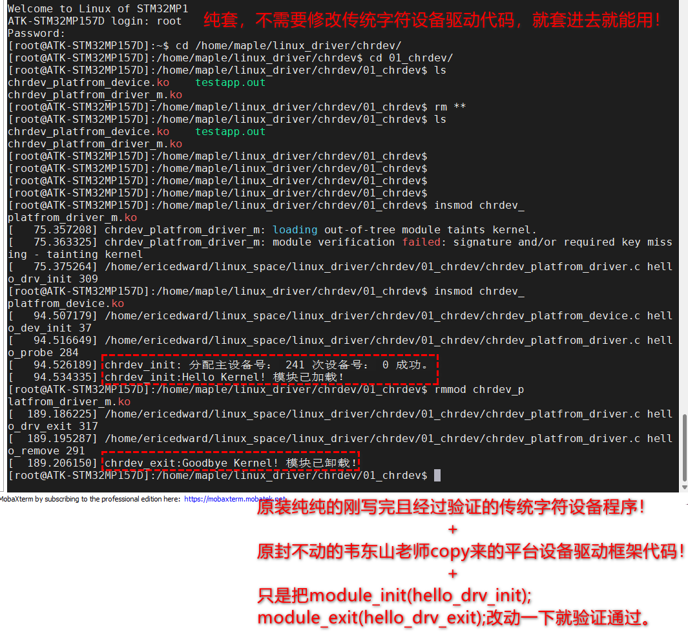
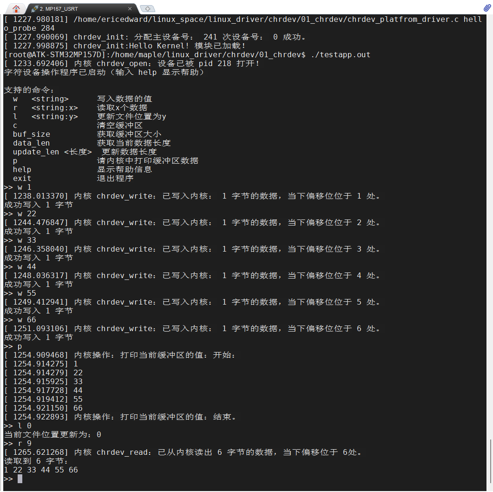
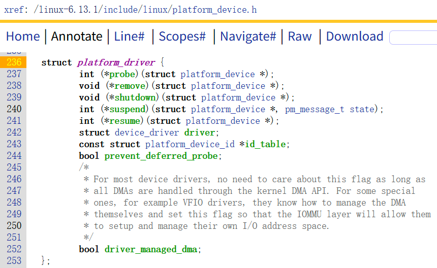
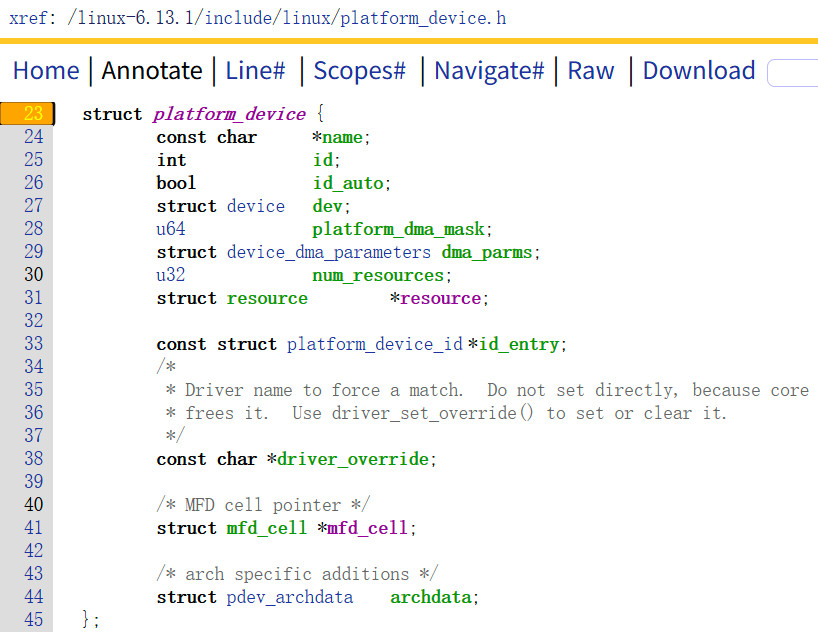

版本目标：新增：平台设备驱动框架。《补充10》章节有设备与驱动分离的细节。

# 问题1 增加平台设备驱动的构想

在 Linux 内核中，设备驱动模型（Device Driver Model）通过 `struct device` 和 `struct device_driver` 等结构实现设备与驱动的分离管理。以下是针对你的字符设备驱动适配设备驱动模型的步骤：

---

### **一、适配设备驱动模型的修改方案**

#### **1. 定义平台设备结构体**
将设备资源抽象为平台设备，用于描述硬件信息（如 GPIO 引脚）。

```c
#include <linux/platform_device.h>

// 在 chrdev.h 中添加平台设备资源结构体
struct chrdev_platform_data {
    int led_gpio;      // LED 控制的 GPIO 编号
    const char *label; // 设备标签
};
```

#### **2. 重构驱动为平台驱动**
将初始化逻辑移至平台驱动的 `probe` 函数，资源释放移至 `remove` 函数。

```c
static int chrdev_probe(struct platform_device *pdev)
{
    struct chrdev_t *chrdev;
    struct chrdev_platform_data *pdata = dev_get_platdata(&pdev->dev);
    int err;

    // 1. 分配设备私有数据
    chrdev = devm_kzalloc(&pdev->dev, sizeof(*chrdev), GFP_KERNEL);
    if (!chrdev)
        return -ENOMEM;

    // 2. 初始化硬件（从平台数据获取 GPIO）
    err = led_init(pdata->led_gpio);
    if (err)
        return err;

    // 3. 分配缓冲区
    chrdev->dev_data.buffer = devm_kzalloc(&pdev->dev, BUF_SIZE, GFP_KERNEL);
    if (!chrdev->dev_data.buffer)
        return -ENOMEM;

    // 4. 注册字符设备（动态主设备号）
    err = alloc_chrdev_region(&chrdev->dev_num, 0, 1, DEVICE_NAME);
    if (err)
        return err;

    cdev_init(&chrdev->dev, &fops);
    err = cdev_add(&chrdev->dev, chrdev->dev_num, 1);
    if (err)
        goto fail_cdev;

    // 5. 创建设备节点
    chrdev->dev_class = class_create(THIS_MODULE, CLASS_NAME);
    if (IS_ERR(chrdev->dev_class)) {
        err = PTR_ERR(chrdev->dev_class);
        goto fail_class;
    }

    chrdev->dev_device = device_create(chrdev->dev_class, NULL, chrdev->dev_num, NULL, DEVICE_NAME);
    if (IS_ERR(chrdev->dev_device)) {
        err = PTR_ERR(chrdev->dev_device);
        goto fail_device;
    }

    // 保存私有数据到平台设备
    platform_set_drvdata(pdev, chrdev);
    printk(KERN_INFO "chrdev_probe: 设备已成功初始化\n");
    return 0;

fail_device:
    class_destroy(chrdev->dev_class);
fail_class:
    cdev_del(&chrdev->dev);
fail_cdev:
    unregister_chrdev_region(chrdev->dev_num, 1);
    return err;
}

static int chrdev_remove(struct platform_device *pdev)
{
    struct chrdev_t *chrdev = platform_get_drvdata(pdev);

    // 释放资源
    device_destroy(chrdev->dev_class, chrdev->dev_num);
    class_destroy(chrdev->dev_class);
    cdev_del(&chrdev->dev);
    unregister_chrdev_region(chrdev->dev_num, 1);
    led_deinit();

    printk(KERN_INFO "chrdev_remove: 设备已卸载\n");
    return 0;
}
```

#### **3. 定义平台驱动结构体**
```c
static struct platform_driver chrdev_platform_driver = {
    .probe  = chrdev_probe,
    .remove = chrdev_remove,
    .driver = {
        .name  = "mapleay-chrdev",
        .owner = THIS_MODULE,
    },
};
```

#### **4. 修改模块初始化和退出函数**
```c
static int __init chrdev_init(void)
{
    return platform_driver_register(&chrdev_platform_driver);
}

static void __exit chrdev_exit(void)
{
    platform_driver_unregister(&chrdev_platform_driver);
}
```

---

### **二、添加 SysFS 属性支持**
通过 SysFS 暴露设备属性（如缓冲区大小、数据长度等）。

#### **1. 定义设备属性**
```c
// 在 chrdev.h 中定义属性宏
#define CHRDEV_ATTR(_name) DEVICE_ATTR(_name, 0644, chrdev_show_##_name, chrdev_store_##_name)

// 显示缓冲区大小
static ssize_t chrdev_show_buf_size(struct device *dev, struct device_attribute *attr, char *buf)
{
    struct chrdev_t *chrdev = dev_get_drvdata(dev);
    return sprintf(buf, "%d\n", chrdev->dev_data.buf_size);
}

// 显示数据长度
static ssize_t chrdev_show_data_len(struct device *dev, struct device_attribute *attr, char *buf)
{
    struct chrdev_t *chrdev = dev_get_drvdata(dev);
    return sprintf(buf, "%d\n", chrdev->dev_data.data_len);
}

// 定义属性
static CHRDEV_ATTR(buf_size);
static CHRDEV_ATTR(data_len);

// 属性列表
static struct attribute *chrdev_attrs[] = {
    &dev_attr_buf_size.attr,
    &dev_attr_data_len.attr,
    NULL,
};

// 属性组
static struct attribute_group chrdev_attr_group = {
    .attrs = chrdev_attrs,
};
```

#### **2. 在 `probe` 函数中注册属性**
```c
// 在 chrdev_probe 函数末尾添加
err = sysfs_create_group(&pdev->dev.kobj, &chrdev_attr_group);
if (err)
    dev_err(&pdev->dev, "无法创建 SysFS 属性组\n");
```

---

### **三、设备树（Device Tree）支持（可选）**
若硬件使用设备树描述，需添加设备树匹配表。

#### **1. 定义设备树匹配表**
```c
static const struct of_device_id chrdev_of_match[] = {
    { .compatible = "mapleay,chrdev" },
    { /* Sentinel */ }
};
MODULE_DEVICE_TABLE(of, chrdev_of_match);
```

#### **2. 更新平台驱动结构体**
```c
static struct platform_driver chrdev_platform_driver = {
    .probe  = chrdev_probe,
    .remove = chrdev_remove,
    .driver = {
        .name  = "mapleay-chrdev",
        .owner = THIS_MODULE,
        .of_match_table = chrdev_of_match, // 添加设备树匹配
    },
};
```

#### **3. 修改 `probe` 函数以解析设备树**
```c
static int chrdev_probe(struct platform_device *pdev)
{
    struct device_node *np = pdev->dev.of_node;
    struct chrdev_platform_data *pdata;

    // 从设备树解析 GPIO
    if (np) {
        pdata = devm_kzalloc(&pdev->dev, sizeof(*pdata), GFP_KERNEL);
        if (!pdata)
            return -ENOMEM;

        pdata->led_gpio = of_get_named_gpio(np, "led-gpio", 0);
        pdata->label = of_get_property(np, "label", NULL);
        pdev->dev.platform_data = pdata;
    }
    // 后续代码不变...
}
```

---

### **四、验证与测试**

#### **1. 加载模块并查看设备**
```bash
$ insmod chrdev.ko
$ dmesg | tail
[ 1234.567890] chrdev_probe: 设备已成功初始化
```

#### **2. 通过 SysFS 查看属性**
```bash
$ cat /sys/class/mapleay_class/mapleay-chrdev/buf_size
1024
$ cat /sys/class/mapleay_class/mapleay-chrdev/data_len
0
```

#### **3. 用户空间工具测试**
使用原提供的用户空间工具测试读写功能，确保功能正常。

---

### **五、关键优势**
1. **设备与驱动分离**：通过平台设备/驱动模型，硬件资源（如 GPIO）可通过设备树或平台数据动态配置。
2. **生命周期管理**：利用 `devm_*` 函数自动释放资源，减少内存泄漏风险。
3. **标准化接口**：通过 SysFS 属性提供用户空间访问通道，无需依赖专用 IOCTL 命令。
4. **设备树支持**：便于嵌入式系统中通过设备树描述硬件，增强可移植性。

通过此方案，你的字符设备驱动将完全符合 Linux 设备驱动模型规范，具备更好的可维护性和扩展性。


## 问题2 file_operations 的 read 函数里的 char __user* 为什么是指向char类型的？为什么不是其他类型的？

```c
ssize_t (*read) (struct file *, char __user *, size_t, loff_t *);

```

file_operations 的 read 函数里的 char __user* 为什么是指向char类型的？为什么不是其他类型的？

在Linux内核的`file_operations`结构体中，`read`函数的参数`char __user *`被设计为指向字符类型（字节流）的指针，主要原因包括以下方面：

### 1. **通用性与数据的最小传输单位**
   - 数据传输的基本单位是字节（Byte），而非特定数据类型（如`int`或结构体）。无论用户空间需要读取何种数据，最终都以字节流形式传输。
   - **示例**：  
     当用户空间请求读取一个`int`数组时，内核将数组的每个整数按连续字节序列写入用户缓冲。用户程序再将这些字节按`int`类型解析。

### 2. **兼容任意类型的用户空间缓冲区**
   - 用户空间的`void *`可以与内核的`char __user *`无缝配合，无需为每种数据类型定义不同的函数签名。
   - **示例**：  
     用户调用`read(fd, buffer, size)`时，`buffer`可以是`char[]`、`struct data`或`void *`的内存块，内核通过`char __user *`统一处理。

### 3. **指针运算的便捷性**
   - `char`指针的步长为1字节，便于按字节偏移操作，特别是在处理复杂数据结构或非对齐内存时。
   - **示例**：  
     若用户空间请求从偏移字节`i`读取数据，内核可直接通过`buf + i`计算地址，无需考虑类型对齐问题。

### 4. **内核与用户空间的安全拷贝**
   - 内核使用`copy_to_user()`和`copy_from_user()`函数处理用户空间的指针。这些函数的参数为`void *`，但具体操作以字节为单位进行。
   - **实现逻辑**：  
     ```c
     // 内核端：
     ssize_t dev_read(struct file *filp, char __user *buf, size_t len, loff_t *off) {
         char kernel_buf[1024];
         copy_to_user(buf, kernel_buf, len); // 按字节复制到用户空间
         return len;
     }
     
     // 用户端：
     int fd = open("/dev/device", O_RDONLY);
     uint32_t data[4];
     read(fd, data, sizeof(data)); // 将内核的字节流解释为uint32_t数组
     ```

### 5. **设计符合UNIX“一切皆文件”哲学**
   - 设备和文件的操作接口统一为字节流（如标准输入输出、管道、套接字）。
   - **优势**：驱动开发者仅关注字节层面的传输逻辑，用户程序自行处理数据解释（如网络协议栈解析）。

### 总结
| **关键点**         | **说明**                                 | **用户空间与内核交互示例**     |
| ------------------ | ---------------------------------------- | ------------------------------ |
| **通用字节流传输** | 所有数据均以字节形式读写                 | 用户`read`→字节流→内核`char *` |
| **指针运算简化**   | 计算偏移时无需考虑类型步长               | 迭代缓冲位置直接加字节数       |
| **安全拷贝支持**   | `copy_to_user`隐藏类型差异，专注字节操作 | 内核`int`→用户`uint32_t`无感知 |

通过`char __user *`的设计，内核的`read`函数能够灵活适应任意类型的数据传输需求，而用户空间的解释权则完全交给应用程序。这种模型确保了驱动的简洁性和通用性。


注意传入传出的二进制流的安全性，相关的问题：

1. 应用层的数据解析，内核（copy_from_user/copy_to_user）出入都是 char 1字节，当int或其他类型用的时候，需要解析。


## 问题3 设备模型与平台设备模型的区别？

在 Linux 驱动开发中，**设备模型（Device Model）**和**平台设备模型（Platform Device Model）**是两个密切关联但作用不同的概念。它们的核心区别如下：

---

### **1. 设备模型（Device Model）**
#### **定义**  
Linux 内核中管理所有设备的**统一框架**，提供设备、驱动、总线、类（Class）等抽象概念，用于描述设备之间的层次关系和交互机制。

#### **核心机制**  
- **总线（Bus）**：设备连接的抽象（如 PCI、USB、I2C 等）。
- **设备（Device）**：硬件设备的抽象（如键盘、网卡）。
- **驱动（Driver）**：控制设备的软件模块。
- **类（Class）**：按功能分类设备（如输入设备类 `input_class`）。
- **sysfs**：通过 `/sys` 文件系统暴露设备信息。

#### **特点**  
- **通用性**：适用于所有类型的设备（PCI、USB、虚拟设备等）。
- **动态管理**：支持热插拔、电源管理、设备生命周期管理。
- **自动匹配**：通过总线机制自动匹配设备与驱动（如 PCI 设备的 Vendor/Device ID）。

---

### **2. 平台设备模型（Platform Device Model）**
#### **定义**  
设备模型的**子集**，专用于管理 SoC（片上系统）内部或非传统总线连接的设备（如 GPIO、定时器、内存映射设备等）。

#### **核心机制**  
- **平台设备（Platform Device）**：描述设备的硬件资源（寄存器地址、中断号等）。
- **平台驱动（Platform Driver）**：实现设备控制的驱动模块。
- **设备树（Device Tree）**：通过 `.dts` 文件静态定义硬件资源（替代旧版 `board-*.c` 硬编码）。

#### **特点**  
- **静态资源**：适用于无法通过总线枚举的设备（如 SoC 内部外设）。
- **手动匹配**：通过设备树或 `platform_device` 名称匹配驱动。
- **资源管理**：使用 `platform_get_resource()` 获取寄存器地址、中断等资源。
- **无总线架构**：设备不挂载在传统总线上，直接由内核管理。

---

### **3. 关键区别对比**
| **特性**             | **设备模型**                     | **平台设备模型**                    |
| -------------------- | -------------------------------- | ----------------------------------- |
| **适用范围**         | 所有设备（PCI、USB、虚拟设备等） | SoC 内部设备、非总线设备（如 GPIO） |
| **总线依赖**         | 依赖总线（如 PCI、USB）          | 无总线，直接由内核管理              |
| **硬件资源获取**     | 通过总线配置空间（如 PCI BAR）   | 通过设备树或 `platform_device` 定义 |
| **设备发现方式**     | 总线枚举（动态）                 | 静态定义（设备树或硬编码）          |
| **驱动匹配机制**     | 总线 ID 自动匹配（如 PCI ID）    | 名称匹配（如 `compatible` 属性）    |
| **典型驱动注册函数** | `pci_register_driver()`          | `platform_driver_register()`        |
| **设备树支持**       | 可选                             | 必需（现代内核）                    |
| **示例设备**         | 网卡、USB 摄像头                 | GPIO、定时器、内存映射寄存器        |

---

### **4. 使用场景**
#### **设备模型**  
- 开发标准总线设备驱动（如 PCI 网卡、USB 摄像头）。
- 需要热插拔支持的设备（如 U 盘）。

#### **平台设备模型**  
- 开发 SoC 内部外设驱动（如 STM32 的 GPIO、UART）。
- 无法通过总线枚举的设备（如 FPGA 寄存器映射设备）。
- 嵌入式系统中需要设备树配置的硬件。

---

### **5. 代码示例对比**
#### **通用设备模型（如 PCI 驱动）**
```c
static struct pci_driver my_pci_driver = {
    .name     = "my_pci_dev",
    .id_table = pci_ids,  // 通过 PCI ID 匹配设备
    .probe    = pci_probe,
    .remove   = pci_remove,
};

pci_register_driver(&my_pci_driver);
```

#### **平台设备模型**
```c
static struct platform_driver my_platform_driver = {
    .probe  = platform_probe,
    .remove = platform_remove,
    .driver = {
        .name = "my_platform_dev",  // 通过名称或设备树匹配
        .of_match_table = of_match_table,
    },
};

platform_driver_register(&my_platform_driver);
```

---

### **6. 总结**
- **设备模型**是 Linux 内核管理所有设备的通用框架，**平台设备模型**是其针对非总线设备的扩展。
- **平台设备模型**通过设备树解耦硬件描述与驱动代码，是嵌入式开发的核心机制。
- 选择模型时：若设备挂载在传统总线上（如 PCI、USB），用设备模型；若设备是 SoC 内部外设，用平台设备模型。

## 问题4 也就是说 设备模型支持的枚举出的总线类型，天然内置，其他非总线枚举出的，都使用平台设备模型吗？

你的理解基本正确，但需要更精确的表述和补充说明。以下是详细分析：

---

### **1. 设备模型与总线枚举设备的关系**
**正确性**：
- **设备模型（Device Model）** 确实是面向 **总线枚举设备（Bus-enumerated Devices）** 的通用框架，例如： 
  - **PCI/PCIe**：通过总线扫描发现设备
  - **USB**：通过总线协议枚举设备
  - **I2C/SPI**：通过总线地址访问设备
- 这些总线类型在硬件上支持动态发现，内核会通过总线驱动自动完成设备识别和资源分配。

**关键特点**：
- 总线驱动负责设备的动态发现和资源分配（如 PCI BAR 空间、USB 端点）。
- 设备与驱动通过总线特定的标识符（如 PCI Vendor/Device ID）自动匹配。

---

### **2. 平台设备模型与非总线设备的关系**
**正确性**：
- **平台设备模型（Platform Device Model）** 主要用于管理 **非总线枚举设备（Non-bus-enumerated Devices）**，例如：
  - **SoC 内部外设**：GPIO、UART、定时器
  - **内存映射设备**：FPGA 寄存器、硬件加速器
  - **无总线连接的设备**：直接通过物理地址访问的设备

**关键特点**：
- 设备资源（寄存器地址、中断号）**静态定义**，无法通过总线动态发现。
- 资源定义方式：
  - **传统方式**：通过 `platform_device` 结构体硬编码（已过时）。
  - **现代方式**：通过设备树（Device Tree）或 ACPI 表描述硬件。

---

### **3. 为什么说“非总线设备使用平台模型”？**
#### **设计逻辑**：
- **统一接口**：平台模型为静态设备提供了与总线设备一致的接口（`probe()`/`remove()`）。
- **资源管理**：通过 `platform_get_resource()` 等 API 解耦硬件资源与驱动代码。
- **设备树支持**：平台模型天然支持设备树，使得硬件描述与驱动代码分离。

#### **例外情况**：
虽然平台模型是主流选择，但某些非总线设备可能使用其他机制：
- **MISC 设备**：通过 `misc_register()` 注册简单字符设备（如 `/dev/random`）。
- **直接注册**：直接调用 `register_chrdev()` 注册字符设备（已不推荐）。
- **特定子系统**：如 Input 子系统、FrameBuffer 子系统有自己的设备注册接口。

---

### **4. 平台模型 vs 其他非总线设备管理方式**
| **机制**             | **适用场景**                        | **优点**                            | **缺点**                     |
| -------------------- | ----------------------------------- | ----------------------------------- | ---------------------------- |
| **平台设备模型**     | SoC 外设、内存映射设备              | 支持设备树、资源管理规范            | 需要编写平台驱动和设备树节点 |
| **MISC 设备**        | 简单字符设备（如传感器）            | 注册简单，无需复杂匹配逻辑          | 功能有限，不支持复杂资源管理 |
| **直接注册字符设备** | 极简驱动（仅需 `read()`/`write()`） | 快速实现                            | 硬编码资源，无法适配多种硬件 |
| **专用子系统**       | 输入设备、显示设备                  | 直接利用子系统框架（如 Input 事件） | 需遵循子系统规范             |

---

### **5. 设备树与平台模型的结合**
现代内核中，平台模型通过设备树实现硬件描述的标准化：
```dts
// 设备树节点示例（STM32 UART）
uart4: serial@40004c00 {
    compatible = "st,stm32-uart";
    reg = <0x40004c00 0x400>;
    interrupts = <52>;
    clocks = <&rcc STM32_CLK_USART4>;
};
```
- 驱动通过 `of_match_table` 匹配设备树节点：
```c
static const struct of_device_id uart_dt_ids[] = {
    { .compatible = "st,stm32-uart" },
    { /* Sentinel */ }
};
```

---

### **6. 结论**
- **绝大多数非总线设备使用平台模型**：这是 Linux 内核对静态设备的标准管理方式。
- **平台模型不是唯一选择**：根据设备复杂度，可选用 MISC 设备或其他子系统。
- **设备树是核心**：现代嵌入式开发中，平台模型与设备树的结合是事实标准。

---

### **何时必须使用平台模型？**
1. 设备需要访问物理地址或中断。
2. 硬件资源需通过设备树描述。
3. 驱动需要与内核资源管理框架（如电源管理）集成。

---

通过这种设计，Linux 内核实现了对总线设备和非总线设备的统一管理，同时保持了对嵌入式系统的灵活支持。


## 问题5 所以一般设备驱动模型的实际编程，都是用平台设备驱动模型来做，对吗？

你的理解 **部分正确**，但需要根据具体场景细化。以下是详细分析：

---

### **1. 平台设备模型的典型应用场景**
平台设备驱动模型 **主要用于以下场景**：
1. **SoC 内部外设**  
   - GPIO 控制器、时钟控制器、中断控制器等。
   - 例如：STM32 的 USART、NXP i.MX 的 I2C 控制器。

2. **无总线连接的设备**  
   - 内存映射设备（如 FPGA 寄存器）。
   - 固定物理地址的硬件模块（如嵌入式系统中的 ADC/DAC）。

3. **设备树描述的硬件**  
   - 现代嵌入式系统通过设备树（`.dts`）静态定义资源，驱动通过平台模型获取资源。

#### **示例代码**（Platform 驱动框架）：
```c
static const struct of_device_id my_driver_ids[] = {
    { .compatible = "vendor,my-device" }, // 匹配设备树中的 compatible 属性
    { /* Sentinel */ }
};

static struct platform_driver my_platform_driver = {
    .probe  = my_probe,      // 设备匹配时调用
    .remove = my_remove,     // 设备移除时调用
    .driver = {
        .name           = "my-platform-device",
        .of_match_table = my_driver_ids, // 设备树匹配表
    },
};

module_platform_driver(my_platform_driver); // 自动注册驱动
```

---

### **2. 不需要平台模型的场景**
以下情况通常 **不使用平台模型**，而是用更直接的驱动框架：

#### **(1) 标准总线设备**
- **PCI/PCIe 设备**：使用 `struct pci_driver`。
- **USB 设备**：使用 `struct usb_driver`。
- **I2C 设备**：使用 `struct i2c_driver`。

#### **(2) 简单字符设备**
- 若设备无需复杂资源（如寄存器、中断），可直接注册字符设备：
```c
// 直接注册字符设备（传统方式）
static int __init my_init(void) {
    register_chrdev(MAJOR_NUM, "my_char_dev", &fops);
    return 0;
}
```

#### **(3) 专用子系统设备**
- **输入设备**（如键盘、触摸屏）：使用 `input_register_device()`。
- **帧缓冲设备**：使用 `register_framebuffer()`。
- **网络设备**：使用 `struct net_device`。

#### **(4) MISC 设备**
- 简单字符设备（如 `/dev/random`）可使用 `misc_register()`：
```c
static struct miscdevice my_misc_device = {
    .minor = MISC_DYNAMIC_MINOR,
    .name  = "my_misc",
    .fops  = &fops,
};

misc_register(&my_misc_device);
```

---

### **3. 平台模型的核心作用**
平台模型的 **核心价值** 是解决以下问题：
1. **硬件资源管理**  
   - 通过 `platform_get_resource()` 获取寄存器地址、中断号等资源。
   - 替代硬编码，实现驱动与硬件描述的分离。

2. **设备树集成**  
   - 将硬件资源配置从代码迁移到设备树（`.dts`），提高可移植性。

3. **统一设备生命周期**  
   - 提供标准的 `probe()` 和 `remove()` 接口，集成电源管理、热插拔等机制。

---

### **4. 实际开发中的选择策略**
| **场景**                      | **推荐模型**                    | **示例**                  |
| ----------------------------- | ------------------------------- | ------------------------- |
| SoC 内部外设（如 GPIO、UART） | 平台模型 + 设备树               | STM32 的 USART 控制器驱动 |
| 复杂字符设备（需中断/DMA）    | 平台模型 + 字符设备框架         | FPGA 数据采集卡驱动       |
| 简单字符设备（无硬件资源）    | 直接注册字符设备或 MISC 设备    | `/dev/my_sensor`          |
| 标准总线设备（如 PCIe 网卡）  | 总线专用模型（如 `pci_driver`） | Intel 千兆网卡驱动        |
| 输入/显示设备                 | 专用子系统（Input/FrameBuffer） | 触摸屏驱动                |

---

### **5. 典型驱动开发流程对比**
#### **(1) 平台模型驱动开发流程**
1. 编写设备树节点（`.dts`），定义寄存器、中断等资源。
2. 在驱动中通过 `platform_get_resource()` 获取资源。
3. 实现 `probe()` 和 `remove()` 管理设备生命周期。
4. 注册字符设备或其他操作接口（如 `fops`）。

#### **(2) 总线设备驱动开发流程**（以 PCI 为例）
1. 定义 PCI Vendor/Device ID 表。
2. 实现 `probe()` 初始化设备，`remove()` 清理资源。
3. 通过 PCI 配置空间访问寄存器。
4. 无需设备树（除非 PCI 设备需要额外配置）。

---

### **6. 总结**
- **平台模型不是万能的**：它是嵌入式系统中管理 **非总线设备** 的首选方案。
- **总线设备必须用专用模型**：如 PCI、USB、I2C 等总线有各自的驱动框架。
- **简单设备可绕过平台模型**：直接注册字符设备或使用 MISC 设备更高效。

平台模型的实际使用频率取决于目标硬件类型：在嵌入式领域（如 ARM SoC）中，平台模型占主导地位；在 x86 服务器或桌面系统中，标准总线设备驱动更常见。


## 问题6 平台设备模型与传统字符设备框架的关系

让我们通过以下分析澄清两者关系：

---

### **1. 核心结论**
**平台设备模型与传统字符设备框架是 _协作关系_，而非包含关系**。  
- **平台模型**：负责硬件资源管理（寄存器、中断）和设备树集成。
- **字符设备框架**：负责实现设备文件操作（`open`/`read`/`write`/`ioctl`）。

---

### **2. 协作流程**
```text
+-------------------+     +---------------------+     +-------------------+
|  Platform Driver  |     | Character Device    |     | User Space        |
| (probe/remove)    | --> | (read/write/ioctl)  | <-> | (/dev/chrdev)     |
+-------------------+     +---------------------+     +-------------------+
        |                         ^
        | 获取硬件资源              | 提供用户接口
        v                         |
+-------------------+     +---------------------+
| Device Tree       |     | File Operations     |
| (registers, IRQs) |     | (fops结构体)         |
+-------------------+     +---------------------+
```

#### **(1) 平台模型的角色**
- 在 `probe()` 中通过设备树获取硬件资源（寄存器地址、中断号）。
- 管理设备生命周期（加载/卸载时自动调用 `probe()`/`remove()`）。

#### **(2) 字符设备框架的角色**
- 在 `probe()` 中注册字符设备（`alloc_chrdev_region()` + `cdev_add()`）。
- 实现 `file_operations` 定义的用户空间接口。

---

### **3. 关键区别**
| **维度**         | **平台设备模型**               | **传统字符设备框架**                |
| ---------------- | ------------------------------ | ----------------------------------- |
| **核心职责**     | 硬件资源管理与设备树集成       | 用户空间接口实现（设备文件操作）    |
| **注册入口**     | `platform_driver_register()`   | `register_chrdev()` 或 `cdev_add()` |
| **硬件资源获取** | 通过设备树或 `platform_device` | 硬编码或手动分配                    |
| **设备匹配机制** | 设备树 `compatible` 属性       | 主设备号匹配                        |
| **代码耦合度**   | 低（硬件描述与驱动解耦）       | 高（硬件操作与驱动代码强耦合）      |

---

### **4. 实际代码中的协作**
#### **(1) 平台驱动初始化**
```c
static int chrdev_probe(struct platform_device *pdev) {
    // 1. 从设备树获取寄存器地址
    res = platform_get_resource(pdev, IORESOURCE_MEM, 0);
    chrdev->led_reg = devm_ioremap_resource(&pdev->dev, res);

    // 2. 注册字符设备（传统框架）
    alloc_chrdev_region(&chrdev->dev_num, ...);
    cdev_init(&chrdev->dev, &fops);
    cdev_add(&chrdev->dev, ...);

    // 3. 创建设备节点
    device_create(...);
}
```

#### **(2) 文件操作实现（传统框架）**
```c
static ssize_t dev_write(struct file *filp, const char __user *buf, ...) {
    // 通过私有数据访问平台驱动获取的硬件资源
    struct cdev_private_data_t *data = filp->private_data;
    writel(data->buffer[0], data->led_reg); // 操作寄存器
}
```

---

### **5. 常见误区澄清**
#### **误区 1**  
_"平台模型替代了字符设备框架"_  
**纠正**：平台模型仅替代了传统驱动中硬件资源管理的部分，字符设备框架仍需用于实现设备文件接口。

#### **误区 2**  
_"使用平台模型后无需调用 `alloc_chrdev_region()`"_  
**纠正**：平台驱动的 `probe()` 中仍需调用字符设备注册函数，只是硬件资源来源不同。

#### **误区 3**  
_"设备树可以自动生成 `/dev` 设备节点"_  
**纠正**：设备节点仍需通过 `device_create()` 创建，设备树仅提供硬件描述。

---

### **6. 总结**
- **平台模型** 和 **字符设备框架** 是 Linux 驱动开发中的两个正交维度，分别解决不同问题：
  - **平台模型**：解决硬件资源描述与动态管理问题。
  - **字符设备框架**：解决用户空间接口标准化问题。
- 在复杂驱动中，二者通常 **协同工作**：平台模型管理硬件，字符设备框架暴露操作接口。


## 实操7 自己字符设备代码+韦东山老师的平台设备驱动框架

自己代码版本是 Linux_chrdev_demo_v2.6.3 纯纯的字符设备框架实现的字符设备驱动，无其他内核支持的科技与狠活。

韦东山老师的代码是纯纯的平台设备驱动框架代码，99%纯度，1%是打印了一个hello 字符串。

两者直接嵌套，韦东山老师的代码框架套在我代码的外面，直接就能用，不需要动任何字符设备相关的代码，只是增加一个平台设备模型需要的头文件，修改Makefile，就能运行。





```c
/* UTF-8编码 Unix(LF) */
#include <linux/module.h>
#include <linux/init.h>
#include <linux/kernel.h>
#include <linux/cdev.h>
#include <linux/fs.h>
#include <linux/device.h>
#include <linux/uaccess.h>  /* 用户空间数据拷贝 */
#include <linux/slab.h>     /* 内核内存分配    */
#include <linux/ioctl.h>    /* ioctl相关定义   */
#include <linux/string.h>   /* 内核的 strlen() */
#include <linux/platform_device.h>
#include "chrdev_ioctl.h"
#include "chrdev.h"         /* 自定义内核字符设备驱动框架信息 */
#include "stm32mp157d.h"    /* 自定义内核控制的硬件相关信息 */


static chrdev_t chrdev;

static int dev_open(struct inode *inode, struct file *filp) {
    filp->private_data = &chrdev.dev_data;
    printk(KERN_INFO "内核 chrdev_open：设备已被 pid %d 打开！\n", current->pid);
    return 0;
}

/* llseek 函数跟字符设备驱动的数据，可以无任何直接关联，只通过 offset 间接关联。 */
/* loff_t 类型是 signed long long 有符号数值 */
loff_t dev_llseek (struct file *filp, loff_t offset, int whence){

    struct cdev_private_data_t *data = filp->private_data;
    loff_t new_pos = 0;
    /* 对进程的 f_ops 进行校验，防止意外 */
    if ((filp->f_pos < 0) || (filp->f_pos > data->buf_size)) {
        return -EINVAL;
    }

    switch (whence) {
        case SEEK_SET:
                if ((offset < 0) || (offset > data->buf_size)) {
                    printk(KERN_INFO "内核 dev_llseek:SEEK_SET:文件偏移失败！！\n");
                    return -EINVAL;
                }
                filp->f_pos = offset;
                break;

        case SEEK_CUR:
                new_pos = filp->f_pos + offset;
                if ((new_pos < 0) || (new_pos > data->buf_size)){
                    printk(KERN_INFO "内核 dev_llseek:SEEK_CUR:文件偏移失败！！\n");
                    return -EINVAL;
                }
                filp->f_pos = new_pos;
                break;

        case SEEK_END:
                new_pos = data->buf_size + offset;
                if ((new_pos < 0) || (new_pos > data->buf_size)){
                    printk(KERN_INFO "内核 dev_llseek:SEEK_END:文件偏移失败！！\n");
                    return -EINVAL;
                }
                filp->f_pos = new_pos;
                break;

        default: return -EINVAL; /* 禁止隐式偏移 */
    }
    return filp->f_pos;
}

/* 提示：read/write处理风格都是：二进制安全型！所以使用char类型代表单个字节，所有以单个字节的操作都是安全且兼容性强的 */
static ssize_t dev_read(struct file *filp, char __user *buf, size_t len_to_meet, loff_t *off) {

    struct cdev_private_data_t *data = filp->private_data;
    size_t cnt_read = min_t(size_t, len_to_meet, data->data_len - *off); //min截短

    if (cnt_read == 0) {
        printk(KERN_INFO "内核 chrdev_read：内核数据早已读出完毕！无法继续读出！\n");
        return 0;
    }

    if (copy_to_user(buf, data->buffer + *off, cnt_read)) {
        printk(KERN_ERR "内核 chrdev_read：从内核复制数据到用户空间操作失败！\n");
        return -EFAULT;
    }

    *off += cnt_read;
    printk(KERN_INFO "内核 chrdev_read：已从内核读出 %zu 字节的数据，当下偏移位于 %lld处。\n", cnt_read, *off);
    return cnt_read;
}

/* 提示：read/write处理风格都是：二进制安全型！所以使用char类型代表单个字节，所有以单个字节的操作都是安全且兼容性强的 */
static ssize_t dev_write(struct file *filp, const char __user *buf, size_t len_to_meet, loff_t *off) {
    struct cdev_private_data_t *data = filp->private_data;
    size_t cnt_write = min_t(size_t, len_to_meet, data->buf_size - *off); //min，二进制安全，取小。OK。
    
    if (cnt_write == 0) {
        printk(KERN_INFO "内核 chrdev_write：内核缓冲区已满，无法继续写入！\n");
        return -ENOSPC;
    }
    
    if (copy_from_user(data->buffer + *off, buf, cnt_write)) {
        printk(KERN_ERR "内核 chrdev_write：从用户空间复制数据到内核空间的操作失败！\n");
        return -EFAULT;
    }

    /* 硬件LED灯控制部分: 提示，注意 data->buffer[0] 表示缓冲区第0位。而不是 (*off) */
    if(data->buffer[0] == LEDON) {
        led_switch(LEDON);  /* 打开 LED 灯  */
    }
    else if(data->buffer[0] == LEDOFF) { 
        led_switch(LEDOFF);  /* 关闭 LED 灯  */
    }
    else{
        printk(KERN_INFO "内核缓冲区内容：data->buffer[0]的值是：%d\n", data->buffer[0]);
        printk(KERN_ERR "硬件操控失败！\n");
    }

    *off += cnt_write;
    data->data_len = max_t(size_t, data->data_len, *off); //max，二进制安全，取大。OK。
    printk(KERN_INFO "内核 chrdev_write：已写入内核： %zu 字节的数据，当下偏移位位于 %lld 处。\n", cnt_write, *off);
    return cnt_write;
}

static long dev_ioctl(struct file *filp, unsigned int cmd, unsigned long arg) {
    struct cdev_private_data_t *data = filp->private_data;
    int ret = 0;
    int val = 0;
    int i   = 0;

    /* 验证命令有效性 */
    if (_IOC_TYPE(cmd) != CHRDEV_IOC_MAGIC) return -ENOTTY;
    if (_IOC_NR(cmd) > CHRDEV_IOC_MAXNR) return -ENOTTY;

    switch (cmd) {
        case CLEAR_BUF:  /* 清除缓冲区 */
            data->data_len = 0;
            memset(data->buffer, 0, data->buf_size);
            printk(KERN_INFO "ioctl: 缓冲区已清空\n");
            break;

        case GET_BUF_SIZE:  /* 获取缓冲区大小 */
            val = data->buf_size;
            if (copy_to_user((int __user *)arg, &val, sizeof(val)))
                return -EFAULT;
            break;

        case GET_DATA_LEN:  /* 获取当前数据长度 */
            val = data->data_len;
            if (copy_to_user((int __user *)arg, &val, sizeof(val)))
                return -EFAULT;
            break;

        case MAPLEAY_UPDATE_DAT_LEN:  /* 自定义：更新有效数据长度 */
            if (copy_from_user(&val, (int __user *)arg, sizeof(arg)))
                return -EFAULT;
            data->data_len = val;  //设置有效数据长度
            val = 12345678;        //特殊数字 仅用来测试 _IORW 的返回方向。
            if (copy_to_user((int __user *)arg, &val, sizeof(val)))
                return -EFAULT;
            break;
        case PRINT_BUF_DATA:
            printk(KERN_INFO"内核操作：打印当前缓冲区的值：开始：\n");
            for (i = 0; i < data->data_len; i++){
                printk(KERN_INFO "%d ", data->buffer[i]);
            }
            printk(KERN_INFO"内核操作：打印当前缓冲区的值：结束。\n");
            break;

        default:
            return -ENOTTY;
    }
    return ret;
}

static int dev_release(struct inode *inode, struct file *file) {
    printk(KERN_INFO "内核 chrdev_release：设备已被 pid 为 %d 的进程释放！\n", current->pid);
    return 0;
}

static struct file_operations fops = {
    .owner          = THIS_MODULE,
    .llseek         = dev_llseek,
    .open           = dev_open,
    .read           = dev_read,
    .write          = dev_write,
    .unlocked_ioctl = dev_ioctl,
    .release        = dev_release,
};

static int chrdev_init(void) {
    
    int err = 0;
    /* 0. 初始化 stm32mp157d 的 gpio 硬件部分 */
    led_init();

    /* 1. 申请主设备号：动态申请方式（推荐方式） */
    if (alloc_chrdev_region(&chrdev.dev_num, MINOR_BASE, MINOR_COUNT, DEVICE_NAME))
    {
        printk("chrdev_init: 分配 chrdev 的字符设备号操作失败！！！\n");
        err = -ENODEV;
        goto fail_devnum;
    }
    printk("chrdev_init: 分配主设备号： %d 次设备号： %d 成功。\n", MAJOR(chrdev.dev_num), MINOR(chrdev.dev_num));
    
    /* 2. 初始化缓冲区 */
    chrdev.dev_data.buffer = kmalloc(BUF_SIZE, GFP_KERNEL);
    if (!chrdev.dev_data.buffer) {
        err = -ENOMEM;
        goto fail_buffer;
    }
    chrdev.dev_data.buf_size = BUF_SIZE;
    /* kmalloc 成功分配内存后，返回的指针指向的内存区域包含未定义的数据（可能是旧数据或随机值）。 */
    /* kzalloc 会初始化为0，但性能弱于 kmalloc */
    memset(chrdev.dev_data.buffer, 0, chrdev.dev_data.buf_size);//可以不用执行
    chrdev.dev_data.data_len = 0;
    
    /* 3. 初始化 cdev 结构体 */
    cdev_init(&chrdev.dev, &fops);
    
    /* 4. 注册 cdev 结构体到 Linux 内核 */
    if (cdev_add(&chrdev.dev, chrdev.dev_num, MINOR_COUNT) < 0)
    {
        printk("chrdev_init: 添加 chrdev 字符设备失败！！！\n");
        goto fail_cdev;
    }
    
    /* 5. 创建设备类 */
    chrdev.dev_class = class_create(THIS_MODULE, CLASS_NAME);
    if (IS_ERR(chrdev.dev_class))
    {
        err = PTR_ERR(chrdev.dev_class);
        printk(KERN_ERR"创建设备类失败！错误代码：%d\n", err);
        goto fail_class;
    }
    
    /* 6. 创建设备节点 */
    chrdev.dev_device = device_create(chrdev.dev_class, NULL, chrdev.dev_num, NULL, DEVICE_NAME);
    if (IS_ERR(chrdev.dev_device))
    {
        err = PTR_ERR(chrdev.dev_device);
        printk(KERN_ERR"创建设备节点失败！错误代码：%d\n", err);
        goto fail_device;
    }
    
    printk(KERN_INFO "chrdev_init:Hello Kernel! 模块已加载！\r\n"); 
    return 0;

fail_device:
    class_destroy(chrdev.dev_class);
fail_class:
    cdev_del(&chrdev.dev);
fail_cdev:
    kfree(chrdev.dev_data.buffer);
fail_buffer:
    unregister_chrdev_region(chrdev.dev_num, MINOR_COUNT);
fail_devnum:
    led_deinit();

    return err;
}

static void chrdev_exit(void) {
    
    /* 0. 注销硬件资源：解除内核中注册的引脚映射 */
    led_deinit();
    
    /* 1. 销毁设备节点和设备类 */
    device_destroy(chrdev.dev_class, chrdev.dev_num);
    class_destroy(chrdev.dev_class);
    
    /* 2. 注销cdev */
    cdev_del(&chrdev.dev);
    
    /* 3. 释放设备号 */
    unregister_chrdev_region(chrdev.dev_num, MINOR_COUNT);
    
    /* 4. 释放缓冲区 */
    kfree(chrdev.dev_data.buffer);
    
    printk(KERN_INFO "chrdev_exit:Goodbye Kernel! 模块已卸载！\r\n");
}

/* 新增平台设备模型：开始 2025年4月15日15:52:07 */
static int hello_probe(struct platform_device *pdev)
{
    printk("%s %s %d\n", __FILE__, __FUNCTION__, __LINE__);
    chrdev_init();
    return 0;
}

static int hello_remove(struct platform_device *pdev)
{
    printk("%s %s %d\n", __FILE__, __FUNCTION__, __LINE__);
    chrdev_exit();
    return 0;
}


static struct platform_driver hello_driver = {
    .probe      = hello_probe,
    .remove     = hello_remove,
    .driver     = {
                    .name = "100ask_hello",
    },
};

static int __init hello_drv_init(void)
{
    int err;

    printk("%s %s %d\n", __FILE__, __FUNCTION__, __LINE__);
    err = platform_driver_register(&hello_driver); 

    return err;
}

static void __exit hello_drv_exit(void)
{
    printk("%s %s %d\n", __FILE__, __FUNCTION__, __LINE__);
    platform_driver_unregister(&hello_driver);
}

module_init(hello_drv_init);
module_exit(hello_drv_exit);
/* 新增平台设备模型：结束 2025年4月15日15:52:07 */

MODULE_LICENSE("GPL");
MODULE_AUTHOR("Mapleay");
MODULE_DESCRIPTION("纯纯增加一个平台设备驱动框架.");
```

```c
/* 新增平台设备模型：这个文件全是新增的 2025年4月15日15:52:07 */
#include <linux/module.h>
#include <linux/fs.h>
#include <linux/errno.h>
#include <linux/miscdevice.h>
#include <linux/kernel.h>
#include <linux/major.h>
#include <linux/mutex.h>
#include <linux/proc_fs.h>
#include <linux/seq_file.h>
#include <linux/stat.h>
#include <linux/init.h>
#include <linux/device.h>
#include <linux/tty.h>
#include <linux/kmod.h>
#include <linux/gfp.h>
#include <linux/platform_device.h>


static void hello_dev_release(struct device *dev)
{
    printk("%s %s %d\n", __FILE__, __FUNCTION__, __LINE__);
}


static struct platform_device hello_dev = {
        .name = "100ask_hello",
        .dev = {
                .release = hello_dev_release,
         },
};

static int __init hello_dev_init(void)
{
    int err;
    
    printk("%s %s %d\n", __FILE__, __FUNCTION__, __LINE__);
    err = platform_device_register(&hello_dev);   
    
    return err;
}

static void __exit hello_dev_exit(void)
{
    printk("%s %s %d\n", __FILE__, __FUNCTION__, __LINE__);
    platform_device_unregister(&hello_dev);
}

module_init(hello_dev_init);
module_exit(hello_dev_exit);

MODULE_LICENSE("GPL");
MODULE_AUTHOR("Mapleay");
MODULE_DESCRIPTION("纯纯增加一个平台设备驱动框架.");
```

## 实操8 从传统纯字符设备代码中剥离设备信息与驱动代码体现实用价值

怎么从传统的字符设备代码里剥离出设备与驱动信息，填入平台设备驱动模型框架内，以提高代码的实用性，更好的移植特性和兼容特性？

探索1 先看看平台设备驱动框架的代码

这个平台设备模型框架应该是几乎全都是通过这俩重要数据结构关联的。

```c

/* 位置： \linux-5.4.31\include\linux\platform_device.h */
struct platform_driver {
	int (*probe)(struct platform_device *);
	int (*remove)(struct platform_device *);
	void (*shutdown)(struct platform_device *);
	int (*suspend)(struct platform_device *, pm_message_t state);
	int (*resume)(struct platform_device *);
	struct device_driver driver;
	const struct platform_device_id *id_table;
	bool prevent_deferred_probe;
};
/* 位置： \linux-5.4.31\include\linux\platform_device.h */
struct platform_device {
	const char	*name;
	int		id;
	bool		id_auto;
	struct device	dev;
	u64		platform_dma_mask;
	u32		num_resources;
	struct resource	*resource;

	const struct platform_device_id	*id_entry;
	char *driver_override; /* Driver name to force a match */

	/* MFD cell pointer */
	struct mfd_cell *mfd_cell;

	/* arch specific additions */
	struct pdev_archdata	archdata;
};
```

```c
//来自tarena的解析
struct platform_driver {
	int (*probe)(struct platform_device *);
	int (*remove)(struct platform_device *);
	void (*shutdown)(struct platform_device *);
	int (*suspend)(struct platform_device *, pm_message_t state);
	int (*resume)(struct platform_device *);
	struct device_driver driver;
	const struct platform_device_id *id_table;
	bool prevent_deferred_probe;
};
/* 简化 
platform_driver
	.driver
		.name 用于匹配
	.probe
		pdev 指向硬件
			pdev->dev.platform_data
			platfrom_get_resource
		通过pdev获取硬件信息
		处理硬件信息
		注册混杂或字符，提供接口
	.remove
		pdev 指向硬件

platform_driver_register()
platform_driver_unregister()
*/

-----------------------

struct platform_device {
	const char	*name;
	int		id;
	bool		id_auto;
	struct device	dev;
	u64		platform_dma_mask;
	u32		num_resources;
	struct resource	*resource;

	const struct platform_device_id	*id_entry;
	char *driver_override; /* Driver name to force a match */

	/* MFD cell pointer */
	struct mfd_cell *mfd_cell;

	/* arch specific additions */
	struct pdev_archdata	archdata;
};
/* 简化 
platform_device
	.name
	.id
	.dev
		.platform_data 装载自定义的硬件信息
	.resource
		.start
		.end
		.flag
			IORESOURCE_MEM
			IORESOURCE_IRQ
	.num_resources

platfrom_device_register()
platform_device_unregister()
*/
```

思考1，做某个硬件的linux平台设备驱动程序时，不再需要将字符设备框架代码跟实际硬件操纵的驱动代码分文件编写，当然可以分，简单的就不分了。

思考2，设备模型原本是2.6内核版本引入的，支持原生硬件总线的热插拔，比如USB总线、PCI总线；设备驱动模型将设备信息与驱动代码分开，便于代码维护、移植与管理。后来为了增强设备模型对其他非原生总线设备的内核信息管理（设备信息+驱动信息），进而引进了一种特殊的总线类型，是一条虚拟总线，叫平台总线。它跟USB总线、PCI总线的地位是一样的，都遵循设备模型框架规则，且受其操纵，被设备模型框架管理和自动匹配。虚拟的平台设备总线尤其适应于嵌入式硬件系统，因为通常嵌入式环境需要很多硬件非标准化的定制裁剪。

思考3 平台设备驱动模型只是提供一种它自身框架实现的机制：在虚拟总线的管理下挂接两条链表，一条挂设备信息、一条挂驱动信息。当两条总线上链表上发生任何变化时（新增设备对象或驱动信息对象），内核框架代码会拿新增对象与对面链表上的对象进行自动匹配，若匹配成功，则调用已注入的probe或remove函数。我们可以自由使用这种机制：1. 比如嵌套树形使用此机制；2. 与其他相关框架（字符设备驱动框架、其他杂项框架等）联动工作，最典型的就是：平台设备驱动框架+字符设备框架+设备树；3. 其他任何你想做的：在设备模型框架下的平台设备总线模型下被自动调用的probe/remove里自由编写自己的代码。

思考4 要了解平台设备总线驱动模型框架，哈哈哈这个术语好乱，故意的。那么必须绕不开 struct platform_device 与 struct platform_driver 的联动细节，这俩就是虚拟总线链表上的设备与驱动的表达方式。所以，必须搞定。

### struct platform_device 与 struct platform_driver 如何关联在一起？

在 Linux 内核中，`struct platform_device` 和 `struct platform_driver` 的关联通过以下机制实现：

---

### **1. 核心机制**
内核的 **设备-驱动匹配模型** 负责将两者绑定。当注册设备或驱动时，内核会尝试匹配已注册的驱动或设备，匹配成功后调用驱动的 `probe` 函数。

---

### **2. 关键结构体字段**
- **`platform_device`**：
  - `.name`：设备名称（传统方式，非设备树）。
  - `.id`：设备 ID（用于区分同名设备）。
  - `.dev.of_node`：指向设备树节点（如使用设备树）。
  - `.resource`：设备资源（内存、中断等）。

- **`platform_driver`**：
  - `.driver.name`：驱动名称（传统匹配方式）。
  - `.probe()`：设备初始化入口。
  - `.id_table`：指向 `platform_device_id` 表（支持多设备名称匹配）。
  - `.driver.of_match_table`：指向 `of_device_id` 表（设备树兼容性匹配）。

---

### **3. 匹配方式**
#### **(1) 传统名称匹配**
- **直接名称匹配**：`platform_device.name` 必须与 `platform_driver.driver.name` 或 `platform_driver.id_table` 中的某个条目匹配。
- **示例**：
  ```c
  // 设备注册
  struct platform_device my_dev = {
      .name = "my_device",
      .id = -1,
  };
  platform_device_register(&my_dev);
  
  // 驱动注册
  static struct platform_driver my_drv = {
      .driver = {
          .name = "my_device", // 直接匹配设备名称
      },
      .probe = my_probe,
  };
  platform_driver_register(&my_drv);
  ```

#### **(2) 设备树兼容性匹配**
- **通过 `.of_match_table`**：设备树节点的 `compatible` 属性需与 `platform_driver.driver.of_match_table` 中的某个条目匹配。
- **示例**：
  ```c
  // 设备树节点
  my_device: my_device@0 {
      compatible = "vendor,my-device";
      reg = <0x10000000 0x1000>;
  };
  
  // 驱动定义
  static const struct of_device_id my_drv_of_match[] = {
      { .compatible = "vendor,my-device" },
      {}
  };
  
  static struct platform_driver my_drv = {
      .driver = {
          .of_match_table = my_drv_of_match, // 设备树匹配
      },
      .probe = my_probe,
  };
  ```

---

### **4. 注册与匹配流程**
1. **设备注册**：
   - `platform_device_register()` 将设备加入内核的 `platform_bus` 设备列表。
2. **驱动注册**：
   - `platform_driver_register()` 将驱动加入 `platform_bus` 驱动列表。
3. **匹配触发**：
   - 当设备或驱动任意一方注册时，总线核心（`platform_bus_type`）会遍历对方列表，尝试匹配。
4. **匹配优先级**：
   - 设备树兼容性匹配（`of_match_table`）优先于传统名称匹配。
5. **执行 `probe`**：
   - 匹配成功后，调用驱动的 `probe()` 函数，完成设备初始化。

---

### **5. 代码流程示例**
```c
// 设备注册（设备树触发或手动注册）
platform_device_register(dev);

// 驱动注册（模块初始化时）
static int __init my_drv_init(void) {
    return platform_driver_register(&my_drv);
}

// 驱动定义
static struct platform_driver my_drv = {
    .driver = {
        .name = "my_device",
        .of_match_table = my_drv_of_match,
    },
    .probe = my_probe,
    .remove = my_remove,
};
```

---

### **6. 关键函数**
- **匹配逻辑入口**：`platform_match()`（定义在 `drivers/base/platform.c`）。
- **触发匹配**：`driver_match_device()` -> `platform_match()`。

---

### **总结**
- **传统方式**：通过设备名称（`.name` 或 `.id_table`）匹配。
- **设备树方式**：通过 `compatible` 字符串匹配。
- 匹配后由内核自动调用 `probe()`，完成设备和驱动的绑定。


### 分析平台设备驱动模型提供分离驱动与设备信息的能力？如何分离，又如何互通？

### Linux 平台设备驱动模型：驱动与设备信息的分离与互通

Linux 平台设备驱动模型（Platform Device/Driver Model）通过 **抽象硬件描述** 和 **动态匹配机制**，实现了驱动代码与设备信息的解耦。这种设计大幅提高了内核代码的可维护性和可移植性，尤其适用于嵌入式系统中硬件配置频繁变化的场景。

---

### **一、为何需要分离驱动与设备信息？**

#### **1. 传统模式的痛点**
- **硬编码设备信息**：硬件地址、中断号等直接嵌入驱动代码，导致：
  - **驱动与硬件强耦合**：硬件变动需修改驱动源码。
  - **代码冗余**：同一驱动需为不同硬件编写多个版本。
  - **难以动态适配**：无法支持热插拔或设备树等动态配置。

#### **2. 分离后的优势**
- **驱动通用化**：驱动仅关注硬件操作逻辑（如寄存器读写），不依赖具体硬件参数。
- **设备信息动态化**：硬件描述可存储在设备树（Device Tree）、ACPI 表或平台代码中，独立于驱动。
- **灵活适配**：同一驱动可支持多种硬件配置，无需重新编译。

---

### **二、如何实现分离？**

#### **1. 设备信息的抽象**
设备信息通过以下方式从驱动中剥离：

##### **(1) 设备树（Device Tree）**
- **描述方式**：在 `.dts` 文件中定义设备节点，包含寄存器地址、中断号等属性。
  ```dts
  // 设备树节点示例
  uart0: serial@10000000 {
      compatible = "vendor,my-uart";
      reg = <0x10000000 0x1000>;
      interrupts = <5 IRQ_TYPE_LEVEL_HIGH>;
  };
  ```
- **内核解析**：启动时，内核将设备树转换为 `device_node` 结构体，并生成 `platform_device`。

##### **(2) 静态平台设备**
- **代码定义**：在平台代码中静态定义 `platform_device`。
  ```c
  // 静态定义设备资源
  static struct resource uart0_res[] = {
      DEFINE_RES_MEM(0x10000000, 0x1000),
      DEFINE_RES_IRQ(5),
  };
  
  // 注册平台设备
  struct platform_device uart0_dev = {
      .name = "my-uart",
      .id = 0,
      .resource = uart0_res,
      .num_resources = ARRAY_SIZE(uart0_res),
  };
  platform_device_register(&uart0_dev);
  ```

#### **2. 驱动的通用化**
驱动通过匹配表（Match Table）声明支持的设备，不包含具体硬件参数：

##### **(1) 驱动定义**
```c
static struct platform_driver my_uart_driver = {
    .probe = my_uart_probe,
    .remove = my_uart_remove,
    .driver = {
        .name = "my-uart",         // 传统名称匹配
        .of_match_table = of_match_ptr(my_uart_of_match), // 设备树匹配
    },
};

// 设备树匹配表
static const struct of_device_id my_uart_of_match[] = {
    { .compatible = "vendor,my-uart" },
    {}
};
```

##### **(2) 关键点**
- **无硬件参数**：驱动不直接包含寄存器地址或中断号。
- **匹配标识符**：通过 `.compatible` 字符串或 `.name` 关联设备。

---

### **三、分离后如何互通？**

#### **1. 匹配与绑定机制**
内核总线（`platform_bus_type`）负责匹配设备与驱动：

##### **(1) 匹配流程**
1. **设备/驱动注册**：设备通过 `platform_device_register()`，驱动通过 `platform_driver_register()` 注册到总线。
2. **触发匹配**：总线调用 `platform_match()` 函数，依次尝试以下匹配方式：
   - **设备树匹配**：检查设备节点的 `.compatible` 是否与驱动的 `of_match_table` 匹配。
   - **名称匹配**：对比 `platform_device.name` 与 `platform_driver.driver.name` 或 `id_table`。
3. **绑定成功**：匹配后调用驱动的 `probe()` 函数。

##### **(2) 匹配优先级**
- 设备树匹配（`.of_match_table`） > 传统名称匹配（`.driver.name` 或 `.id_table`）。

#### **2. 资源传递机制**
在 `probe()` 函数中，驱动通过 `platform_device` 获取设备信息：

##### **(1) 从设备树获取资源**
```c
static int my_uart_probe(struct platform_device *pdev) {
    // 获取设备树节点
    struct device_node *np = pdev->dev.of_node;

    // 解析寄存器地址
    void __iomem *base = devm_platform_ioremap_resource(pdev, 0);

    // 解析中断号
    int irq = platform_get_irq(pdev, 0);
    if (irq < 0) return irq;

    // 注册中断处理函数
    devm_request_irq(&pdev->dev, irq, my_uart_isr, 0, "my-uart", NULL);

    // 初始化硬件...
}
```

##### **(2) 从静态设备获取资源**
```c
static int my_uart_probe(struct platform_device *pdev) {
    // 获取内存资源
    struct resource *res = platform_get_resource(pdev, IORESOURCE_MEM, 0);
    void __iomem *base = devm_ioremap_resource(&pdev->dev, res);

    // 获取中断资源
    int irq = platform_get_irq(pdev, 0);
    devm_request_irq(&pdev->dev, irq, ...);
}
```

##### **(3) 关键 API**
- `platform_get_resource()`：获取内存、I/O 或中断资源。
- `devm_platform_ioremap_resource()`：映射寄存器地址。
- `platform_get_irq()`：获取中断号。

---

### **四、实例分析：GPIO 控制器驱动**

#### **1. 设备树描述**
```dts
gpio0: gpio-controller@2000000 {
    compatible = "vendor,my-gpio";
    reg = <0x2000000 0x100>;
    #gpio-cells = <2>;
    interrupt-controller;
    interrupts = <10 IRQ_TYPE_EDGE_RISING>;
};
```

#### **2. 驱动实现**
```c
static const struct of_device_id my_gpio_of_match[] = {
    { .compatible = "vendor,my-gpio" },
    {}
};

static int my_gpio_probe(struct platform_device *pdev) {
    struct device_node *np = pdev->dev.of_node;
    void __iomem *base = devm_platform_ioremap_resource(pdev, 0);
    int irq = platform_get_irq(pdev, 0);

    // 初始化 GPIO 控制器
    gpiochip_add(...);
    // 注册中断处理
    devm_request_irq(...);
}
```

#### **3. 分离与互通**
- **分离**：寄存器地址（`0x2000000`）和中断号（`10`）在设备树中定义，驱动通过 `of_match_table` 匹配。
- **互通**：`probe()` 函数动态解析设备树节点，获取硬件参数。

---

### **五、总结**

#### **1. 分离的本质**
- **设备信息外置化**：通过设备树、ACPI 或平台代码描述硬件。
- **驱动逻辑通用化**：驱动仅实现硬件操作，不绑定具体参数。

#### **2. 互通的核心**
- **总线匹配模型**：平台总线根据标识符（如 `.compatible`）匹配设备与驱动。
- **资源动态获取**：在 `probe()` 中通过平台 API 解析设备信息。

#### **3. 带来的收益**
- **降低耦合度**：硬件变更无需修改驱动代码。
- **提高可维护性**：驱动可复用，设备信息集中管理。
- **支持动态硬件**：适应设备树、ACPI 等现代固件规范。


### 驱动与设备的分离程度，是完全可以做到 100% 分离吗？

在 Linux 内核的驱动模型中，驱动与设备的分离程度可以达到 **高度解耦**，但 **无法做到 100% 完全分离**。其核心目标是 **将硬件描述与驱动逻辑解耦**，但受硬件特性、内核设计约束和实际场景限制，仍存在部分耦合性。以下是详细分析：

---

### **一、可以实现高度分离的方面**

#### **1. 硬件参数完全外部化**
- **寄存器地址、中断号、时钟频率**等可通过设备树（Device Tree）或 ACPI 表动态传递，驱动无需硬编码。
- **示例**：
  ```dts
  // 设备树定义
  i2c0: i2c@40000000 {
      compatible = "vendor,i2c-controller";
      reg = <0x40000000 0x1000>;
      interrupts = <12 IRQ_TYPE_LEVEL_HIGH>;
      clock-frequency = <100000>;
  };
  ```
  ```c
  // 驱动通过 platform_device 获取参数
  void __iomem *base = devm_platform_ioremap_resource(pdev, 0);
  int irq = platform_get_irq(pdev, 0);
  ```

#### **2. 驱动逻辑通用化**
- **同一驱动支持多种设备**：通过匹配表（`of_match_table` 或 `id_table`）声明兼容的设备标识符，无需为不同硬件编写重复代码。
  ```c
  static const struct of_device_id i2c_drv_of_match[] = {
      { .compatible = "vendor,i2c-controller" },
      { .compatible = "another-vendor,i2c" },
      {}
  };
  ```

#### **3. 资源管理动态化**
- **内存、中断等资源**通过 `devm_*` 系列 API（如 `devm_ioremap_resource`、`devm_request_irq`）动态申请和释放，避免资源泄漏。

---

### **二、无法完全分离的方面**

#### **1. 硬件操作逻辑的耦合**
- **寄存器操作序列**：某些硬件的初始化流程（如特定寄存器的写入顺序）需固化在驱动中，无法通过设备树参数化。
  ```c
  static void init_hardware_sequence(void __iomem *base) {
      writel(0x1, base + CTRL_REG);  // 必须按固定顺序写寄存器
      writel(0x2, base + MODE_REG);
  }
  ```

#### **2. 硬件特有行为处理**
- **错误恢复机制**：某些硬件在异常状态下的恢复逻辑（如复位操作）需驱动直接处理。
- **性能优化代码**：针对特定硬件的 DMA 配置或缓存优化可能需在驱动中实现。

#### **3. 私有数据结构的依赖**
- **设备状态管理**：驱动需维护与硬件状态相关的数据结构（如环形缓冲区、状态机），无法通过设备树传递。
  ```c
  struct i2c_controller {
      void __iomem *base;
      spinlock_t lock;
      struct completion tx_done;
  };
  ```

#### **4. 硬件限制的妥协**
- **不可配置的硬件特性**：某些硬件特性（如固定位宽、不可修改的工作模式）需驱动直接适配。
- **兼容性补丁**：为绕过硬件缺陷（Errata），驱动需硬编码补丁代码。

---

### **三、为何无法 100% 分离？**

#### **1. 硬件多样性**
- **非标准化硬件行为**：不同厂商的硬件即使接口相同，内部行为可能存在差异，需驱动特殊处理。
- **历史遗留设备**：老旧设备的非标准操作可能无法通过通用模型抽象。

#### **2. 性能与灵活性权衡**
- **直接操作硬件**：为减少抽象层开销，内核允许驱动直接访问寄存器，牺牲部分解耦性以提升性能。
- **实时性要求**：中断处理、DMA 控制等需直接操作硬件寄存器。

#### **3. 内核设计哲学**
- **平衡通用性与效率**：内核设计倾向于在解耦与性能之间寻求平衡，而非追求绝对解耦。
- **模块化而非无限抽象**：过度抽象会导致代码复杂度和维护成本上升。

---

### **四、实践中的解耦极限**

#### **1. 设备树与驱动的分工**
- **设备树**：描述硬件静态信息（地址、中断、时钟）。
- **驱动**：实现硬件动态行为（初始化、中断处理、数据传输）。

#### **2. 进一步解耦的尝试**
- **硬件抽象层（HAL）**：在用户态或中间件层实现更高级别的抽象（如 Android HAL），但内核驱动仍需与硬件交互。
- **固件（Firmware）**：将部分硬件控制逻辑下放到固件，但驱动仍需与固件交互。

#### **3. 典型反例：高度定制化设备**
- **GPU、NIC 等复杂设备**：其驱动通常包含大量硬件特定优化代码，难以完全解耦。
- **安全关键设备**（如加密引擎）：需严格验证硬件行为，导致驱动与硬件深度绑定。

---

### **五、总结：解耦的意义与局限**

#### **1. 解耦的价值**
- **提高可维护性**：硬件变动时无需修改驱动。
- **支持动态配置**：适应设备树、ACPI 等现代固件规范。
- **代码复用**：同一驱动支持多种硬件。

#### **2. 无法 100% 分离的根源**
- **硬件本质差异**：不同硬件的行为无法完全统一。
- **性能与复杂度限制**：解耦需要付出抽象成本。

#### **3. 设计建议**
- **最大化解耦**：将硬件参数外置到设备树。
- **接受必要耦合**：对硬件特有行为保留驱动代码。
- **模块化设计**：将通用逻辑与硬件相关代码分离。

---

### **最终结论**
Linux 驱动模型允许驱动与设备 **高度解耦**，但受硬件特性、性能需求和设计复杂度限制，**无法做到 100% 完全分离**。实际开发中，应在可维护性与效率之间找到平衡点。

## 总结9 

### 平台驱动

```c
static struct platform_driver my_platform_drv = {
    .probe = my_pdrv_probe,
    .remove = my_pdrv_remove,
    .driver = {
        .name = "my_platform_driver",
        .owner = THIS_MODULE,
    },
};
```



### 平台设备

```c
struct platform_device {
	const char* name;
	u32 id;
    struct device dev;
    u32 num_resources;
    struct resource *resource;
};
```



### 设备配置 - 废弃的旧方法

这种方法用于不支持设备树的内核版本。此方法下，其驱动程序仍可保持其通用性，其设备信息需注册到平台设备驱动框架内的相关数据结构内，或者简单点说就是将设备信息与平台设备驱动框架的内部设备信息注入接口相挂接关联，这通常以C文件形式体现。

平台设备驱动框架的设备信息注入接口部分，是一个值得关注的部分！这部分被分为两类：

#### 第一类 资源

资源代表设备在硬件方面的所有特征元素。内核中有6中类型的资源，枚举在 include/linux/ioport.h 中，用于标志被表述的资源类型：

```c
// xref: /linux-6.13.1/include/linux/ioport.h
#define IORESOURCE_TYPE_BITS    0x00001f00  /* Resource type */
#define IORESOURCE_IO       0x00000100  /* PCI/ISA I/O ports */
#define IORESOURCE_MEM      0x00000200
#define IORESOURCE_REG      0x00000300  /* Register offsets */
#define IORESOURCE_IRQ      0x00000400
#define IORESOURCE_DMA      0x00000800
#define IORESOURCE_BUS      0x00001000
```

```c
//xref: /linux-6.13.1/include/linux/ioport.h
/*
 * Resources are tree-like, allowing
 * nesting etc..
 */
struct resource {
    resource_size_t start; //资源开始位置
    resource_size_t end;   //资源结束位置
    const char *name;      //标识描述资源
    unsigned long flags;   //资源类型的掩码
    unsigned long desc;
    struct resource *parent, *sibling, *child;
};
```

- start/end：表示资源开始/结束的位置。对于I/O或内存区域，它表示开始/结束位置。对于中断线、总线或DMA通道，开始/结束必须是相同值。


pdev在注册数据和资源前后被自动填充。

platform_get_resource() 可以检索 嵌入在 struct platform_device 内部的 struct resource 成员。
若资源是中断，则必须通过 int platform_get_irq() 函数获取。

```c
/** xref: /linux-6.13.1/drivers/base/platform.c
 * platform_get_resource - get a resource for a device
 * @dev: platform device
 * @type: resource type
 * @num: resource index
 *
 * Return: a pointer to the resource or NULL on failure.
 */
struct resource *platform_get_resource(struct platform_device *dev,
                       unsigned int type, unsigned int num)
{
    u32 i;

    for (i = 0; i < dev->num_resources; i++) {
        struct resource *r = &dev->resource[i];

        if (type == resource_type(r) && num-- == 0)
            return r;
    }
    return NULL;
}
EXPORT_SYMBOL_GPL(platform_get_resource);

/**
 * platform_get_irq - get an IRQ for a device
 * @dev: platform device
 * @num: IRQ number index
 *
 * Gets an IRQ for a platform device and prints an error message if finding the
 * IRQ fails. Device drivers should check the return value for errors so as to
 * not pass a negative integer value to the request_irq() APIs.
 *
 * For example::
 *
 *     int irq = platform_get_irq(pdev, 0);
 *     if (irq < 0)
 *         return irq;
 *
 * Return: non-zero IRQ number on success, negative error number on failure.
 */
int platform_get_irq(struct platform_device *dev, unsigned int num)
{
   int ret;

   ret = platform_get_irq_optional(dev, num);
   if (ret < 0)
       return dev_err_probe(&dev->dev, ret,
                    "IRQ index %u not found\n", num);

   return ret;
}
EXPORT_SYMBOL_GPL(platform_get_irq);
```

#### 第二类 平台数据

所有不属于第一类所列举的资源类型，都属于这里的第二类平台数据。
无论这种数据是什么类型，都可以被 struct platform_device 里的 struct device 里的 struct platform_data 字段挂接。

struct device 的 platform_data 成员：与此设备关联的特定的平台数据。平台方面的数据，设备内核不碰它；Platform specific data, device core doesn't touch it。是一个 void* 类型的指针。所以，用户可以个性化定制类型，且设备内核无法管理它。
比如，对于定制化板子上的设备，典型地如嵌入式基于SoC的硬件，linux常常使用 platform_data 去挂接其板载个性化设备结构信息。这些信息种类包括，可用引脚、芯片变种、哪些有其他复用功能的引脚等等。  

```
619  /** xref: /linux-6.13.1/include/linux/device.h
620   * struct device - The basic device structure
621   * @parent:	The device's "parent" device, the device to which it is attached.
622   * 		In most cases, a parent device is some sort of bus or host
623   * 		controller. If parent is NULL, the device, is a top-level device,
624   * 		which is not usually what you want.
625   * @p:		Holds the private data of the driver core portions of the device.
626   * 		See the comment of the struct device_private for detail.
627   * @kobj:	A top-level, abstract class from which other classes are derived.
628   * @init_name:	Initial name of the device.
629   * @type:	The type of device.
630   * 		This identifies the device type and carries type-specific
631   * 		information.
632   * @mutex:	Mutex to synchronize calls to its driver.
633   * @bus:	Type of bus device is on.
634   * @driver:	Which driver has allocated this
635   * @platform_data: Platform data specific to the device.
636   * 		Example: For devices on custom boards, as typical of embedded
637   * 		and SOC based hardware, Linux often uses platform_data to point
638   * 		to board-specific structures describing devices and how they
639   * 		are wired.  That can include what ports are available, chip
640   * 		variants, which GPIO pins act in what additional roles, and so
641   * 		on.  This shrinks the "Board Support Packages" (BSPs) and
642   * 		minimizes board-specific #ifdefs in drivers.
643   * @driver_data: Private pointer for driver specific info.
644   * @links:	Links to suppliers and consumers of this device.
645   * @power:	For device power management.
646   *		See Documentation/driver-api/pm/devices.rst for details.
647   * @pm_domain:	Provide callbacks that are executed during system suspend,
648   * 		hibernation, system resume and during runtime PM transitions
649   * 		along with subsystem-level and driver-level callbacks.
650   * @em_pd:	device's energy model performance domain
651   * @pins:	For device pin management.
652   *		See Documentation/driver-api/pin-control.rst for details.
653   * @msi:	MSI related data
654   * @numa_node:	NUMA node this device is close to.
655   * @dma_ops:    DMA mapping operations for this device.
656   * @dma_mask:	Dma mask (if dma'ble device).
657   * @coherent_dma_mask: Like dma_mask, but for alloc_coherent mapping as not all
658   * 		hardware supports 64-bit addresses for consistent allocations
659   * 		such descriptors.
660   * @bus_dma_limit: Limit of an upstream bridge or bus which imposes a smaller
661   *		DMA limit than the device itself supports.
662   * @dma_range_map: map for DMA memory ranges relative to that of RAM
663   * @dma_parms:	A low level driver may set these to teach IOMMU code about
664   * 		segment limitations.
665   * @dma_pools:	Dma pools (if dma'ble device).
666   * @dma_mem:	Internal for coherent mem override.
667   * @cma_area:	Contiguous memory area for dma allocations
668   * @dma_io_tlb_mem: Software IO TLB allocator.  Not for driver use.
669   * @dma_io_tlb_pools:	List of transient swiotlb memory pools.
670   * @dma_io_tlb_lock:	Protects changes to the list of active pools.
671   * @dma_uses_io_tlb: %true if device has used the software IO TLB.
672   * @archdata:	For arch-specific additions.
673   * @of_node:	Associated device tree node.
674   * @fwnode:	Associated device node supplied by platform firmware.
675   * @devt:	For creating the sysfs "dev".
676   * @id:		device instance
677   * @devres_lock: Spinlock to protect the resource of the device.
678   * @devres_head: The resources list of the device.
679   * @class:	The class of the device.
680   * @groups:	Optional attribute groups.
681   * @release:	Callback to free the device after all references have
682   * 		gone away. This should be set by the allocator of the
683   * 		device (i.e. the bus driver that discovered the device).
684   * @iommu_group: IOMMU group the device belongs to.
685   * @iommu:	Per device generic IOMMU runtime data
686   * @physical_location: Describes physical location of the device connection
687   *		point in the system housing.
688   * @removable:  Whether the device can be removed from the system. This
689   *              should be set by the subsystem / bus driver that discovered
690   *              the device.
691   *
692   * @offline_disabled: If set, the device is permanently online.
693   * @offline:	Set after successful invocation of bus type's .offline().
694   * @of_node_reused: Set if the device-tree node is shared with an ancestor
695   *              device.
696   * @state_synced: The hardware state of this device has been synced to match
697   *		  the software state of this device by calling the driver/bus
698   *		  sync_state() callback.
699   * @can_match:	The device has matched with a driver at least once or it is in
700   *		a bus (like AMBA) which can't check for matching drivers until
701   *		other devices probe successfully.
702   * @dma_coherent: this particular device is dma coherent, even if the
703   *		architecture supports non-coherent devices.
704   * @dma_ops_bypass: If set to %true then the dma_ops are bypassed for the
705   *		streaming DMA operations (->map_* / ->unmap_* / ->sync_*),
706   *		and optionall (if the coherent mask is large enough) also
707   *		for dma allocations.  This flag is managed by the dma ops
708   *		instance from ->dma_supported.
709   * @dma_skip_sync: DMA sync operations can be skipped for coherent buffers.
710   * @dma_iommu: Device is using default IOMMU implementation for DMA and
711   *		doesn't rely on dma_ops structure.
712   *
713   * At the lowest level, every device in a Linux system is represented by an
714   * instance of struct device. The device structure contains the information
715   * that the device model core needs to model the system. Most subsystems,
716   * however, track additional information about the devices they host. As a
717   * result, it is rare for devices to be represented by bare device structures;
718   * instead, that structure, like kobject structures, is usually embedded within
719   * a higher-level representation of the device.
720   */
721  struct device {
722  	struct kobject kobj;
723  	struct device		*parent;
724  
725  	struct device_private	*p;
726  
727  	const char		*init_name; /* initial name of the device */
728  	const struct device_type *type;
729  
730  	const struct bus_type	*bus;	/* type of bus device is on */
731  	struct device_driver *driver;	/* which driver has allocated this
732  					   device */
733  	void		*platform_data;	/* Platform specific data, device
734  					   core doesn't touch it */
735  	void		*driver_data;	/* Driver data, set and get with
736  					   dev_set_drvdata/dev_get_drvdata */
737  	struct mutex		mutex;	/* mutex to synchronize calls to
738  					 * its driver.
739  					 */
740  
741  	struct dev_links_info	links;
742  	struct dev_pm_info	power;
743  	struct dev_pm_domain	*pm_domain;
744  
745  #ifdef CONFIG_ENERGY_MODEL
746  	struct em_perf_domain	*em_pd;
747  #endif
748  
749  #ifdef CONFIG_PINCTRL
750  	struct dev_pin_info	*pins;
751  #endif
752  	struct dev_msi_info	msi;
753  #ifdef CONFIG_ARCH_HAS_DMA_OPS
754  	const struct dma_map_ops *dma_ops;
755  #endif
756  	u64		*dma_mask;	/* dma mask (if dma'able device) */
757  	u64		coherent_dma_mask;/* Like dma_mask, but for
758  					     alloc_coherent mappings as
759  					     not all hardware supports
760  					     64 bit addresses for consistent
761  					     allocations such descriptors. */
762  	u64		bus_dma_limit;	/* upstream dma constraint */
763  	const struct bus_dma_region *dma_range_map;
764  
765  	struct device_dma_parameters *dma_parms;
766  
767  	struct list_head	dma_pools;	/* dma pools (if dma'ble) */
768  
769  #ifdef CONFIG_DMA_DECLARE_COHERENT
770  	struct dma_coherent_mem	*dma_mem; /* internal for coherent mem
771  					     override */
772  #endif
773  #ifdef CONFIG_DMA_CMA
774  	struct cma *cma_area;		/* contiguous memory area for dma
775  					   allocations */
776  #endif
777  #ifdef CONFIG_SWIOTLB
778  	struct io_tlb_mem *dma_io_tlb_mem;
779  #endif
780  #ifdef CONFIG_SWIOTLB_DYNAMIC
781  	struct list_head dma_io_tlb_pools;
782  	spinlock_t dma_io_tlb_lock;
783  	bool dma_uses_io_tlb;
784  #endif
785  	/* arch specific additions */
786  	struct dev_archdata	archdata;
787  
788  	struct device_node	*of_node; /* associated device tree node */
789  	struct fwnode_handle	*fwnode; /* firmware device node */
790  
791  #ifdef CONFIG_NUMA
792  	int		numa_node;	/* NUMA node this device is close to */
793  #endif
794  	dev_t			devt;	/* dev_t, creates the sysfs "dev" */
795  	u32			id;	/* device instance */
796  
797  	spinlock_t		devres_lock;
798  	struct list_head	devres_head;
799  
800  	const struct class	*class;
801  	const struct attribute_group **groups;	/* optional groups */
802  
803  	void	(*release)(struct device *dev);
804  	struct iommu_group	*iommu_group;
805  	struct dev_iommu	*iommu;
806  
807  	struct device_physical_location *physical_location;
808  
809  	enum device_removable	removable;
810  
811  	bool			offline_disabled:1;
812  	bool			offline:1;
813  	bool			of_node_reused:1;
814  	bool			state_synced:1;
815  	bool			can_match:1;
816  #if defined(CONFIG_ARCH_HAS_SYNC_DMA_FOR_DEVICE) || \
817      defined(CONFIG_ARCH_HAS_SYNC_DMA_FOR_CPU) || \
818      defined(CONFIG_ARCH_HAS_SYNC_DMA_FOR_CPU_ALL)
819  	bool			dma_coherent:1;
820  #endif
821  #ifdef CONFIG_DMA_OPS_BYPASS
822  	bool			dma_ops_bypass : 1;
823  #endif
824  #ifdef CONFIG_DMA_NEED_SYNC
825  	bool			dma_skip_sync:1;
826  #endif
827  #ifdef CONFIG_IOMMU_DMA
828  	bool			dma_iommu:1;
829  #endif
830  };
```

### 请解析：平台设备驱动模型中，注入硬件信息的方式和具体接口代码

### 平台设备驱动模型中硬件信息注入方式与接口代码解析

在 Linux 平台设备驱动模型中，硬件信息的注入方式主要有 **设备树（Device Tree）** 和 **传统静态定义（Legacy Platform Data）** 两种模式。以下从两种方式的实现原理、接口代码和操作流程进行详细解析。

---

### **一、设备树（Device Tree）方式**
通过设备树将硬件信息动态传递给驱动，是嵌入式领域的标准做法。

#### **1. 硬件信息注入流程**
1. **编写设备树（`.dts`）**：在设备树中定义设备节点，描述寄存器地址、中断号、时钟等硬件信息。
2. **内核解析设备树**：启动时，内核将设备树编译为二进制格式（`.dtb`），并解析生成对应的 `platform_device`。
3. **驱动匹配与资源获取**：驱动通过 `of_match_table` 匹配设备树节点，在 `probe()` 中解析硬件参数。

#### **2. 设备树节点示例**
```dts
// 定义 UART 设备节点
uart0: serial@10000000 {
    compatible = "vendor,my-uart";   // 驱动匹配标识
    reg = <0x10000000 0x1000>;       // 寄存器地址范围
    interrupts = <5 IRQ_TYPE_LEVEL_HIGH>; // 中断号及触发类型
    clocks = <&clk 10>;              // 时钟源
};
```

#### **3. 驱动代码实现**
```c
#include <linux/module.h>
#include <linux/platform_device.h>
#include <linux/of.h>

// 定义设备树匹配表
static const struct of_device_id my_uart_of_match[] = {
    { .compatible = "vendor,my-uart" }, // 必须与设备树中的 compatible 匹配
    {}
};
MODULE_DEVICE_TABLE(of, my_uart_of_match);

// Probe 函数：设备初始化入口
static int my_uart_probe(struct platform_device *pdev) {
    struct resource *res;
    void __iomem *base;
    int irq;

    // 获取内存资源
    res = platform_get_resource(pdev, IORESOURCE_MEM, 0);
    base = devm_ioremap_resource(&pdev->dev, res);
    if (IS_ERR(base))
        return PTR_ERR(base);

    // 获取中断号
    irq = platform_get_irq(pdev, 0);
    if (irq < 0)
        return irq;

    // 注册中断处理函数
    devm_request_irq(&pdev->dev, irq, my_uart_isr, 0, "my-uart", NULL);

    // 初始化硬件...
    return 0;
}

// 定义平台驱动
static struct platform_driver my_uart_driver = {
    .driver = {
        .name = "my-uart",
        .of_match_table = my_uart_of_match, // 设备树匹配表
    },
    .probe = my_uart_probe,
    .remove = my_uart_remove,
};

module_platform_driver(my_uart_driver);
```

#### **4. 关键接口与 API**
| 接口函数                    | 作用                                                 |
| --------------------------- | ---------------------------------------------------- |
| `platform_get_resource()`   | 获取设备的指定类型资源（内存、I/O 等）               |
| `devm_ioremap_resource()`   | 映射寄存器地址到内核虚拟地址空间（自动管理资源释放） |
| `platform_get_irq()`        | 获取中断号                                           |
| `devm_request_irq()`        | 注册中断处理函数（自动释放中断资源）                 |
| `of_device_is_compatible()` | 直接检查设备节点是否兼容某个字符串                   |

---

### **二、传统静态定义方式**
在未使用设备树的内核中，通过代码静态定义 `platform_device` 传递硬件信息。

#### **1. 硬件信息注入流程**
1. **定义 `platform_device`**：在板级代码（如 `arch/arm/mach-xxx`）中静态定义设备资源。
2. **注册设备**：调用 `platform_device_register()` 将设备注册到内核。
3. **驱动匹配**：驱动通过 `.name` 或 `.id_table` 匹配设备。

#### **2. 静态定义设备示例**
```c
#include <linux/platform_device.h>

// 定义内存资源
static struct resource uart0_res[] = {
    DEFINE_RES_MEM(0x10000000, 0x1000), // 寄存器地址范围
    DEFINE_RES_IRQ(5),                  // 中断号
};

// 定义平台设备
static struct platform_device uart0_device = {
    .name = "my-uart",       // 驱动匹配名称
    .id = 0,                 // 设备 ID（用于区分同名设备）
    .resource = uart0_res,   // 资源数组
    .num_resources = ARRAY_SIZE(uart0_res),
};

// 在板级初始化代码中注册设备
void __init board_init(void) {
    platform_device_register(&uart0_device);
}
```

#### **3. 驱动代码实现**
```c
#include <linux/module.h>
#include <linux/platform_device.h>

// Probe 函数
static int my_uart_probe(struct platform_device *pdev) {
    struct resource *res;
    void __iomem *base;
    int irq;

    // 获取内存资源
    res = platform_get_resource(pdev, IORESOURCE_MEM, 0);
    base = devm_ioremap_resource(&pdev->dev, res);
    if (IS_ERR(base))
        return PTR_ERR(base);

    // 获取中断号
    irq = platform_get_irq(pdev, 0);
    if (irq < 0)
        return irq;

    // 注册中断处理函数
    devm_request_irq(&pdev->dev, irq, my_uart_isr, 0, "my-uart", NULL);

    // 初始化硬件...
    return 0;
}

// 定义平台驱动
static struct platform_driver my_uart_driver = {
    .driver = {
        .name = "my-uart", // 必须与 platform_device.name 一致
    },
    .probe = my_uart_probe,
    .remove = my_uart_remove,
};

module_platform_driver(my_uart_driver);
```

#### **4. 关键接口与 API**
| 接口函数                     | 作用                       |
| ---------------------------- | -------------------------- |
| `DEFINE_RES_MEM()`           | 定义内存资源宏             |
| `DEFINE_RES_IRQ()`           | 定义中断资源宏             |
| `platform_device_register()` | 注册平台设备               |
| `platform_get_resource()`    | 获取资源（与传统方式相同） |

---

### **三、两种方式对比**

| **特性**             | **设备树方式**                   | **传统静态方式**            |
| -------------------- | -------------------------------- | --------------------------- |
| **硬件信息存储位置** | 设备树文件（`.dts`）             | 内核板级代码（C 文件）      |
| **动态性**           | 支持动态修改（无需重新编译内核） | 需重新编译内核              |
| **可移植性**         | 高（硬件描述与代码分离）         | 低（与板级代码耦合）        |
| **适用场景**         | 嵌入式设备（ARM、RISC-V 等）     | 旧内核或 x86 等固定硬件平台 |
| **资源冲突检查**     | 内核自动处理                     | 需手动管理                  |
| **维护成本**         | 低（修改设备树即可）             | 高（需修改并重新编译内核）  |

---

### **四、高级用法**

#### **1. 设备树中的自定义属性**
```dts
uart0: serial@10000000 {
    compatible = "vendor,my-uart";
    reg = <0x10000000 0x1000>;
    vendor,data-width = <8>;  // 自定义属性
};
```
在驱动中解析自定义属性：
```c
u32 data_width;
of_property_read_u32(pdev->dev.of_node, "vendor,data-width", &data_width);
```

#### **2. 混合匹配模式**
驱动可同时支持设备树和传统方式：
```c
static struct platform_driver my_driver = {
    .driver = {
        .name = "my-device",
        .of_match_table = of_match_ptr(my_of_match), // 设备树匹配
    },
    .id_table = my_id_table,  // 传统 ID 表
};
```

#### **3. 资源管理 API**
- **自动释放资源**：使用 `devm_*` 系列函数（如 `devm_ioremap`、`devm_kzalloc`）避免资源泄漏。
- **资源冲突检测**：内核自动检查设备树中 `reg` 和 `interrupts` 的冲突。

---

### **五、总结**
- **设备树方式**：通过动态解析设备树节点实现硬件信息注入，适合嵌入式开发，具有高可移植性和灵活性。
- **传统静态方式**：通过代码直接定义 `platform_device`，适合固定硬件平台或旧内核。
- **核心接口**：
  - 设备树：`of_match_table`、`platform_get_resource()`、`of_property_read_*()`
  - 传统方式：`platform_device_register()`、`DEFINE_RES_*` 宏
- **设计原则**：优先使用设备树，避免硬编码硬件参数，提高驱动与硬件的解耦性。


## 补充10 硬件信息中，哪些信息需要挂接到 struct platform_device 的 struct resource ？ 哪些信息需要挂接到 struct platform_device 的 struct device 的 platform_data？

在Linux内核的Platform机制中，硬件信息的组织方式直接影响驱动的可移植性和可维护性。以下是标准实践的分界原则：

---

### **一、应放入`struct resource`的硬件信息**
**适用场景**：**标准化的、可枚举的硬件资源**，这些资源类型在内核中有明确定义且可通过标准API访问。

#### 1. **内存映射寄存器区域**
```c
struct resource res_mem = {
    .start = 0xC001C000,   // 物理起始地址
    .end   = 0xC001C023,   // 结束地址（包含）
    .flags = IORESOURCE_MEM // 标识为内存资源
};
```
- 通过`platform_get_resource(pdev, IORESOURCE_MEM, index)`获取
- 驱动中需用`devm_ioremap_resource()`进行地址映射

#### 2. **中断号**
```c
struct resource res_irq = {
    .start = 64,           // 中断号
    .end   = 64,
    .flags = IORESOURCE_IRQ | IRQF_TRIGGER_RISING // 中断类型
};
```
- 通过`platform_get_resource(pdev, IORESOURCE_IRQ, index)`获取
- 需调用`request_irq()`注册中断处理函数

#### 3. **DMA通道**
```c
struct resource res_dma = {
    .start = 2,            // DMA通道号
    .flags = IORESOURCE_DMA
};
```

#### 4. **IO端口空间**
```c
struct resource res_io = {
    .start = 0x300,        // IO端口起始
    .end   = 0x30F,
    .flags = IORESOURCE_IO
};
```

---

### **二、应放入`platform_data`的硬件信息**
**适用场景**：**设备特定的非标准配置参数**，需自定义数据结构传递。

#### 1. **GPIO配置信息**
```c
// 自定义数据结构
struct mydev_platform_data {
    int power_gpio;      // 电源控制GPIO
    int led_gpio;        // 状态指示灯GPIO
    u32 initial_mode;    // 设备启动模式
};

// 填充数据
struct mydev_platform_data pdata = {
    .power_gpio = 12,
    .led_gpio = 15,
    .initial_mode = 0x5A
};

// 挂载到platform_device
platform_device.dev.platform_data = &pdata;
```

#### 2. **设备工作参数**
```c
struct sensor_config {
    u32 sampling_rate;   // 采样率
    u16 threshold;       // 触发阈值
    bool enable_debug;   // 调试模式开关
};
```

#### 3. **复杂外设配置**
```c
struct lcd_params {
    u32 width;           // 屏幕宽度
    u32 height;          // 高度
    u8 bus_width;        // 数据总线宽度
    bool use_dithering;  // 是否启用颜色抖动
};
```

---

### **三、关键区别与选择原则**
| **特征**         | `struct resource`                    | `platform_data`                  |
| ---------------- | ------------------------------------ | -------------------------------- |
| **数据类型**     | 标准资源（内存、中断、DMA等）        | 任意自定义数据结构               |
| **访问方式**     | 通过`platform_get_resource()`        | 直接类型转换指针                 |
| **内核支持**     | 有统一管理机制                       | 完全由驱动定义                   |
| **典型应用场景** | 寄存器基地址、中断号等标准化资源     | GPIO引脚、设备工作模式等特殊参数 |
| **可移植性影响** | 修改硬件无需改动驱动逻辑             | 需调整数据结构定义               |
| **代码示例**     | `res = platform_get_resource(...,0)` | `pdata = dev_get_platdata(dev)`  |

---

### **四、实战开发建议**
1. **优先使用`resource`的场景**
   - 当硬件资源符合`IORESOURCE_*`定义的标准类型时
   - 需要利用内核资源管理API（如自动释放映射内存）时

2. **必须使用`platform_data`的场景**
   - 需要传递结构化数据（如包含多个参数的配置块）
   - 设备有非标准配置项（如校准参数、工作模式标志位）

3. **混合使用案例**
```c
// 设备同时需要标准资源和非标参数
struct platform_device mydev = {
    .name = "my-device",
    .resource = (struct resource[]){
        { /* 内存资源 */ },
        { /* 中断资源 */ }
    },
    .num_resources = 2,
    .dev.platform_data = &(struct mydev_custom_data){
        .gpio_config = 25,
        .power_save_mode = true
    }
};
```

---

### **五、进阶设计模式**
对于复杂设备（如多通道ADC），可结合设备树（Device Tree）进一步解耦：
```dts
// 设备树节点
mydev: mydev@0xC001C000 {
    compatible = "vendor,mydev";
    reg = <0xC001C000 0x100>;
    interrupts = <64 IRQF_TRIGGER_HIGH>;
    power-gpios = <&gpio 12 GPIO_ACTIVE_HIGH>;
    sampling-rate = <1000>;
};
```
驱动中通过`of_match_table`解析，同时保留`platform_data`兼容旧版硬件。

通过合理分配硬件信息到`resource`和`platform_data`，可显著提升驱动的可维护性和跨平台能力。


## 附录 重要的数据结构

### struct device

```c
//xref: /linux-6.13.1/include/linux/device.h 的 619~830行。
/** 
 * struct device - The basic device structure
 * @parent:	The device's "parent" device, the device to which it is attached.
 * 		In most cases, a parent device is some sort of bus or host
 * 		controller. If parent is NULL, the device, is a top-level device,
 * 		which is not usually what you want.
 * @p:		Holds the private data of the driver core portions of the device.
 * 		See the comment of the struct device_private for detail.
 * @kobj:	A top-level, abstract class from which other classes are derived.
 * @init_name:	Initial name of the device.
 * @type:	The type of device.
 * 		This identifies the device type and carries type-specific
 * 		information.
 * @mutex:	Mutex to synchronize calls to its driver.
 * @bus:	Type of bus device is on.
 * @driver:	Which driver has allocated this
 * @platform_data: Platform data specific to the device.
 * 		Example: For devices on custom boards, as typical of embedded
 * 		and SOC based hardware, Linux often uses platform_data to point
 * 		to board-specific structures describing devices and how they
 * 		are wired.  That can include what ports are available, chip
 * 		variants, which GPIO pins act in what additional roles, and so
 * 		on.  This shrinks the "Board Support Packages" (BSPs) and
 * 		minimizes board-specific #ifdefs in drivers.
 * @driver_data: Private pointer for driver specific info.
 * @links:	Links to suppliers and consumers of this device.
 * @power:	For device power management.
 *		See Documentation/driver-api/pm/devices.rst for details.
 * @pm_domain:	Provide callbacks that are executed during system suspend,
 * 		hibernation, system resume and during runtime PM transitions
 * 		along with subsystem-level and driver-level callbacks.
 * @em_pd:	device's energy model performance domain
 * @pins:	For device pin management.
 *		See Documentation/driver-api/pin-control.rst for details.
 * @msi:	MSI related data
 * @numa_node:	NUMA node this device is close to.
 * @dma_ops:    DMA mapping operations for this device.
 * @dma_mask:	Dma mask (if dma'ble device).
 * @coherent_dma_mask: Like dma_mask, but for alloc_coherent mapping as not all
 * 		hardware supports 64-bit addresses for consistent allocations
 * 		such descriptors.
 * @bus_dma_limit: Limit of an upstream bridge or bus which imposes a smaller
 *		DMA limit than the device itself supports.
 * @dma_range_map: map for DMA memory ranges relative to that of RAM
 * @dma_parms:	A low level driver may set these to teach IOMMU code about
 * 		segment limitations.
 * @dma_pools:	Dma pools (if dma'ble device).
 * @dma_mem:	Internal for coherent mem override.
 * @cma_area:	Contiguous memory area for dma allocations
 * @dma_io_tlb_mem: Software IO TLB allocator.  Not for driver use.
 * @dma_io_tlb_pools:	List of transient swiotlb memory pools.
 * @dma_io_tlb_lock:	Protects changes to the list of active pools.
 * @dma_uses_io_tlb: %true if device has used the software IO TLB.
 * @archdata:	For arch-specific additions.
 * @of_node:	Associated device tree node.
 * @fwnode:	Associated device node supplied by platform firmware.
 * @devt:	For creating the sysfs "dev".
 * @id:		device instance
 * @devres_lock: Spinlock to protect the resource of the device.
 * @devres_head: The resources list of the device.
 * @class:	The class of the device.
 * @groups:	Optional attribute groups.
 * @release:	Callback to free the device after all references have
 * 		gone away. This should be set by the allocator of the
 * 		device (i.e. the bus driver that discovered the device).
 * @iommu_group: IOMMU group the device belongs to.
 * @iommu:	Per device generic IOMMU runtime data
 * @physical_location: Describes physical location of the device connection
 *		point in the system housing.
 * @removable:  Whether the device can be removed from the system. This
 *              should be set by the subsystem / bus driver that discovered
 *              the device.
 *
 * @offline_disabled: If set, the device is permanently online.
 * @offline:	Set after successful invocation of bus type's .offline().
 * @of_node_reused: Set if the device-tree node is shared with an ancestor
 *              device.
 * @state_synced: The hardware state of this device has been synced to match
 *		  the software state of this device by calling the driver/bus
 *		  sync_state() callback.
 * @can_match:	The device has matched with a driver at least once or it is in
 *		a bus (like AMBA) which can't check for matching drivers until
 *		other devices probe successfully.
 * @dma_coherent: this particular device is dma coherent, even if the
 *		architecture supports non-coherent devices.
 * @dma_ops_bypass: If set to %true then the dma_ops are bypassed for the
 *		streaming DMA operations (->map_* / ->unmap_* / ->sync_*),
 *		and optionall (if the coherent mask is large enough) also
 *		for dma allocations.  This flag is managed by the dma ops
 *		instance from ->dma_supported.
 * @dma_skip_sync: DMA sync operations can be skipped for coherent buffers.
 * @dma_iommu: Device is using default IOMMU implementation for DMA and
 *		doesn't rely on dma_ops structure.
 *
 * At the lowest level, every device in a Linux system is represented by an
 * instance of struct device. The device structure contains the information
 * that the device model core needs to model the system. Most subsystems,
 * however, track additional information about the devices they host. As a
 * result, it is rare for devices to be represented by bare device structures;
 * instead, that structure, like kobject structures, is usually embedded within
 * a higher-level representation of the device.
 */
struct device {
	struct kobject kobj;
	struct device		*parent;

	struct device_private	*p;

	const char		*init_name; /* initial name of the device */
	const struct device_type *type;

	const struct bus_type	*bus;	/* type of bus device is on */
	struct device_driver *driver;	/* which driver has allocated this
					   device */
	void		*platform_data;	/* Platform specific data, device
					   core doesn't touch it */
	void		*driver_data;	/* Driver data, set and get with
					   dev_set_drvdata/dev_get_drvdata */
	struct mutex		mutex;	/* mutex to synchronize calls to
					 * its driver.
					 */

	struct dev_links_info	links;
	struct dev_pm_info	power;
	struct dev_pm_domain	*pm_domain;

#ifdef CONFIG_ENERGY_MODEL
	struct em_perf_domain	*em_pd;
#endif

#ifdef CONFIG_PINCTRL
	struct dev_pin_info	*pins;
#endif
	struct dev_msi_info	msi;
#ifdef CONFIG_ARCH_HAS_DMA_OPS
	const struct dma_map_ops *dma_ops;
#endif
	u64		*dma_mask;	/* dma mask (if dma'able device) */
	u64		coherent_dma_mask;/* Like dma_mask, but for
					     alloc_coherent mappings as
					     not all hardware supports
					     64 bit addresses for consistent
					     allocations such descriptors. */
	u64		bus_dma_limit;	/* upstream dma constraint */
	const struct bus_dma_region *dma_range_map;

	struct device_dma_parameters *dma_parms;

	struct list_head	dma_pools;	/* dma pools (if dma'ble) */

#ifdef CONFIG_DMA_DECLARE_COHERENT
	struct dma_coherent_mem	*dma_mem; /* internal for coherent mem
					     override */
#endif
#ifdef CONFIG_DMA_CMA
	struct cma *cma_area;		/* contiguous memory area for dma
					   allocations */
#endif
#ifdef CONFIG_SWIOTLB
	struct io_tlb_mem *dma_io_tlb_mem;
#endif
#ifdef CONFIG_SWIOTLB_DYNAMIC
	struct list_head dma_io_tlb_pools;
	spinlock_t dma_io_tlb_lock;
	bool dma_uses_io_tlb;
#endif
	/* arch specific additions */
	struct dev_archdata	archdata;

	struct device_node	*of_node; /* associated device tree node */
	struct fwnode_handle	*fwnode; /* firmware device node */

#ifdef CONFIG_NUMA
	int		numa_node;	/* NUMA node this device is close to */
#endif
	dev_t			devt;	/* dev_t, creates the sysfs "dev" */
	u32			id;	/* device instance */

	spinlock_t		devres_lock;
	struct list_head	devres_head;

	const struct class	*class;
	const struct attribute_group **groups;	/* optional groups */

	void	(*release)(struct device *dev);
	struct iommu_group	*iommu_group;
	struct dev_iommu	*iommu;

	struct device_physical_location *physical_location;

	enum device_removable	removable;

	bool			offline_disabled:1;
	bool			offline:1;
	bool			of_node_reused:1;
	bool			state_synced:1;
	bool			can_match:1;
#if defined(CONFIG_ARCH_HAS_SYNC_DMA_FOR_DEVICE) || \
    defined(CONFIG_ARCH_HAS_SYNC_DMA_FOR_CPU) || \
    defined(CONFIG_ARCH_HAS_SYNC_DMA_FOR_CPU_ALL)
	bool			dma_coherent:1;
#endif
#ifdef CONFIG_DMA_OPS_BYPASS
	bool			dma_ops_bypass : 1;
#endif
#ifdef CONFIG_DMA_NEED_SYNC
	bool			dma_skip_sync:1;
#endif
#ifdef CONFIG_IOMMU_DMA
	bool			dma_iommu:1;
#endif
};
```

- bus 成员： 此设备所挂载的总线类型；
- driver 成员： 分配此设备的驱动；
- platform_data 成员：与此设备关联的特定的平台数据。平台方面的数据，设备内核不碰它；Platform specific data, device core doesn't touch it。是一个 void* 类型的指针。所以，用户可以个性化定制类型，且设备内核无法管理它。
  比如，对于定制化板子上的设备，典型地如嵌入式基于SoC的硬件，linux常常使用 platform_data 去挂接其板载个性化设备结构信息。这些信息种类包括，可用引脚、芯片变种、哪些有其他复用功能的引脚等等。
- driver_data 成员：指向驱动信息的私有指针；
