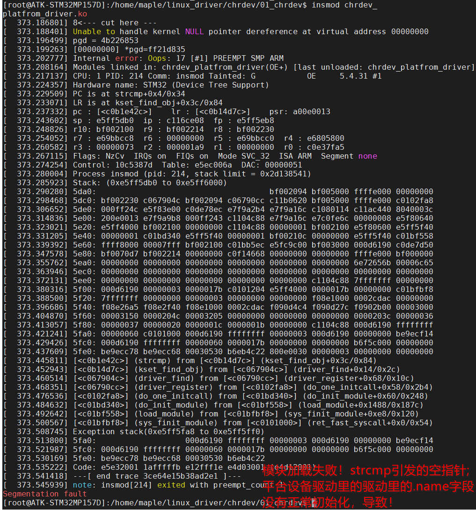

## 新增设备树节点

### 编辑设备树源

位置：/linux-5.4.31/arch/arm/boot/dts/stm32mp157d-atk.dts

在此文件的根节点下的最后一个子单元后面添加关于led的硬件节点信息：

```dtd
stm32mp1_led {
    compatible = "atkstm32mp1-led";
    status = "okay";
    reg = <0X50000A28 0X04      /* RCC_MP_AHB4ENSETR */
           0X5000A000 0X04      /* GPIOI_MODER       */
           0X5000A004 0X04      /* GPIOI_OTYPER      */
           0X5000A008 0X04      /* GPIOI_OSPEEDR     */
           0X5000A00C 0X04      /* GPIOI_PUPDR       */
           0X5000A018 0X04 >;   /* GPIOI_BSRR        */
};
```


### 编译设备树

在Linux内核源码的根目录下，比如我的：

cd /home/ericedward/linux_space/linux_kernel/my_linux_kernel/linux-stm32mp-5.4.31-r0/linux-5.4.31/

执行编译设备树命令：make dtbs


在dts源码目录下找到产出的dtb文件：stm32mp157d-atk.dtb文件。


```
sudo cp /home/ericedward/linux_space/linux_kernel/my_linux_kernel/linux-stm32mp-5.4.31-r0/linux-5.4.31/arch/arm/boot/dts/stm32mp157d-atk.dtb /home/ericedward/linux_space/tools/tftpboot/
```


这是使用网络tftp加载内核镜像和设备树文件。

重启开发板。

/proc/device-tree/目录中查看是否有“stm32mp1_led”这个节点。.


大家可以用 cat 命令查看一下 compatible、status 等属性值是否和我们设置的一致。

代码修改：直接放弃了传统方式从设备C文件获取硬件信息的方法：

```c
static int led_probe(struct platform_device *pdev)
{
	int ret = 0;
	u32 regdata[12]; 
	const char* str;
	struct property *proper;
	

	/* 1. 获取设备节点 */
	chrdev.nd = of_find_node_by_path("/stm32mp1_led");
	if (chrdev.nd == NULL) {
		printk(KERN_ERR "设备树：解析设备节点失败！");
		return -EINVAL;
	} else {
		printk("设备树：以获取到设备节点：stm32mp1_led node found!\r\n");
	}

    /* 2. 获取 compatible 属性内容 */
    proper = of_find_property(chrdev.nd, "compatible", NULL);
	if (proper == NULL) {
		printk(KERN_ERR "设备树：解析属性内容失败！");
		return -EINVAL;
	} else {
		printk("compatible = %s\r\n", (char*)proper->value);
	}

    /* 3. 获取 status 属性内容 */ 
	ret = of_property_read_string(chrdev.nd, "status", &str);
	if (ret < 0) {
		printk(KERN_ERR "设备树：解析 status 属性内容失败！");
		return -EINVAL;
	} else {
		printk("status = %s\r\n",str);
	}

	/* 4. 获取 reg 属性内容 */
	ret = of_property_read_u32_array(chrdev.nd, "reg", regdata, 12);
	if (ret < 0) {
		printk(KERN_ERR "设备树：解析 reg 属性内容失败！");
		return -EINVAL;
	} else {
		u8 i = 0;
		printk("reg data:\r\n");
		for(i = 0; i < 12; i++) 
			{ printk("%#X ", regdata[i]); }
		printk("\r\n"); 
	}

    /* 获取完硬件信息后，开始初始化 LED */ 
    /* 0. 寄存器地址映射 */ 
    MPU_AHB4_PERIPH_RCC_PI = of_iomap(chrdev.nd, 0);
    GPIOI_MODER_PI         = of_iomap(chrdev.nd, 1);
    GPIOI_OTYPER_PI        = of_iomap(chrdev.nd, 2);
    GPIOI_OSPEEDR_PI       = of_iomap(chrdev.nd, 3);
    GPIOI_PUPDR_PI         = of_iomap(chrdev.nd, 4);
    GPIOI_BSRR_PI          = of_iomap(chrdev.nd, 5);

	led_init(); //初始化LED硬件

    /* 2. 注册字符设备 */
    if(chrdev_init()){
		led_deinit();
		return -1;
	}
	
    return 0;
}
```

第一步只是做了上面这些。

## 适配C文件，重新构建

推理：应该把设备c文件删除掉，重新适配Makefile文件，摸出设备C文件参与构建。应该OK。

好了，测试推理完毕，是对的。下面是操作细节：

1. 删除设备c文件；

2. 适配Makefile文件，将设备模块目标删除；

3. 修改代码：比较简单，有个重点需要注意，凡是在linux内核中调用 strcmp 函数做字符串对比操作，若参数为NULL那么就报系统崩溃，若是ko模块，则无法成功加载！刚刚遇到的实际情况是，

   在驱动c文件中的 struct platform_driver 实例对象中的 struct device_driver 实例成员对象里的 .name 字段需要被初始化为非空指针，指向某个字符串。否则栈错误，模块加载失败！

   

4. 将.name字段正确初始化后，就可以正常运行，且验证通过。

   ```c
   static struct platform_driver chrdev_platform_drv = {
       .probe  = led_probe,
       .remove = led_remove,
       .driver = {
   			  /* .name 字段：只需要给不匹配的任意字符串即可触发设备树匹配。但是！！
   			   *			 第一：不能不初始化这个字段！！
   			   *			 第二：不能初始化为 NULL ！！ 否则模块崩溃！！
   			   */
                 .name = "not_matched_strs",
                 .of_match_table = dts_driver_of_match, //使用设备树方式
       },
   };
   ```

   
   
   
