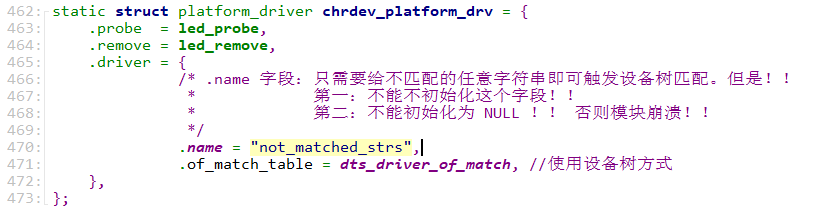

环境：

linux 5.31 正点原子开发板 stm32mp157d-v1.5版本，做linux字符设备驱动和linux平台设备驱动模型的验证，重点在平台设备驱动模型的验证，配置的模式是，硬件设备树led寄存器信息+platform_driver


现象：

在开发板后台上，执行 insmod chrdev_platfrom_driver.ko 操作后，提示模块加载失败！原因是strcmp引用了空指针！平台设备驱动模型的匹配策略大概有4中，其中3种都是比较字符串，也就是调用strcmp函数做字符串对比。内核不允许未初始化的野指针引用字符串，这种就是没有初始化的，也不允许初始化为NULL指针的name，因为字符串内容不合法，所以内核也给判定为蹦溃。


问题根源分析：platform_driver.driver.name 未正确初始化
在提供的代码中，platform_driver 结构体的 .driver.name 字段未被赋值，导致驱动注册时内核尝试对 NULL 指针执行 strcmp，触发空指针异常。以下是详细分析和修复方案：实操验证：问题出在：struct platform_driver 类型对象的实例化中：

```
static struct platform_driver chrdev_platform_drv = {
    .probe  = led_probe,
    .remove = led_remove,
    .driver = {
    /* .name 字段：只需要给不匹配的任意字符串即可触发设备树匹配。但是！！
     *            第一：不能不初始化这个字段！！
     *            第二：不能初始化为 NULL ！！
    */
              .name = "not_matched_strs", 
              .of_match_table = dts_driver_of_match, //使用设备树方式
    },
};
```

注意：



