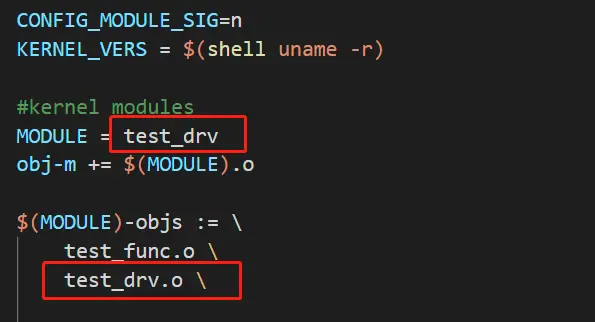
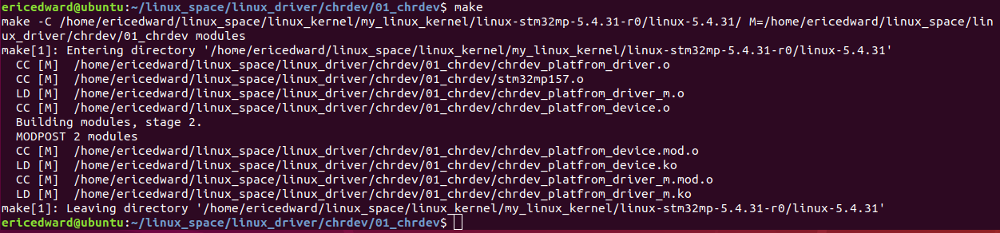

# WARNING: modpost: missing MODULE_LICENSE()

今天在对驱动进行编译时，出现了一个警告信息

> WARNING: modpost: missing MODULE_LICENSE() in .....

检查驱动发现，驱动中已经添加了`MODULE_LICENSE("GPL v2");` ，但为什么还会提示缺少MODULE_LICENSE()呢

当检查`Makefile`的时候，发现MODULE的名字和需要编译的文件名重名了。




当重名时，编译信息如下：

```ruby
  CC [M]  /root/drv/test_func.o
  LD [M]  /root/drv/test_drv.o
  Building modules, stage 2.
  MODPOST 1 modules
WARNING: modpost: missing MODULE_LICENSE() in /root/drv/test_drv.o
see include/linux/module.h for more information
  CC [M]  /root/drv/test_drv.mod.o
  LD [M]  /root/drv/test_drv.ko
```

将Makefile中的MODULE的名字改为 test，信息编译如下


```rust
  CC [M]   /root/drv/test_func.o
  CC [M]   /root/drv/test_drv.o
  LD [M]   /root/drv/test.o
  Building modules, stage 2.
  MODPOST 1 modules
  CC [M]   /root/drv/test.mod.o
  LD [M]   /root/drv/test.ko
```

上面的编译信息可以看到，当重名时，只编译了一个文件 `CC [M] /root/drv/test_func.o`，当不重名时，编译了两个文件`CC [M] /root/drv/test_func.o`和
`CC [M] /root/drv/test_drv.o`


我也遇到这样的问题，估计是一个原因，我知道我也这样做了。哈哈哈 2025年4月15日15:11:37。

```makefile
# 临时禁用模块签名验证功能
CONFIG_MODULE_SIG = n

# KDIR 是开发板所使用的源代码的 Linux 内核源码的根目录
KDIR := /home/ericedward/linux_space/linux_kernel/my_linux_kernel/linux-stm32mp-5.4.31-r0/linux-5.4.31/
CURRENT_PATH := $(shell pwd)
TARGET_PATH  := /home/ericedward/linux_space/tools/nfs/rootfs/home/maple/linux_driver/chrdev/01_chrdev/
WORKING_PATH := /home/ericedward/linux_space/linux_driver/chrdev/01_chrdev

# 指定生成模块目标
obj-m += chrdev_platfrom_driver.o
obj-m += chrdev_platfrom_device.o

chrdev_platfrom_driver-objs := stm32mp157.o # 定义demo_chrdev目标的依赖，注意：是 -objs 别少s！
ccflags-y += -I$(WORKING_PATH)/include #Kbuild语法限制：-IPath，-I后直接加路径，无空格！！

all:
	$(MAKE) -C $(KDIR) M=$(CURRENT_PATH) modules

clean:
	$(MAKE) -C $(KDIR) M=$(CURRENT_PATH) clean # 正在删除 Linux 字符设备驱动的编译产出文件……
	rm -f **.out **.a  # 正在删除应用程序的编译产出文件……

testapp:testapp.c
	arm-none-linux-gnueabihf-gcc -I$(WORKING_PATH)/include $(WORKING_PATH)/testapp.c -o $(WORKING_PATH)/testapp.out

deploy:
	sudo cp $(CURRENT_PATH)/**.ko  $(TARGET_PATH)
	sudo cp $(CURRENT_PATH)/**.out $(TARGET_PATH)
```

这是修改后的Makefile

```makefile
# 临时禁用模块签名验证功能
CONFIG_MODULE_SIG = n

# KDIR 是开发板所使用的源代码的 Linux 内核源码的根目录
KDIR := /home/ericedward/linux_space/linux_kernel/my_linux_kernel/linux-stm32mp-5.4.31-r0/linux-5.4.31/
CURRENT_PATH := $(shell pwd)
TARGET_PATH  := /home/ericedward/linux_space/tools/nfs/rootfs/home/maple/linux_driver/chrdev/01_chrdev/
WORKING_PATH := /home/ericedward/linux_space/linux_driver/chrdev/01_chrdev

# 指定生成模块目标
obj-m += chrdev_platfrom_driver_m.o # 保证目标不能跟c文件重名，多个c文件依赖的时候。
obj-m += chrdev_platfrom_device.o
# 内核模块的构建系统（Kbuild）要求通过 `<module_name>-objs` 指定模块的依赖对象文件，而非直接赋值给模块名。
# 错误写法：demo_chrdev := chrdev.o stm32mp157.o 
chrdev_platfrom_driver_m-objs := chrdev_platfrom_driver.o stm32mp157.o # 定义demo_chrdev目标的依赖，注意：是 -objs 别少s！

# 在模块的 Makefile 中，使用 ccflags-y 或 CFLAGS_MODULE 指定自定义头文件路径
# 添加自定义头文件路径（相对于 Makefile 的路径）
#$(info CURRENT_PATH is $(CURRENT_PATH)) # 确保 CURRENT_PATH 正确展开（调试用）
ccflags-y += -I$(WORKING_PATH)/include #Kbuild语法限制：-IPath，-I后直接加路径，无空格！！

all:
# modules 不是 Makefile 关键字，但在 Linux 内核驱动开发中常用作目标名称，用于编译内核模块（生成 .ko 文件）
# M 表示模块的源码目录。“make modules”命令根据M指定的路径，编码模块源码。
	$(MAKE) -C $(KDIR) M=$(CURRENT_PATH) modules

clean:
# clean 是 Makefile 中常见的伪目标（phony target），用于清理编译生成的文件。
# clean不是关键字，但广泛用于伪目标声明，需通过 .PHONY: clean 声明为伪目标，避免与同名文件冲突。
	$(MAKE) -C $(KDIR) M=$(CURRENT_PATH) clean # 正在删除 Linux 字符设备驱动的编译产出文件……
	rm -f **.out **.a  # 正在删除应用程序的编译产出文件……

testapp:testapp.c
# "-I[path]"命令配置选项，指定自定义头文件路径。比如下面的：-I$(WORKING_PATH)/include
	arm-none-linux-gnueabihf-gcc -I$(WORKING_PATH)/include $(WORKING_PATH)/testapp.c -o $(WORKING_PATH)/testapp.out

deploy:
# 将编译产出的 .ko 可执行文件，复制到STM32MP157d开发板对应的linux文件系统内的合适的路径下。
# scp 是安全拷贝命令，security cp，跨主机拷贝命令。不跨主机直接使用 cp 。
# sudo scp $(CURRENT_PATH)/**.ko $(TARGET_PATH)
	sudo cp $(CURRENT_PATH)/**.ko  $(TARGET_PATH)
	sudo cp $(CURRENT_PATH)/**.out $(TARGET_PATH)

# 在上面Makefile中没有直接调用编译器（如gcc或arm-none-linux-gnueabihf-gcc）编译源代码。
# 这是因为 Linux 内核的模块构建系统（Kbuild系统）会间接执行编译过程。
# 内核模块编译通过$(MAKE) -C $(KDIR) M=$(CURRENT_PATH) modules命令触发内核顶层的Kbuild系统，该系统会自动：
# 1. 调用内核配置的交叉编译器（通过$(CC)变量）
# 2. 应用内核的编译规则（如-Wall、-O2等标志）
# 3. 处理模块签名、版本检查等内核特有流程

# 下面这个执行OK：
# ericedward@ubuntu:~/linux_space/linux_driver/chrdev/01_chrdev$ arm-none-linux-gnueabihf-gcc testapp.c -o testapp.out
# 下面这个被注释的2行脚本执行失败：
#testapp:testapp.c
#	$(MAKE) $(CURRENT_PATH)/testapp.c -o $(CURRENT_PATH)/testapp.out
# 默认情况下，make只处理Makefile中定义的目标。如果没有对应规则，它会认为"无事可做"
# 默认规则缺失：Makefile中没有定义如何从.c文件生成.out文件的规则
# 命令格式错误：你尝试的Makefile规则$(MAKE) $(CURRENT_PATH)/testapp.c -o ...是错误的语法。make不能直接编译源文件，除非明确指定规则

# $(MAKE)是GNU Make的内置变量，展开为当前使用的make命令路径（如/usr/bin/make）。它本身不专属于Kbuild系统，而是Make工具的标准特性。
# linux 的 Kbuild系统（内核构建系统）强制要求使用$(MAKE)进行递归调用。
# 普通应用程序同样可通过$(MAKE)实现递归构建。


```

修改之后，可以正常编译通过。

