路程心得：

1. 开发Linux驱动程序，至少需要走一遍把 Linux 系统跑起来的基本步骤，在不深入阅读uboot源码的前提下也是可以的：

   - STM32MP157D 的芯片启动流程：BootROM、TF-A、U-Boot；
   - 编译 Linux 系统，输出镜像文件：bootfs.ext4 或网络调试；
   - 产出根文件系统，rootfs；

   可以使用正点原子开发板 STM32MP157D v1.5 ，完整走完整个过程，过程漫漫，需要耐心，可以走通。别通过视频，啰里啰嗦，通过文档《【正点原子】STM32MP1嵌入式Linux驱动开发指南V2.1.pdf》尽管也啰里啰嗦，但是效率高很多。没必要购买树莓派去学习，而且树莓派好像是，不提供此部分的开源代码。

2. 上面的好费时间，直接开发多舒服。所以上面的路走一次就行了。主要把精力集中到驱动开发等linux内核开发上来。

   


# STM32MP157D的启动流程

[todo]


# ubuntu 开发环境配置

**tar参数选项**：

C – 创建压缩文件
x – 解压文件
v – 显示进度.
f – 文件名.
t – 查看压缩文件内容.
j – 通过bzip2归档
z –通过gzip归档
r – 在压缩文件中追加文件或目录
W – 验证压缩文件

**压缩命令**：

```bash
# 将 tar 命令执行时所在的路径下所有文件打包，压缩选项可配置，压缩名字可配置，声场的压缩包的输出路径可配置。
tar -czvf 压缩包名.tar.gz 目标文件夹路径
tar -cJvf 压缩包名.tar.xz 目标文件夹路径  # 压缩过程需要很长时间 比如输出文件：linux-5.4.31-adaptedOK.tar.xz
tar  -cvf 压缩包名.tar    目标文件夹路径
```

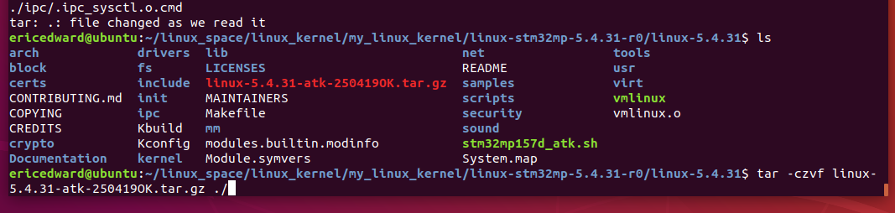

**解压缩命令**：

```bash
# tar -options filename.xxx -C /target/path
tar -xvf  filename.tar
tar -xvf  filename.tar
tar -xzvf filename.tar.gz
tar -xjvf filename.tar.bz2
```


## 交叉编译环境

## 文件传输

搭建FTP服务器。在Ubuntu上安装FTP服务器，在windows主机上安装客户端即可。过程相对简单，这里略过。

注意此 FTP 服务器与uboot使用的tftp服务器[不同](./files/ftp 和 tftp 嵌入式Linux开发中，有啥区别？.md)，这里用于windows与虚拟机ubuntu间的大文件传输。

## 镜像传输

### 配置开发网络环境

篇幅繁冗，请查看 [配置开发网络环境](./files/配置开发网络环境.pdf) 详情。

### **NFS 服务器端安装与配置**

NFS(Network File System)网络文件系统，通过 nfs 可以在计算机之间通过网络来分享资源， 比如我们将 linux 镜像和设备树文件放到 Ubuntu 中，然后在 uboot 中使用 nfs 命令将 Ubuntu 中 的 linux 镜像和设备树下载到开发板的 DRAM 中。

1. 在Ubuntu主机上安装NFS服务器端软件，执行如下命令：

   ```bash
   sudo apt-get install nfs-kernel-server rpcbind
   ```

2. 创建一个自定义的文件夹，用于NFS服务，比如：/home/ericedward/linux_space/tools/nfs

3. 将第二步用于NFS服务的文件夹信息，绑定到NFS服务系统中：

   3.1 sudo vi /etc/exports 

   3.2 添加如下文本内容：

   ```bash
   /home/ericedward/linux_space/tools/nfs *(rw,sync,no_root_squash)
   ```

4. 保存后，重启ubuntu的NFS服务：

   ```bash
   sudo /etc/init.d/nfs-kernel-server restart
   ```

### **TFTP 服务器端安装与配置**

此服务端主要为uboot网络tftp命令加载系统镜像文件服务。

在嵌入式 Linux 开发中，FTP（File Transfer Protocol）和 TFTP（Trivial File Transfer Protocol）是两种常用的文件传输协议，但在协议设计、使用场景和功能特性上有显著区别。以下是它们的核心差异及嵌入式开发中的适用场景：

- FTP基于TCP（面向连接，可靠传输），适合大量复杂的功能，大文件的支持上传、下载、删除、重命名、目录操作等，实现复杂度高（完整会话管理），数据传输完整性高。
- TFTP基于UDP（无连接，快速但不可靠），适合在 U-Boot 阶段，通过 TFTP 从主机下载内核镜像（uImage）、设备树（.dtb）或根文件系统（initramfs）。文件操作上，仅支持上传和下载，实现复杂度低（轻量级协议），数据完整性低低（无重传机制，依赖应用层校验）。

tftp 命令的作用和 nfs 命令都可通过网络下载镜像文件到 DRAM 中， tftp 命令使用的是 TFTP 协议，Ubuntu 主机作为 TFTP 服务器。

1. 在 Ubuntu 上搭建 TFTP 服务器，需要安装 tftp-hpa 和 tftpd-hpa，命令如下：

   ```bash
   sudo apt-get install tftp-hpa tftpd-hpa
   sudo apt-get install xinetd
   ```

2. 在Ubuntu上自定义一个合适的文件夹，用于存放与tftp服务相关的文件：

   ```bash
   mkdir /home/ericedward/linux_space/tools/tftpboot      #自定义一个文件夹
   chmod 777 /home/ericedward/linux_space/tools/tftpboot  #配置文件夹权限
   ```

3. 后配置 tftp，`sudo vi /etc/xinetd.d/tftp`，如果没有/etc/xinetd.d目录则自行创建，并在此文件内输入如下内容： 

   ```bash
   # /etc/xinetd.d/tftp 文件内容 
   server tftp 
   { 
       socket_type    = dgram 
       protocol       = udp 
       wait           = yes 
       user           = root 
       server         = /usr/sbin/in.tftpd 
       server_args    = -s /home/ericedward/linux_space/tools/tftpboot
       disable        = no 
       per_source     = 11
       cps            = 100 2
       flags          = IPv4 
   }
   ```

4. 完了以后启动 tftp 服务，命令如下：

   ```bash
   sudo service tftpd-hpa start
   ```

5. `sudo vi /etc/default/tftpd-hpa` 文件，将其修改为如下所示内容： 

   ```bash
   # /etc/default/tftpd-hpa 
   
   TFTP_USERNAME="tftp" 
   TFTP_DIRECTORY="/home/ericedward/linux_space/tools/tftpboot"  
   TFTP_ADDRESS=":69"                                 
   TFTP_OPTIONS="-l -c -s" 
   ```

6.  重启 tftp 服务器： 

   ```bash
   sudo service tftpd-hpa restart
   ```

tips：tftp 服务器已搭建完毕。使用时，将 uImage 镜像文件拷贝到 tftpboot 文件夹中，并且给予 uImage 相应的权限，剩下的就可以在uboot客户端操作了。


# U-Boot

## 启动方式

自动启动与手动启动的区别：自动启动是手动启动的各个操作步骤写入到uboot的 `bootcmd` 启动环境变量里的等价形式。

**从EMMC中启动Linux系统**

需使用ext4load命令将uImage和设备树文件stm32mp157d-atk.dtb从EMMC分区2中拷贝到DRAM里去，最后使用bootm命令启动。

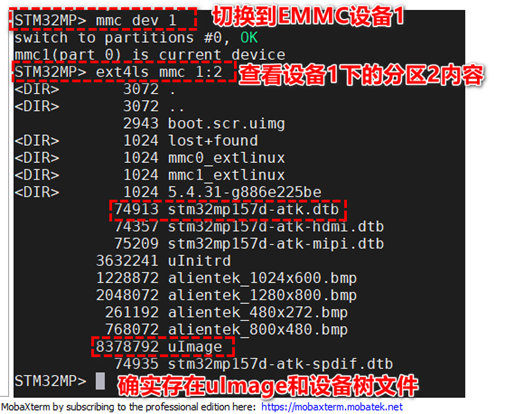

使用命令 ext4load 将 uImage 和 stm32mp157d-atk.dtb 文件拷贝到 DRAM 中，地址分别为 0XC2000000 和 0XC4000000，最后使用 bootm 启动，命令如下：

```bash
# 这是uboot的手动命令，也可以写入环境变量，自动执行者一系列流程，自动启动。
ext4load mmc 1:2 c2000000 uImage
ext4load mmc 1:2 c4000000 stm32mp157d-atk.dtb
bootm c2000000 - c4000000
```

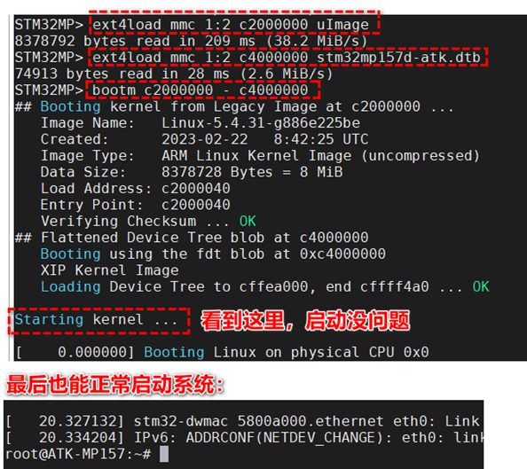

**网络启动Linux系统**

常见的网络启动类型为：uboot的 **tftp命令** 启动和 **nfs命令** 启动。

在uboot控制台使用<a name="tftp加载到DDR方式">tftp加载到DDR方式</a>，将Ubuntu上tftp服务器目录里 uImage 和设备树文件加载到STM32MP157d开发板的DDR内：

```bash
# 1. 加载 uImage 
tftp c2000000 uImage
# 2. 加载设备树文件
tftp C4000000 stm32mp157d-atk.dtb   # 注意：请根据实际情况适配设备树文件名字（二选一！）
#tftp C4000000 stm32mp157d-ed1.dtb  # 这是ST官方默认的配置文件名字（二选一！）
# 3. 启动Linux内核
bootm C2000000 – C4000000           #这个也需要注意适配
```


## U-Boot 环境变量配置

U-Boot 环境变量的存储位置

环境变量存储机制
U-Boot 的环境变量默认存储在 独立的分区或存储区域（如 Flash、eMMC、SD 卡等），而非 U-Boot 镜像文件所在的分区。以下为典型场景：

(1) 存储位置

- NOR/NAND Flash：

  环境变量保存在 Flash 的固定偏移地址（如 CONFIG_ENV_OFFSET=0x80000）。

- eMMC/SD 卡：

  环境变量可能位于 BOOT 分区的特定区域（如 CONFIG_SYS_MMC_ENV_DEV=0）。

- SPI Flash：

  通过 CONFIG_ENV_OFFSET 指定偏移地址。

(2) 持久化机制

- 通过 saveenv 命令将环境变量写入存储介质，即使 U-Boot 镜像更新，这些区域也不会被覆盖。

重新编译 U-Boot 镜像不影响环境变量的原因：

- 镜像与环境变量分离：

  新编译的 u-boot.bin 仅包含 U-Boot 的代码和数据，不包含环境变量区域。

- 烧写操作范围：

  烧写工具（如 dd、fastboot）通常仅覆盖 U-Boot 镜像所在分区，不会擦除环境变量区域。

所以，若重新烧写了uboot镜像，且先前设置过的uboot环境变量，尤其是 bootcmd ，的值仍然存在，则其原因是：

- 环境变量独立存储：

  重新编译和烧写 U-Boot 镜像不会影响已保存的环境变量。

- 清除方法：

  通过 U-Boot 命令或直接擦除存储区域手动清除。

- 预防建议：

  在源码中更新默认值，或在烧写流程中集成环境变量擦除操作。

确定环境变量存储的位置

修改环境变量存储的位置

环境变量的设置过程

**网络环境变量配置**

```bash
# uboot 网路环境变量的配置项，根据实际情况适配。在uboot的控制台执行如下命令设置。
setenv ipaddr 192.168.10.50       # 客户端IP，即开发板IP地址；
setenv ethaddr b8:ae:1d:01:01:00  # 开发板的 MAC 地址；
setenv gatewayip 192.168.10.1     # 网段中的网关IP地址；
setenv netmask 255.255.255.0      # 子网掩码
setenv serverip 192.168.10.100    # 服务器IP地址，即Ubuntu主机IP地址；
saveenv
```

**启动环境变量 bootcmd 的配置**

uboot的 `boot` 命令会读取环境变量  `bootcmd` 来启 动 Linux 系统，`bootcmd` 是一个很重要的环境变量！
`bootcmd`环境变量的内容是多条Linux启动命令的集合，它的值是可修改的，也就是说具体的Linux启动引导操作序列是可以修改。

假设我们要想使用 tftp 命令从网络启动 Linux 那么就可以设置 bootcmd 环境变量的值为“tftp c2000000 uImage;tftp c4000000 stm32mp157d-atk.dtb;bootm c2000000 - c4000000”， 然后使用 saveenv 将 bootcmd 保存在非易失存储设备的独立分区上。然后直接输入 boot 命令即可从网络启动 Linux 系统， 命令如下：

```bash
# 网络启动方式
setenv bootcmd 'tftp c2000000 uImage;tftp c4000000 stm32mp157d-atk.dtb;bootm c2000000 - c4000000'   
# eMMC启动方式
setenv bootcmd 'ext4load mmc 1:2 c2000000 uImage;ext4load mmc 1:2 c4000000 stm32mp157d-atk.dtb;bootm c2000000 - c4000000' 

saveenv 
boot

```

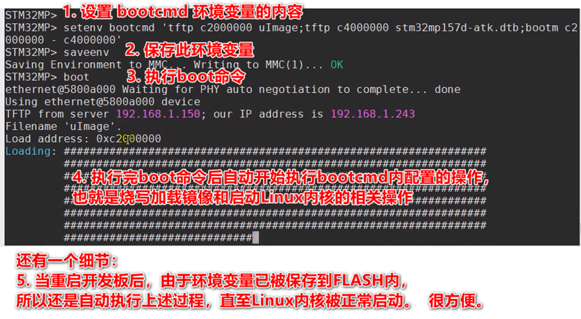

如上图，这就设置了，开机从主机网络内加载镜像启动Linux内核的操作模式。
从网络启动Linux内核的方式，是我们嵌入式Linux开发者在开发过程中的主要使用手段。
直到产品开发流程结束，才会转到从EMMC加载内核的方式启动Linux系统。此时，直接将bootcmd环境变量的值适配成从EMMC加载启动的相关操作命令，即可。

**bootargs 环境变量** 

bootargs 保存着 uboot 传递给 Linux 内核的参数，比如指定 Linux 内核所使用的 console、指定根文件系统所在的分区等，如下面 bootargs 环境变量值： 

```
console=ttySTM0,115200 root=/dev/mmcblk2p3 rootwait rw
```


## ST 官方 U-Boot 编译

**了解关于ST官方开发板的官方信息**

了解STM32MP157d开发板的官方信息：[uboot官方STM32MP157d信息](./files/uboot/STM32MP1xx boards — Das U-Boot unknown version documentation (2025_3_14 11：03：46).html)、 [ST官方uboot信息](./files/ST/STM32MP15 U-Boot - stm32mpu.html)。

**一些困惑：**

1. include/configs/stm32mp15_common.h   这个文件怎么在uboot源代码中不存在？请参阅：[答案](./files/uboot源码中 stm32mp15_common.h 文件不存在.md)

2. Kconfig 的语法，参考官方 [kconfig-language.rst](./files/kconfig-language.rst) 文件。 Kconfig 在U-Boot/Linux/鸿蒙都有使用。

3. 为什么我重新编译了uboot生成镜像文件并烧写后，之前的uboot环境变量还是存在？ [答案](./files/uboot环境变量存储的位置.md)

【1】 **获取 ST 官方 uboot 源码**

从官方提供的开发包 en.SOURCES-stm32mp1-openstlinux-5-4-dunfell-mp1-20-06-24.tar.xz 内得到 u-boot-stm32mp-2020.01-r0 源码。

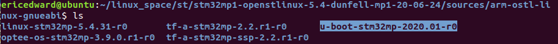

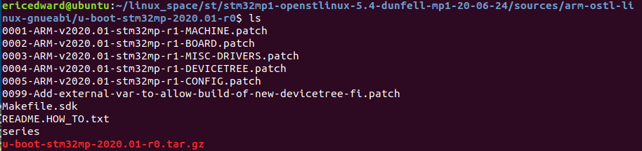

将此文件夹，完整地复制到自定义的文件夹内，便于开发。我放在 `/home/ericedward/linux_space/uboot/my_uboot/u-boot-stm32mp-2020.01-r0` 下。

【2】**解压文件**

```bash
u-boot-stm32mp-2020.01-r0$ tar -xvf u-boot-stm32mp-2020.01-r0.tar.gz 
```

【3】**打补丁**

```bash
cd u-boot-stm32mp-2020.01/                          # 进入相应目录下
for p in `ls -1 ../*.patch`;do patch -p1 < $p;done  # 打补丁操作
```

【4】**编译 ST 官方 uboot 源码**

【4.1】先修改Makefile，设定 ARCH 和 CROSS_COMPILE.

```bash
ARCH = arm   # line 266
CROSS_COMPILE = arm-none-linux-gnueabihf-  # line 267 
```

【4.2】**生成配置文件，并编译**

```makefile
# 1. 生成 ./scripts/kconfig/conf 文件，他是一个可执行程序，用来
# 2. 生成配置文件.config
make stm32mp15_trusted_defconfig           # 现存的配置文件，生成.config（显式覆盖+兜底默认配置）
# 若想看详细细节 加 -p 选项 下面有生成的文件 log.txt
# make stm32mp15_trusted_defconfig -p > log.txt 
```

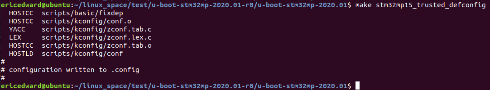

先对此条操作，做详细分析：生成的日志内容详见 [log.txt](./files/uboot-log.txt)

```makefile
# Q = @; silent 无定义，等价于空，忽略;
# 在构建过程中，--defconfig 是用于指定默认配置文件（Default Configuration）的关键参数，常见于 U-Boot、Linux 内核等项目的编译流程中。它的核心作用是 快速生成一个预定义的、针对特定硬件或场景的编译配置（.config 文件）。
# SRCARCH := ..
# Kconfig := Kconfig ；$(Kconfig)，指定 Kconfig 配置系统的入口文件（通常是项目根目录的 Kconfig）
# 最终转化为： scripts/kconfig/conf  --defconfig=arch/../configs/stm32mp15_trusted_defconfig Kconfig
stm32mp15_trusted_defconfig: scripts/kconfig/conf
	$(Q)$< $(silent) --defconfig=arch/$(SRCARCH)/configs/$@ $(Kconfig)
	
# Makefile 常识细节补充
# 在 Makefile 中，$@ 是一个自动变量（Automatic Variable），表示当前规则中的目标文件名（即规则左侧定义的目标）。它的作用是动态引用当前规则的目标名称，避免硬编码文件名，提高 Makefile 的灵活性和可维护性。在本例中，$@ 的值：当前规则的目标是 stm32mp15_trusted_defconfig，所以 $@ 会被替换为 stm32mp15_trusted_defconfig。
# 其他常见自动变量（补充）：
# $<：当前规则的第一个依赖项（即 scripts/kconfig/conf）。
# $^：当前规则的所有依赖项。
# $?：比目标文件更新的依赖项列表。
# $*：匹配通配符规则时的词干（例如 %.o 中的 % 部分）。

# 下面内容是上面的依赖细节，用于生成 ./scripts/kconfig/conf 二进制程序文件，用来处理顶层 Kconfig系统 和 stm32mp15_trusted_defconfig 文件的配置信息，最终生成 .config 文件。
scripts/kconfig/conf: FORCE scripts/kconfig/conf.o scripts/kconfig/zconf.tab.o
	$(call if_changed,host-cmulti)
	
scripts/kconfig/conf.o: scripts/kconfig/conf.c FORCE
	$(call if_changed_dep,host-cobjs)
	
scripts/kconfig/zconf.tab.o: scripts/kconfig/zconf.tab.c FORCE scripts/kconfig/zconf.lex.c
	$(call if_changed_dep,host-cobjs)
```

**细节1：**在 make stm32mp15_trusted_defconfig 后生成的 ./scripts/kconfig/conf  文件，他的作用是什么？[答案](./files/在 make stm32mp15_trusted_defconfig 后生成的 .scriptskconfigconf  文件，他的作用是什么？.md)

首先，他是一个二进制小程序，不是文本文件。其次，这个 conf 小程序是通过主机编译相关的 .c 文件后生成的。

```makefile
# 这里的第一个依赖就是生成 ./scripts/kconfig/conf 二进制程序文件，细节是依赖源代码中编译规则指定的相关C文件编译后生成的。
stm32mp15_trusted_defconfig: scripts/kconfig/conf
	$(Q)$< $(silent) --defconfig=arch/$(SRCARCH)/configs/$@ $(Kconfig)
```

它的细节如下：

- 解析 Kconfig 结构
  - Kconfig 系统通过项目目录中的 `Kconfig` 文件定义所有可配置选项（如驱动、硬件支持、功能开关等）。
  - `conf` 工具会递归解析这些 `Kconfig` 文件，构建出完整的配置选项树和依赖关系。
- 合并默认配置
  - 当运行 `make stm32mp15_trusted_defconfig` 时，实际是调用 `conf` 工具将预定义的配置文件（如 `configs/stm32mp15_trusted_defconfig`）与 Kconfig 的默认值结合。
  - 它会加载 `stm32mp15_trusted_defconfig` 中的用户配置，并覆盖 Kconfig 中定义的默认值。
- 解决依赖关系
  - Kconfig 选项通常存在依赖（例如启用某个驱动可能需要先启用特定的硬件支持）。
  - `conf` 工具会自动处理这些依赖关系，确保生成的 `.config` 是自洽的。如果存在冲突或缺失的依赖，它会报错或自动修正。
- 生成 `.config` 文件
  - Kconfig 选项通常存在依赖（例如启用某个驱动可能需要先启用特定的硬件支持）。
  - `conf` 工具会自动处理这些依赖关系，确保生成的 `.config` 是自洽的。如果存在冲突或缺失的依赖，它会报错或自动修正。

**细节2：**stm32mp15_trusted_defconfig 文件内容是ST官方对其开发板的显式配置信息。如下图：

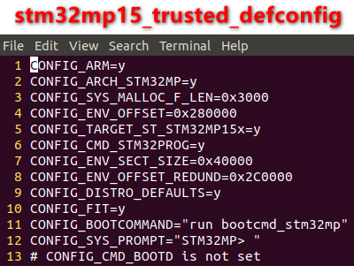

**细节3：**U-Boot源代码项目的根路径下的 Kconfig 文件用于：

- 管理配置项，包含配置项的默认值。
- 生成用户配置的交互界面
- 生成 .config 文件
- 处理依赖关系

顶层 `Kconfig` 文件的作用是 **定义配置框架**，而非直接提供所有默认值：

- **集成子系统的配置**：
   通过 `source` 指令引入子目录的 Kconfig 文件（如 `source "drivers/Kconfig"`）。
- **维护全局依赖关系**：
   例如，架构相关的选项（如 `ARCH_STM32MP15`）可能影响外设驱动的可用性。
- **提供兜底默认值**：
   如果某个配置项未被 `defconfig` 文件覆盖，则使用 Kconfig 中定义的 `default` 值。

**`defconfig` 文件的优先级高于 Kconfig 的 `default`**：
 显式定义的配置项（如 `CONFIG_XXX=y`）会直接覆盖 Kconfig 中的默认值。

**顶层 Kconfig 的作用是框架整合**：
 它定义配置选项的结构和依赖关系，而非最终值。

**覆盖的实质是合并逻辑**：
 `conf` 工具将 `defconfig` 的显式配置与 Kconfig 的默认值和依赖规则结合，生成最终有效的 `.config`。

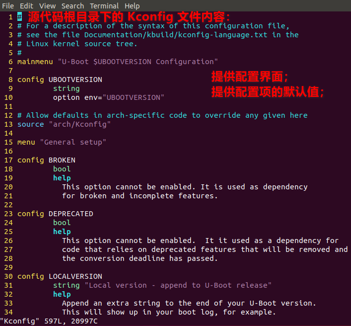

【4.3】**编译**

```bash
# 编译 
make DEVICE_TREE=stm32mp157d-ev1 all -j4   # 执行编译操作
```

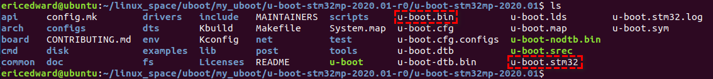

编译过程的动态日志，也能看到一些重要的细节，因此是有价值的，这里给出[日志文件](./files/make_uboot_log.txt)。

uboot 编译成功，生成了 u-boot.bin 和 u-boot.stm32。

- u-boot.bin 包含了设备树(dtb)，也就是将 uboot 镜像和设备树打包在了一起。 
- u-boot.stm32 是在 u-boot.bin前面添加了 256 字节头部信息的可执行文件，是要烧写到开发板里面的。 

【5】 **烧写测试**

这一步需要基于正点原子STM32MP157d开发板的出厂脚本flashlayout.tsv进行适配。下面是适配后的版本，修改了第六行的uboot文件名。

```
#Opt	Id		Name		Type		Device	Offset		Binary
-		0x01	fsbl1-boot	Binary		none	0x0			tf-a-stm32mp157d-atk-serialboot.stm32
-		0x03	ssbl-boot	Binary		none	0x0			u-boot.stm32
P		0x04	fsbl1		Binary		mmc1	boot1		tf-a-stm32mp157d-atk-trusted.stm32
P		0x05	fsbl2		Binary		mmc1	boot2		tf-a-stm32mp157d-atk-trusted.stm32
P		0x06	ssbl		Binary		mmc1	0x00080000	my_u-boot.stm32
```

其中，第三行的 u-boot.stm32 文件是uboot的全功能版本，被 STM23CubeProgrammer调用，先向开发板的 DDR 里面下载一个完整的 uboot 进去，用这个 uboot 来烧写系统。所以必须保证这个下载到 DDR 里面的 uboot 是工作正常的，但是我们刚刚编译出来的uboot 可执行文件肯定是有问题的，所以下载到 DDR 中的 uboot 必须用正点原子提供的，烧写到 EMMC 里面的是我们刚刚编译的，这两个 uboot 要区分开。 于是将刚刚自己编译出来的ST原版uboot重命名为my_u-boot.stm32在第六行脚本里适配。最后可以烧录测试。

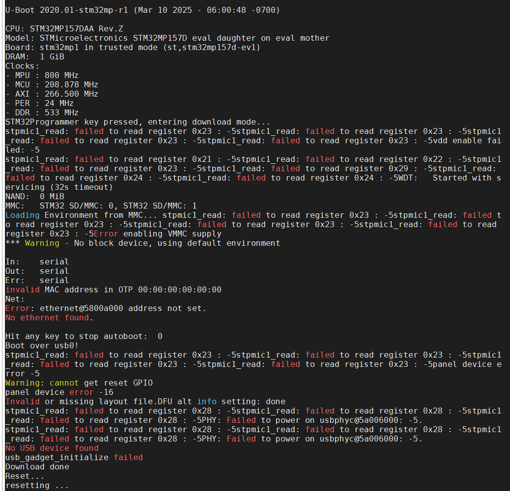

测试结果：启动失败，无法进入uboot，不断重启开发板，且蜂鸣器发出滴滴声。下面是正点原子给的分析结果：

1. uboot 能运行，也就是说 ST 官方 EVK 开发板的 uboot 可以直接在正点原子的开发板上运行，但是运行会出错！
2. uboot 版本为U-Boot 2020.01-stm32mp-r1 (Mar 10 2025 - 06:00:48 -0700)，说明运行的就是我们刚刚编译的版本。
3. 出现了“stpmic1_read: failed to read register”错误，前面讲解 TF-A 的时候已经说了，ST 官方 EVK 开发板使用了电源管理芯片 STPMIC1A，所以 uboot 运行的时候会初始化这个PMIC 芯片，但是正点原子开发板并没有使用这个 PMIC 芯片，所以就会报 STPMIC 错误！

接下来就是一步步的修改 uboot，至到其正常工作，也就是所谓的 uboot 移植。

## U-Boot 移植

移植过程详情参考：[正点原子STM32MP157d-uboot移植内容](./files/正点原子STM32MP157d-uboot移植内容.txt)

编译结束后，生成的 u-boot.stm32 文件，就是我们需要烧写的镜像文件。

**移植过后，测试U-Boot**

### 从 EMMC 启动 Linux

1. 加入Linux镜像需要烧写文件atk-image-bootfs.ext4 （=Linux镜像文件：uImage + stm32mp157d-atk.dtb文件），到烧写的文件夹路径里，我放在桌面的Image文件夹里。

   - 获取出厂镜像 atk-image-bootfs.ext4 位置是：C:\Users\EricEdward\Desktop\【正点原子】STM32MP157开发板（A盘）-基础资料\08、系统镜像\02、出厂系统镜像\01、STM32CubeProg烧录固件包\atk-image-bootfs.ext4。说明：从EMMC启动也就是将编译出来的Linux镜像文件uImage和.dtb设备树文件保存在EMMC中，uboot 从 EMMC 中读取这两个文件并启动，这个是我们产品最终的启动方式。atk-image-bootfs.ext4 是 ext4 格式的打包文件，因为 STM32CubeProgrammer软件要求将 uImage 和.dtb 打包在一起，格式为 ext4。

   - 修改FlashLayout.tsv文件，新增一行:

     ```
     P	0x21	boot	System	mmc1	0x00280000	atk-image-bootfs.ext4
     
     # 修改后的tsv文件内容如下：
     #Opt	Id		Name		Type		Device	Offset		Binary
     -		0x01	fsbl1-boot	Binary		none	0x0			tf-a-stm32mp157d-atk-serialboot.stm32
     -		0x03	ssbl-boot	Binary		none	0x0			u-boot.stm32
     P		0x04	fsbl1		Binary		mmc1	boot1		tf-a-stm32mp157d-atk-trusted.stm32
     P		0x05	fsbl2		Binary		mmc1	boot2		tf-a-stm32mp157d-atk-trusted.stm32
     P		0x06	ssbl		Binary		mmc1	0x00080000	u-boot.stm32
     P		0x21	boot		System		mmc1	0x00280000	atk-image-bootfs.ext4
     ```

2. 重新烧写，烧写完成

   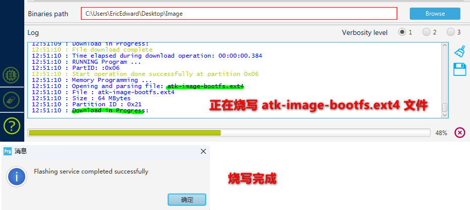

3. 使用 ext4ls 命令查看一下 EMMC 的分区 2 里面有没有 uImage 和.dtb 文件：

   ```
   ext4ls mmc 1:2
   ```

   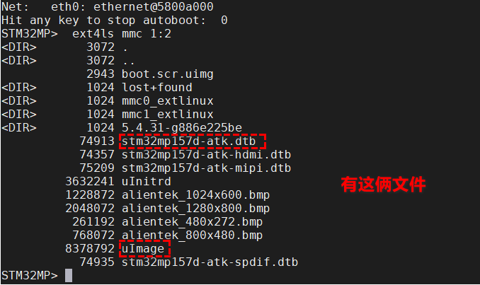

4. 在设置 bootcmd 环境变量从 EMMC 里面读取系统文件时，需要加载的就包括上图中的 uImage 和 stm32mp157d-atk.dtb 这两个文件。设置 bootcmd 从eMMC 启动的具体命令如下：

   ```
   setenv bootcmd 'ext4load mmc 1:2 c2000000 uImage;ext4load mmc 1:2 c4000000 stm32mp157d-atk.dtb;bootm c2000000 - c4000000' 
   saveenv 
   boot 
   ```

   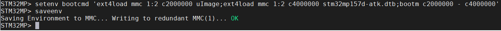

5. 在执行最后的 boot 命令后：

   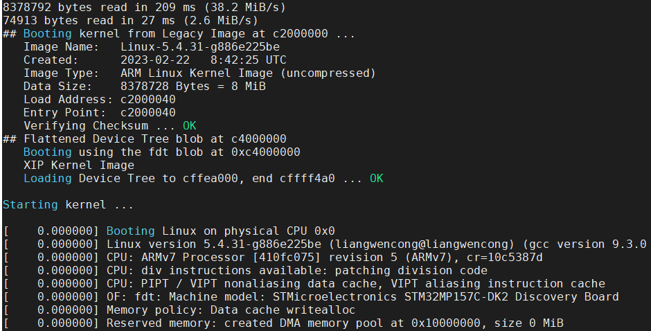

     注意！只有出现图 13.3.2.4 中的“Booting Linux on physical CPU 0x0”这一行就说明 uboot 引导 Linux 内核成功！ 

### 从网络启动 Linux 系统

从网络启动 Linux 系统的唯一目的就是为了调试！
设置 Linux 从网络启动，不用需要频繁的烧写 EMMC，大大加快了开发速度。也就是将 Linux 镜像文件和根文件系统都放到 Ubuntu 下某个指定的文件夹中，通过 nfs 或者 tftp 从 Ubuntu 中下载 uImage 和设备树文件，根文件系统的话也可以通过 nfs 挂载，这样每次重新编译 Linux 内核或者某个 Linux 驱动以后只需要使用 cp 命令将其拷贝到这个指定的文件夹中即可。

将 uImage 和设备树文件放到 Ubuntu 下的 tftp 目录下

```bash
# linux编译完成以后在 arch/arm/boot 目录下生成 uImage 镜像，在 arch/arm/boot/dts 目录下生成 stm32mp157d-atk.dtb 文件，将这两个文件拷贝到 tftp 服务器目录下，然后在 uboot 中使用 tftp 命令下载并运行。

# 当下还没有移植Linux，所以这里使用出厂移植好的 uImage 和 设备树文件（stm32mp157d-atk.dtb）版本。
# 具体的操作步骤这里略过。
```

这里我们使用 tftp 从 Ubuntu 中下载  uImage 和设备树文件，。 
设置 bootcmd 环境变量，设置如下： 

```
setenv bootcmd 'tftp c2000000 uImage;tftp c4000000 stm32mp157d-atk.dtb;bootm c2000000 - c4000000'
saveenv
boot
```

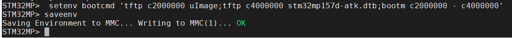

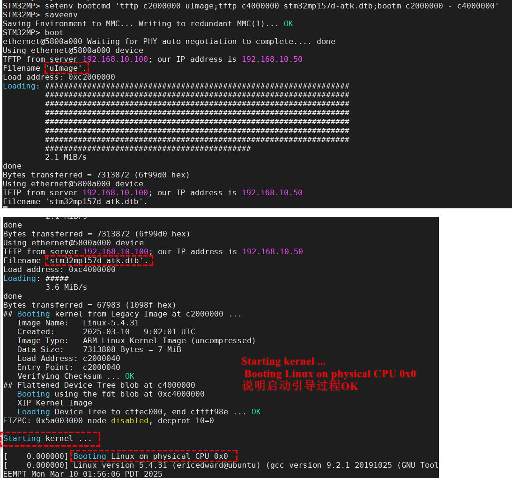


# linux内核移植

## 编译ST官方Linux系统

目的是，以此为蓝本，适配自己开发板的Linux系统。

解压ST的官方开发包：

```bash
tar -xvf en.SOURCES-stm32mp1-openstlinux-5-4-dunfell-mp1-20-06-24.tar.xz 
```

解压后得到相关的文件：

```bash
# 有五个文件夹: linux 内核代码、uboot代码、tf-a代码
stm32mp1-openstlinux-5.4-dunfell-mp1-20-06-24/sources/arm-ostl-linux-gnueabi$ ls
linux-stm32mp-5.4.31-r0       tf-a-stm32mp-2.2.r1-r0      u-boot-stm32mp-2020.01-r0
optee-os-stm32mp-3.9.0.r1-r0  tf-a-stm32mp-ssp-2.2.r1-r0
```

进入Linux内核代码：

```bash
# 可以看到里面有Linux内核源代码压缩包linux-5.4.31.tar.xz，及其对应的各种补丁
~/linux_space/st/stm32mp1-openstlinux-5.4-dunfell-mp1-20-06-24/sources/arm-ostl-linux-gnueabi/linux-stm32mp-5.4.31-r0$ ls
0001-ARM-stm32mp1-r1-MACHINE.patch                   0016-ARM-stm32mp1-r1-PHY-USB.patch
0002-ARM-stm32mp1-r1-CPUFREQ.patch                   0017-ARM-stm32mp1-r1-PINCTRL-REGULATOR-SPI-PWM.patch
0003-ARM-stm32mp1-r1-CRYPTO.patch                    0018-ARM-stm32mp1-r1-SOUND.patch
0004-ARM-stm32mp1-r1-RNG-DEBUG-NVMEM.patch           0019-ARM-stm32mp1-r1-MISC.patch
0005-ARM-stm32mp1-r1-CLOCK.patch                     0020-ARM-stm32mp1-r1-DEVICETREE.patch
0006-ARM-stm32mp1-r1-DMA.patch                       0021-ARM-stm32mp1-r1-CONFIG.patch
0007-ARM-stm32mp1-r1-DRM.patch                       0022-ARM-stm32mp1-r1-POWER.patch
0008-ARM-stm32mp1-r1-HWSPINLOCK.patch                0023-ARM-stm32mp1-r1-PERF.patch
0009-ARM-stm32mp1-r1-I2C-IIO-IRQCHIP.patch           fragment-03-systemd.config
0010-ARM-stm32mp1-r1-MAILBOX-REMOTEPROC-RPMSG.patch  fragment-04-optee.config
0011-ARM-stm32mp1-r1-RESET-RTC-WATCHDOG.patch        fragment-05-modules.config
0012-ARM-stm32mp1-r1-MEDIA-SOC-THERMAL.patch         fragment-06-signature.config
0013-ARM-stm32mp1-r1-MFD.patch                       linux-5.4.31.tar.xz
0014-ARM-stm32mp1-r1-MMC-NAND.patch                  README.HOW_TO.txt
0015-ARM-stm32mp1-r1-NET-TTY.patch                   series
```

各项分析详情参阅：[STM32MP157D 官方Linux补丁文件分析](./files/STM32MP157D 官方Linux补丁文件分析.md)

**对Linux内核代码打补丁：**

```bash
# 解压linux内核源码后得到的是Linux社区的标准内核源码
tar -vxf linux-5.4.31.tar.xz

# 接下来需要将ST官方提供的源码补丁添加到标准内核中
cd linux-5.4.31/                                      #进入 Linux 源码目录 
for p in `ls -1 ../*.patch`; do patch -p1 < $p; done  #打补丁该命令会将上层目录下所有的patch补丁文件应用到当前的内核中
```

**生成ST的标准版内核配置文件**

 ST 官原厂 Linux 内核需要先生成默认的 .config 配置文件，并且对其进行打补丁，才能得到一份原始ST提供的默认版本的内核配置文件。我们自己的内核配置文件，也是基于ST默认内核配置文件做适配。

**生成ST原厂的.config默认配置文件**

进入 Linux 内核源码根目录下，然后执行如下命令：

```bash
cd linux-5.4.31/                  # 进入到 linux 内核 
make ARCH=arm multi_v7_defconfig "fragment*.config"  # 生成multi_v7_defconfig默认配置
```

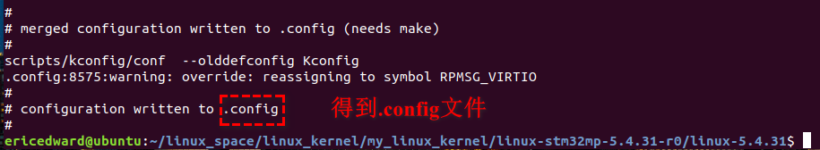

 .config 文件非常重要，Linux 内核的所有配置项最终都保存在.config 文件里面，最终编译Linux 内核的时候需要读取.config 里面的配置项！

**对ST原厂的.config默认配置文件执行打补丁操作**

```bash
# 变量定义：在 for f in ... 循环中，f 是一个变量，每次循环会被赋值为一个文件名（例如 ../fragment-01-xxx.config）。
# 变量引用：$f 表示 取出变量 f 的值（即当前处理的文件名），并传递给后续命令。
for f in `ls -1 ../fragment*.config`; do scripts/kconfig/merge_config.sh -m -r .config $f; done
yes '' | make ARCH=arm oldconfig
```

至此，Linux 源码根目录下的.config 文件就已经保存了所有的配置项。

最后，只需要复制一份.config 作为我们的默认配置文件即可，执行如下命令：

```bash
cd linux-5.4.31/
cp .config ./arch/arm/configs/stm32mp1_atk_defconfig # 复制一份 .config文件作为我们自己的开发板默认配置文件。
```

**编译ST官方源代码**

修改源代码根目录下的Makefile文件，目的是为了固定 ARCH 和 CROSS_COMPILE 这俩参数，方便以后编译时，不再输入这俩参数。

```makefile
 # linux-5.4.31/Makefile
 ARCH = arm
 CROSS_COMPILE = arm-none-linux-gnueabihf-
```

在源代码根目录下，创建一个编译脚本文件，可以命名为 stm32mp157d_atk.sh，其内容为：

```bash
#!/bin/sh
# 注意：这个编译脚本很重要，需要理解每一步操作
# 1. 清除工作
make distclean               
# 2. 按照默认配置项，生成.config文件，其实stm32mp1_atk_defconfig，就是从ST原版默认.config文件复制过来的
make stm32mp1_atk_defconfig 
# 3. （可选）通过图形化配置界面 menuconfig 往 .config 文件里更新用户自定义的配置项。
#    这一步也可以是零变更，也就是说什么也不修改，直接按两下Esc键即可不做修改并退出此操作。
make menuconfig 
# 
make uImage dtbs LOADADDR=0XC2000040 -j4
```

给予 stm32mp157d_atk.sh 可执行文件，然后运行此编译脚本，命令如下： 

```bash
chmod 777 stm32mp157d_atk.sh   
```

**编译ST的Linux源代码**

```bash
./stm32mp157d_atk.sh    # 直接运行编译脚本
```

**必要适配-网口驱动**-STM32MP157d正点原子开发板v1.5版本

我们使用的STM32MP157d正点原子开发板version 1.5版本。为了能够使用网络进行嵌入式Linux开发，这时需要优先适配网卡驱动。如下变更是由正点原子提供的变更内容：

 V1.2 版本核心板网络 PHY 芯片采用 RTL8211，ST 官方源码默认已经支持了 RTL8211，所以不需要进行任何修改。但是 V1.3 以后的核心板网络 PHY 芯片改为了裕太电子的 YT8511，ST 官方源码默认没有支持 YT8511，因此需要我们自行移植相关的网络驱动。相关驱动以及修改方法已经放到了开发板光盘中，路径为：1、程序源码→8、模块驱动源码→1、YT8511 驱动源码→linux 内核下修改方法→linux。 

1. 将 motorcomm.c 和 motorcomm_phy.h 分别拷贝到 Linux 源码下的 drivers/net/phy 和include/linux 目录下。

2. 拷贝完成以后修改 drivers/net/phy/Makefile 文件，加上下面这句： 

   ```makefile
   obj-$(CONFIG_MOTORCOMM_PHY)  += motorcomm.o
   ```

3. 另外还需要修改 drivers/net/phy/Kconfig 文件，加入如下内容：

   ```makefile
   # 注意：预编译endif # PHYLIB，须在这一行代码上面。
   config MOTORCOMM_PHY
   	tristate "Motorcomm PHYs"
   	---help---
   	Supports the YT8010, YT8510, YT8511, YT8512 PHYs.
   ```

4. 最后输入“make menuconfig”，打开 linux 内核配置界面，使能 YT8511 驱动，动，配置路径如下：

   ```makefile
   -> Device Drivers                     
      -> Network device support (NETDEVICES [=y])                                                     
         -> PHY Device support and infrastructure (PHYLIB [=y])       
            -> <*> Motorcomm PHYs        # 将 YT8511 驱动编译进内核 
   ```

5. 重新编译 Linux 内核。

   ```bash
   ./stm32mp157d_atk.sh
   ```

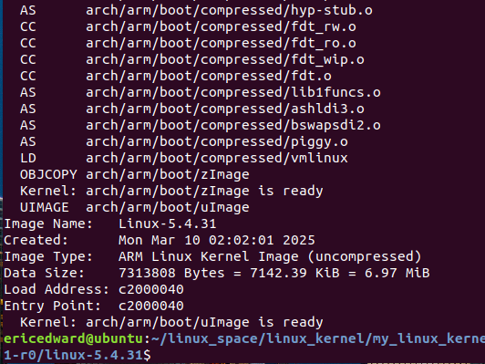

如上，编译完毕。

<a name="镜像文件位置">**镜像文件路径**</a> 

输出的 uImage 和 stm32mp157d-ed1.dtb 镜像文件，位置如下：

**默认编译（源码目录内构建）**

- 如果直接在 内核源码目录 内编译（未指定外部构建目录），uImage 的生成路径为：

  linux-5.4.31/arch/arm/boot/uImage

**使用外部构建目录（推荐）**

- 如果通过 O=../build 参数指定了 外部构建目录（如官方推荐），uImage 的路径为：

  build/arch/arm/boot/uImage

**快速定位文件的方法**

```bash
# 在内核源码根目录下搜索
find . -name "uImage"

# 在外部构建目录下搜索
find ../build -name "uImage"
```

**stm32mp157d-ed1.dtb**

| **构建方式** | **dtb 文件路径**                                     |
| ------------ | ---------------------------------------------------- |
| 默认编译     | `linux-5.4.31/arch/arm/boot/dts/stm32mp157d-ed1.dtb` |
| 外部构建目录 | `build/arch/arm/boot/dts/stm32mp157d-ed1.dtb`        |
| 安装目录     | `install_artifact/boot/stm32mp157d-ed1.dtb`          |


## 测试ST官方Linux系统

 ST 官方开发板的发布包经过编译生成对应的 uImage 和 stm32mp157d-ed1.dtb 镜像文件，大概率不能在自己的开发板上正常运行，因为硬件配置不同。但是我们还是尝试烧写并测试一下，看看会遇到什么情况。

1. 将编译后的 uImage 和 stm32mp157d-ed1.dtb <a href="#镜像文件位置">镜像文件</a>，转移到 Ubuntu 主机上的 tftp 服务目录下。
2. 在 uboot 客户端，执行<a href="#tftp加载到DDR方式">tftp加载命令</a>，并启动Linux内核。

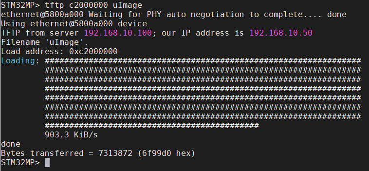

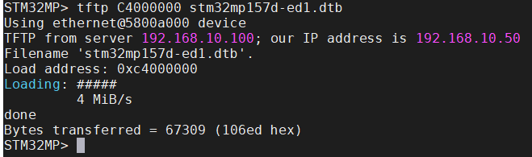


## Linux 移植

基于 ST 官方开发板的 Linux 系统移植正点原子 STM32MP157 开发板的过程相对简单，尤其是移植到 Linux 内核启动成功，后续只需要参考 ST 官方开发板创建一个设备树即可。 

### **适配设备树**

移植过程参考：[ST官方Linux移植到正点原子开发板详细过程](./files/ST官方Linux移植到正点原子开发板详细过程.txt)

移植中需要的配置信息文件

- [stm32mp157d-atk.dtsi](./files/stm32mp157d-atk.dtsi)

### **编译**

编译移植后的Linux内核代码：` stm32mp157d_atk.sh `，脚本内容如下：

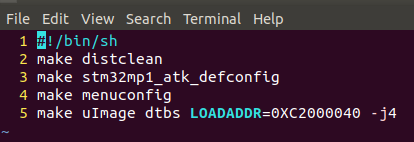

### **输出的镜像文件**

编译完成以后

在 arch/arm/boot 目录下生成 uImage 镜像；

在 arch/arm/boot/dts 目录下生成stm32mp157d-atk.dtb 文件；

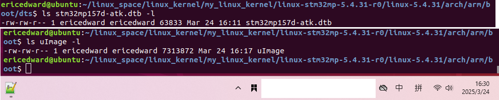

### **运行内核**

**网络方式加载内核**

将镜像文件更新到 tftp 服务器目录下：

- linux-5.4.31$ cp ./arch/arm/boot/dts/stm32mp157d-atk.dtb  /home/ericedward/linux_space/tools/tftpboot/ 
- linux-5.4.31$ cp ./arch/arm/boot/uImage  /home/ericedward/linux_space/tools/tftpboot/

将这两个文件拷贝到 tftp 服务器目录下，在 uboot 中使用 tftp 命令下载并运行，命令如下： 

```bash
tftp c2000000 uImage 
tftp c4000000 stm32mp157d-atk.dtb 
bootm c2000000 - c4000000 
```

得到的运行结果如下：

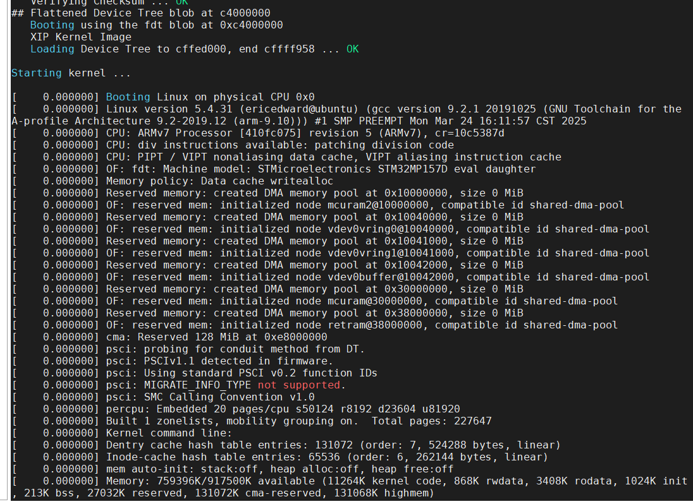

上图信息说明 Linux 启动运行成功。

**eMMC方式加载内核**

这种方式是将镜像文件( uImage + stm32mp157d-atk.dtb)打包成.ext4格式文件，当然此文件也可以包含其他数据（比如图片数据）。

使用 ST 官方烧写软件（STM32CubeProgrammer），将打包后的.ext4格式的文件，烧写进eMMC。

若是使用SD卡，则按照 ST 的镜像分区规则，在Ubuntu上也可以手动执行烧写，与eMMC类似，最终都是将镜像文件按照规则烧写到指定的分区位置，只不过SD卡可以不使用 STM32CubeProgrammer 去烧写，不用去编写为 STM32CubeProgrammer 提供支持烧写功能的uboot，相对比较简单，华清远见采用的就是这种做法。

```bash
# 新建 ext4 格式磁盘
# 我自定义新建的位置是 /home/ericedward/linux_space/file_system/bootfs
cd bootfs  
dd if=/dev/zero of=bootfs.ext4 bs=1M count=10  
mkfs.ext4 -L bootfs bootfs.ext4    
```

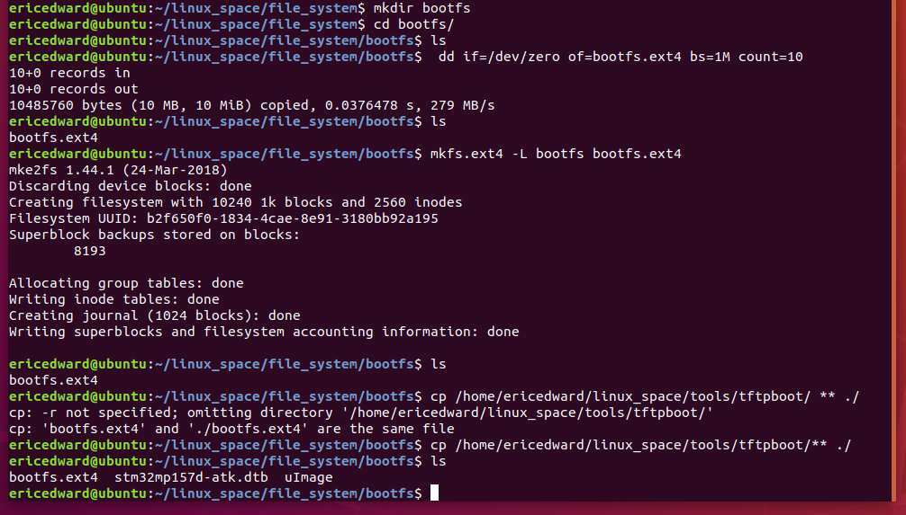

```bash
# 将系统镜像拷贝到 ext4 磁盘中
sudo mkdir /mnt/bootfs

# 使用 mount 命令将 bootfs.ext4 挂载到/mnt/bootfs 目录下
cd /home/ericedward/linux_space/file_system/bootfs
sudo mount bootfs.ext4 /mnt/bootfs/  # 执行挂载操作

#  将 uImage 和 stm32mp157d-atk.dtb 拷贝到/mnt/bootfs 目录下
cd /home/ericedward/linux_space/file_system/bootfs
sudo cp uImage stm32mp157d-atk.dtb /mnt/bootfs/

# 拷贝完成以后使用 umount 卸载/mnt/bootfs 即可
sudo umount /mnt/bootfs

# 至此，bootfs.ext4 文件制作完毕
```

在windows 上使用压缩软件比如360压缩打开bootfs.ext4文件，验证一下，查看其内容：

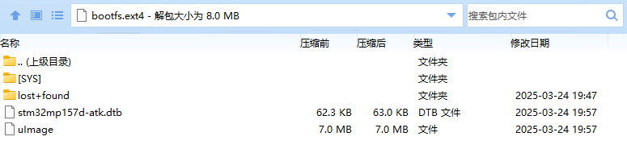

内含镜像文件。OK。

接下来，就是把制作好的 bootfs.ext4 文件，烧写到eMMC里。

适配 STM32CubeProgrammer 的烧写脚本 .tsv 文件

```
#Opt	Id		Name		Type		Device	Offset		Binary
-		0x01	fsbl1-boot	Binary		none	0x0			tf-a-stm32mp157d-atk-serialboot.stm32
-		0x03	ssbl-boot	Binary		none	0x0			u-boot.stm32
P		0x04	fsbl1		Binary		mmc1	boot1		tf-a-stm32mp157d-atk-trusted.stm32
P		0x05	fsbl2		Binary		mmc1	boot2		tf-a-stm32mp157d-atk-trusted.stm32
P		0x06	ssbl		Binary		mmc1	0x00080000	u-boot.stm32
P		0x21	boot		System		mmc1	0x00280000	bootfs.ext4
```

当下，最主要的是最后一行。

使用 STM32CubeProgrammer 重新烧录镜像文件到 eMMC 分区后，建议接下来验证 eMMC 分区2里是否正确烧写了 uImage 和 stm32mp157d-atk.dtb 镜像文件。在uboot命令行下使用：`ext4ls mmc 1:2 ` 命令即可查看。

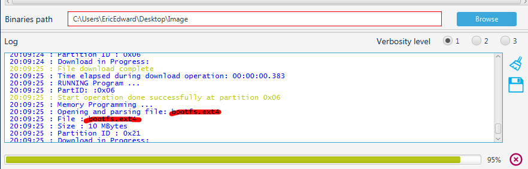

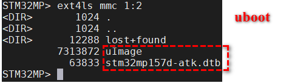

将uboot环境变量的启动方式值，改为从eMMC启动。

```bash
# eMMC启动方式
setenv bootcmd 'ext4load mmc 1:2 c2000000 uImage;ext4load mmc 1:2 c4000000 stm32mp157d-atk.dtb;bootm c2000000 - c4000000' 

saveenv 
boot
```

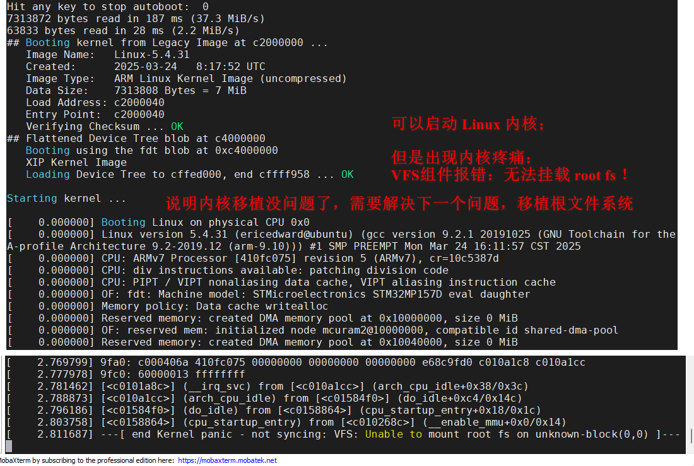

# 构建Linux根文件系统

移植完了 TF-A、Uboot 和 Linux kernel 就剩最后一个根文件系统 rootfs 了。
根文件系统构建好以后就意味着我们已经拥有了一个完整的、可以运行的最小系统。以后我们就在这个最小系统上编写、测试 Linux 驱动，移植一些第三方组件，逐步的完善这个最小系统。最终得到一个功能完善、驱动齐全、相对完善的操作系统。

[什么是linux 的 根文件系统？](./files/linux的根文件系统.md)

创建一个文件夹，名称自定义，位置自定义，用于使用nfs协议挂载根文件系统。
我创建的文件夹是，/home/ericedward/linux_space/tools/nfs/rootfs。

## 使用 busybox 构建根文件系统

获取 busybox ，将其放入 Ubuntu 上自定义位置，解压 busybox 文件包。

```bash
cd  /home/ericedward/linux_space/file_system/busybox  # 进入自定义的 busybox 位置
tar -xjvf busybox-1.32.0.tar.bz2                      # 解压
```

在 Makefile 文件内适配 ARCH 和 CROSS_COMPILE 参数的值：

```bash
cd  /home/ericedward/linux_space/file_system/busybox/busybox-1.32.0  # 进入自定义的 busybox 位置
vi  Makefile

# 适配内容如下：
164 CROSS_COMPILE ?= /usr/local/arm/gcc-arm-9.2-2019.12-x86_64-arm-none-linux-gnueabihf/bin/arm-none-linux-gnueabihf-
190 ARCH ?= arm
```

适配 busybox 中文字符支持：[printable_string.c](./busybox/printable_string.c) 与 [unicode.c](./busybox/unicode.c) 这俩是已经验证过的适配后的文件。

```bash
# libbb/printable_string.c 中更新 printable_string2 函数。
vi libbb/printable_string.c 
# libbb/unicode.c 中更新 unicode_conv_to_printable2 函数。
vi libbb/unicode.c
# 具体适配内容 参考正点原子的手册。
```

生成默认配置文件

```bash
# 第一步
make defconfig
# 第二步，执行正点原子的配置建议操作
# 此步骤，生成自定义的默认配置 ./configs/stm32mp1_atk_defconfig 文件。
make menuconfig
```

编译

```bash
# 第一步 执行make命令
make -j4
# 第二步 编译完成以后会在 busybox 的所有工具和文件就会被安装到 rootfs 目录中
make install CONFIG_PREFIX=/home/ericedward/linux_space/tools/nfs/rootfs
```

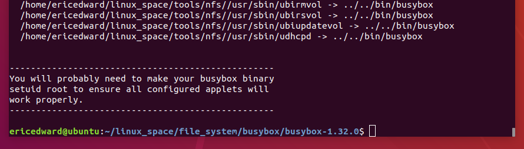

rootfs 目录内容有 bin、sbin 和 usr 这三个目录，以及 linuxrc 这个文件。

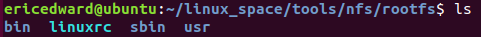

 Linux 内核 init 进程最后会查找用户空间的 init 程序，找到以后就会运行这个用户空间的 init 程序，从而切换到用户态。
若 bootargs 设置 init=/linuxrc，那么 linuxrc 就能作为用户空间的 init 程序，这种情况下，可以这样说，用户态空间的 init 程序是 busybox 来生成的。

至此，busybox 的工作就完成了，但是此时的根文件系统还不能使用，还需要一些其他的文件。我们继续来完善 rootfs。

### 向根文件系统添加lib库

Linux 中的应用程序一般都是需要动态库的，当然你也可以编译成静态的，但是静态的可执行文件会很大。
如果编译为动态的话就需要动态库，所以我们需要先根文件系统中添加动态库。

那么，库文件从哪里来？需要哪些库文件呢？
答案：这些库文件，从之前的交叉编译器里面有很多库文件里来。这些库文件具体是做什么的我们作为初学者不太清楚，索性把其中所有的库文件复制过来，虽然这样做出的根文件系统比较大，且有很多我们可能用不到的库文件。

```bash
## 向rootfs/lib 添加库文件
# 在 rootfs 中创建一个名为“lib”的文件夹，`mkdir lib`
~/linux_space/tools/nfs/rootfs$ mkdir lib

# 根据实际路径适配，这是我自己的。
cd /usr/local/arm/gcc-arm-9.2-2019.12-x86_64-arm-none-linux-gnueabihf/arm-none-linux-gnueabihf/libc/lib

# 复制其下所有库文件，到nfs/rootfs/lib/
cp *so* /home/ericedward/linux_space/tools/nfs/rootfs/lib/ -d

# 其他特殊处理：目前 ld-linux-armhf.so.3 文件是一个软连接文件，类似一个快捷方式，大小为10B，链接到到文件ld-2.30.so文件，且无法在根文件系统中执行。所以需要删除此软连接文件，并复制本尊即可，具体操作如下：
cd /home/ericedward/linux_space/tools/nfs/rootfs/lib # 进入rootfs/lib/下
rm ld-linux-armhf.so.3 # 删除软连接文件
cp /usr/local/arm/gcc-arm-9.2-2019.12-x86_64-arm-none-linux-gnueabihf/arm-none-linux-gnueabihf/libc/lib/ld-linux-armhf.so.3 ./    # 复制真正的 ld-linux-armhf.so.3 文件到 rootfs/lib 下

# 继续
cd /usr/local/arm/gcc-arm-9.2-2019.12-x86_64-arm-none-linux-gnueabihf/arm-none-linux-gnueabihf/lib/
# 复制此路径下的所有动态库和静态库文件，到 rootfs/lib 下
cp *so* *.a /home/ericedward/linux_space/tools/nfs/rootfs/lib/


## 向rootfs的 usr/lib 目录添加库文件
# 构建一个 rootfs/usr/lib 目录
cd /home/ericedward/linux_space/tools/nfs/rootfs/usr/
mkdir lib
# 进入源目录
cd /usr/local/arm/gcc-arm-9.2-2019.12-x86_64-arm-none-linux-gnueabihf/arm-none-linux-gnueabihf/libc/usr/lib
# 复制。cp: warning: source file 'libresolv.a' specified more than once 这个警告没关系，意思是被多次指定，so通配符其名称指定一次，.a通配符又一次指定，所以会警告，结果只复制一次，不严谨的角度，暂时没关系。
cp *so* *.a /home/ericedward/linux_space/tools/nfs/rootfs/usr/lib/ -d


# 至此，根文件系统的库文件就全部准备好了。可以使用“du”命令来查看一下 rootfs/lib 和 rootfs/usr/lib 这两个目录的大小，命令如下：
cd /home/ericedward/linux_space/tools/nfs/rootfs
du ./lib ./usr/lib/ -sh
```

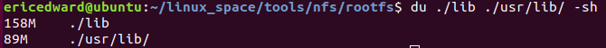

可以看出 lib 和 usr/lib 这两个文件的大小分别为 158MB 和 89MB，加起来就是158+89=247MB，还是挺大的，但是正点原子的 STM23MP157 开发板板载 8GB 的 EMMC，无需担心存储不够用。 

### 创建其他文件夹

在 rootfs  ( 这里是 /home/ericedward/linux_space/tools/nfs/ )下创建其他文件夹：dev、proc、mnt、sys、tmp、etc 和 root 等。
下图是第二次重新创建 根文件系统 rootfs 以后的文件大小，与正点原子的不一样，但实际上OK，可以被Linux内核挂载根文件系统。

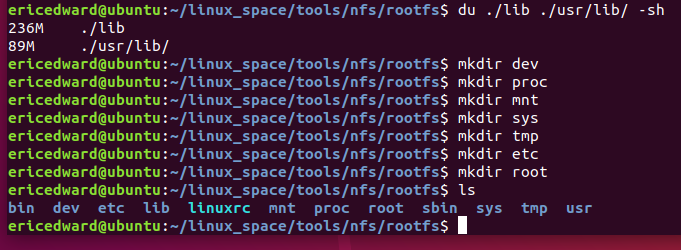

### 根文件系统初步测试

**修改 Ubuntu 的 nfs 版本配置** 

通过烧写根文件系统到eMMC的方式去验证比较麻烦。这里选择使用网络nfs挂载根文件系统的方式去验证。但是，由于 Ubuntu18 的 nfs 默认只支持 3 和 4 版本的 nfs，而 uboot 默认使用的 nfs 是版本 2，因此需要修改 Ubuntu18 的 nfs 配置，否则 nfs 根文件系统会报错，无法成功挂载。

```bash
# 在ubuntu上，
sudo vi /etc/default/nfs-kernel-server

# 在文件最后一行添加如下内容：
RPCNFSDOPTS="--nfs-version 2,3,4 --debug --syslog"

# 保存退出后，重启nfs服务
sudo /etc/init.d/nfs-kernel-server restart
```

**bootargs 环境变量设置** 

需设置 uboot 下的 bootargs 环境变量里的 root 的值，也就是将 root 值改为 NFS 挂载。
在 Linux 内核源码里面有相应的文档讲解如何设置，文档为Documentation/filesystems/nfs/ nfsroot.txt，格式如下：

```bash
root=/dev/nfs nfsroot=[<server-ip>:]<root-dir>[,<nfs-options>] ip=<client-ip>:<server-ip>:<gw-ip>:<netmask>:<hostname>:<device>:<autoconf>:<dns0-ip>:<dns1-ip> 

# 其中具体参数如下：
<server-ip>：服务器 IP 地址：192.168.10.100
<root-dir>：根文件系统的存放路径：/home/ericedward/linux_space/tools/nfs/rootfs 
<nfs-options>：NFS 的其他可选选项，一般不设置。 
<client-ip>：客户端 IP 地址，也就是我们开发板的 IP 地址：192.168.10.50
<server-ip>：服务器 IP 地址：192.168.10.100
<gw-ip>：网关地址，我的就是 192.168.10.1
<netmask>：子网掩码，我的就是 255.255.255.0 
<hostname>：客户机的名字，一般不设置，此值可以空着
<device>：设备名，也就是网卡名，一般是 eth0，eth1之类的，正点原子 STM32MP157 开发板只有一个网口，名字为 eth0。 
<autoconf>：自动配置，一般不使用，所以设置为 off。 
<dns0-ip>：DNS0 服务器 IP 地址，不使用。 
<dns1-ip>：DNS1 服务器 IP 地址，不使用。 
```

根据上面的格式 bootargs 环境变量的 root 值如下： 

```bash
# “proto=tcp”表示使用 TCP 协议，“rw”表示 nfs 挂载的根文件系统为可读可写。
root=/dev/nfs nfsroot=192.168.10.100:/home/ericedward/linux_space/tools/nfs/rootfs,proto=tcp  rw ip=192.168.10.50:192.168.10.100:192.168.10.1:255.255.255.0::eth0:off
```

将上面的值更新到 bootargs 环境变量里

```bash
# 启动开发板，进入 uboot 命令行模式，重新设置 bootargs 环境变量
setenv bootargs 'console=ttySTM0,115200 root=/dev/nfs nfsroot=192.168.10.100:/home/ericedward/linux_space/tools/nfs/rootfs,proto=tcp rw ip=192.168.10.50:192.168.10.100:192.168.10.1:255.255.255.0::eth0:off'

saveenv # 保存环境变量
boot    # 启动 linux 内核
```

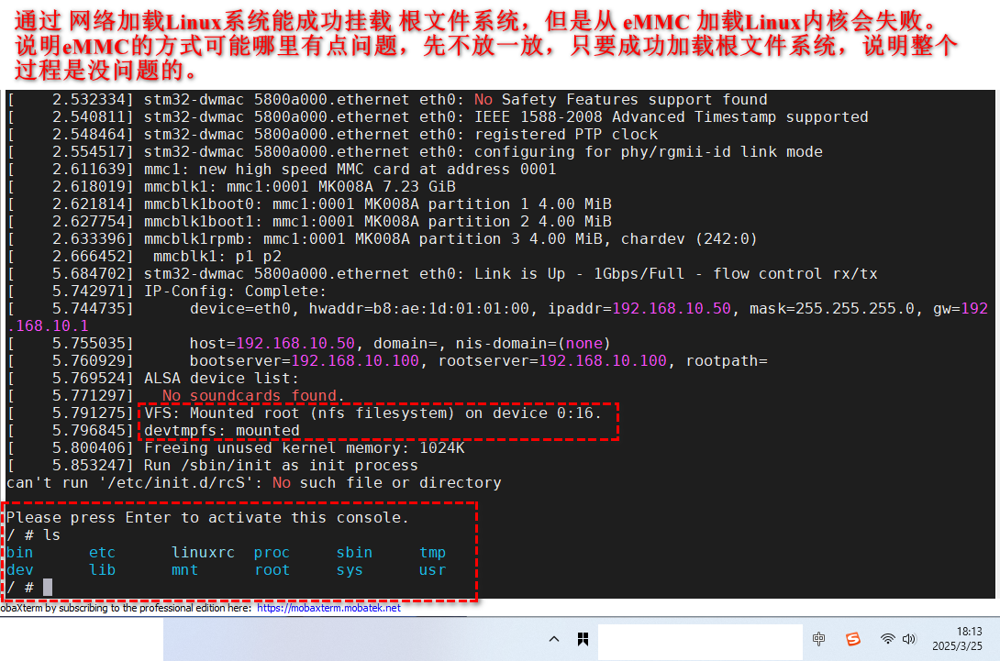

验证通过。

### 完善根文件系统

更新文件，可以直接在开发板上运行的 Linux 中使用 vi 操作，可以在 Ubuntu 上更改 rootfs 的内容。

#### 创建/etc/init.d/rcS 文件 

Linux内核在挂载根文件系统中，会寻找 /etc/init.d/rcS 脚本文件，依据其内容启动一些服务。

所以，需要在 rootfs 中创建 /etc/init.d/rcS 文件，其内容为： #示例代码：/etc/init.d/rcS 文件 ：

```shell
#!/bin/sh

PATH=/sbin:/bin:/usr/sbin:/usr/bin:$PATH
LD_LIBRARY_PATH=$LD_LIBRARY_PATH:/lib:/usr/lib
export PATH LD_LIBRARY_PATH

mount -a
mkdir /dev/pts
mount -t devpts devpts /dev/pts

echo /sbin/mdev > /proc/sys/kernel/hotplug
mdev -s
```

第 1 行，表示这是一个 shell 脚本。 
第 3 行，PATH 环境变量保存着可执行文件可能存在的目录，这样我们在执行一些命令或
者可执行文件的时候就不会提示找不到文件这样的错误。 
第 4 行，LD_LIBRARY_PATH 环境变量保存着库文件所在的目录。 
第 5 行，使用 export 来导出上面这些环境变量，相当于声明一些“全局变量”。 
第 7 行，使用 mount 命令来挂载所有的文件系统，这些文件系统由文件/etc/fstab 来指定，所以我们一会还要创建/etc/fstab 文件。 
第 8 和 9 行，创建目录/dev/pts，然后将 devpts 挂载到/dev/pts 目录中。 
第 11 和 12 行，使用 mdev 来管理热插拔设备，通过这两行，Linux 内核就可以在/dev 目录下自动创建设备节点。关于 mdev 的详细内容可以参考 busybox 中的 docs/mdev.txt 文档。 

示例代码 18.4.1.1 中的 rcS 文件内容是最精简的，大家如果去看 Ubuntu 或者其他大型 Linux操作系统中的 rcS 文件，就会发现其非常复杂。因为我们是初次学习，所以不用搞这么复杂的，而且这么复杂的 rcS 文件也是借助其他工具创建的，比如 buildroot 等。

创建好文件/etc/init.d/rcS 以后一定要给其可执行权限！ 

```shell
chmod 777 /home/ericedward/linux_space/tools/nfs/rootfs/etc/init.d/rcS
```

#### 创建 /etc/fstab 文件

在 Linux 根文件系统 rootfs 中的 /etc/fstab 文件，描述了Linux在开机后需要自动挂载的分区。其格式如下：

```
<file system>        <mount point>      <type>        <options>          <dump>        <pass> 
```

- <file system>：要挂载的特殊的设备，也可以是块设备，比如/dev/sda 等等。 
- <mount point>：挂载点。 
- <type>：文件系统类型，比如 ext2、ext3、proc、romfs、tmpfs 等等。 
- <options>：挂载选项，在 Ubuntu 中输入“man mount”命令可以查看具体的选项。一般使用 defaults，也就是默认选项，defaults 包含了 rw、suid、  dev、  exec、  auto、  nouser 和  async。 
- <dump>：为 1 的话表示允许备份，为 0 不备份，一般不备份，因此设置为 0。
- <pass>：磁盘检查设置，为 0 表示不检查。根目录‘/’设置为 1，其他的都不能设置为 1，其他的分区从 2 开始。一般不在 fstab 中挂载根目录，因此这里一般设置为 0。   

按照上述格式，在 /etc/fstab 文件中输入如下内容：

```
#<file system>  <mount point>     <type>       <options>  <dump>  <pass> 
proc              /proc             proc        defaults    0        0
tmpfs             /tmp              tmpfs       defaults    0        0
sysfs             /sys              sysfs       defaults    0        0
```

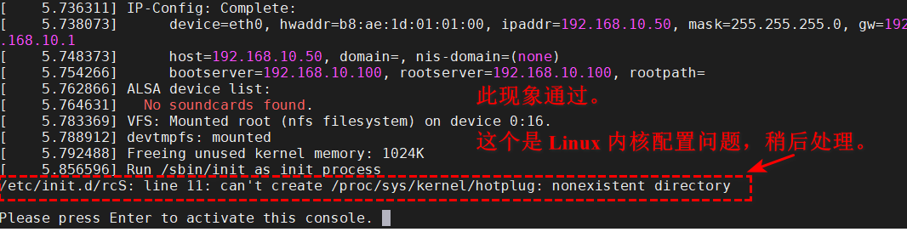

#### 创建 /etc/inittab 文件

现代 Linux 发行版（如 Ubuntu 18.04+、CentOS 7+）已用 **systemd** 替代传统 init 系统，此时需通过 `.service` 文件管理服务。`/etc/inittab` 是传统 Linux 系统启动和运行级别的核心控制文件，通过定义进程行为、运行级别和事件响应，确保系统按需初始化和稳定运行。/etc/inittab 文件的主要特性：

定义系统运行级别（Runlevel）

通过 `initdefault` 字段指定系统启动后的默认运行级别（如 `id:3:initdefault:` 表示默认进入多用户命令行模式）
运行级别分类：

- **0**：关机模式（不可设为默认）
- **1**：单用户维护模式（仅限 root 操作）
- **2**：多用户模式（无网络服务）
- **3**：完整多用户命令行模式（服务器常用）
- **5**：图形界面模式（桌面系统常用）
- **6**：重启（不可设为默认）

管理进程的生命周期

通过 action 字段控制进程的行为，例如：

- **respawn**：进程终止后自动重启（如虚拟终端 `/sbin/mingetty` 的配置）
- **wait**：进入运行级别时启动进程并等待其完成（如初始化脚本 `/etc/rc.d/rc.sysinit`）
- **once**：仅执行一次进程
- **sysinit**：系统启动时执行的初始化操作（如挂载文件系统、加载内核参数）

这些配置确保关键服务（如日志、网络）在系统启动或运行级别切换时按需启动或终止。

响应系统事件

处理特定事件触发的操作，例如：

- **ctrlaltdel**：用户按下 `Ctrl+Alt+Del` 组合键时执行重启命令
- **powerfail**：电源故障时触发安全关机流程

此类配置增强了系统对硬件事件的响应能力

协调系统初始化流程

- 通过调用 `/etc/rc.d/rc.sysinit` 完成基础系统初始化，包括：
  - 激活 SELinux 和 udev（设备管理）
  - 设置系统时钟和主机名
  - 挂载文件系统并启用磁盘配额
- 在运行级别切换时，调用 `/etc/rc.d/rc` 脚本启动或停止对应级别的服务（如 `/etc/rc3.d/` 中的服务）

| 动作       | 描述（来自正点原子手册的内容）                               |
| ---------- | ------------------------------------------------------------ |
| sysinit    | 在系统初始化的时候 process 才会执行一次。                    |
| respawn    | 当 process 终止以后马上启动一个新的。                        |
| askfirst   | 和 respawn 类似，在运行 process 之前在控制台上显示“Please press Enter to activate this console.”。只要用户按下“Enter”键以后才会执行 process。 |
| wait       | 告诉 init，要等待相应的进程执行完以后才能继续执行。          |
| once       | 仅执行一次，而且不会等待 process 执行完成。                  |
| restart    | 当 init 重启的时候才会执行 procee。                          |
| ctrlaltdel | 当按下 ctrl+alt+del 组合键才会执行 process。                 |
| shutdown   | 关机的时候执行 process。                                     |

参考 busybox 的 examples/inittab 文件，创建一个/etc/inittab 文件 `vi inittab`

```
# 在 rootfs 中创建 /etc/inittab 文件
#etc/inittab
::sysinit:/etc/init.d/rcS
console::askfirst:-/bin/sh
::restart:/sbin/init
::ctrlaltdel:/sbin/reboot
::shutdown:/bin/umount -a -r
::shutdown:/sbin/swapoff -a 
```

**修改生效**：修改后需执行 `init q` 或 `telinit q` 使配置生效，否则需重启系统。

到这里，根文件系统的创建已经完成。


#### 使能内核 uevet helper 

当下还有一个问题需要处理，问题现象如下图：

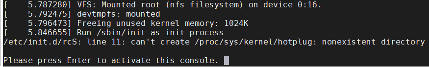

这是 Linux 内核配置问题，可以进入 menuconfig 配置下使能， -> Device Drivers->Generic Driver Options ->Support for uevent helper 即可。

1. 进入到 Linux 内核根目录，`make menuconfig` 打开图形化配置界面；
2. 找到 Support for uevent helper 项，按Y选中；
3. 按左右方向键，调整到 " <save> " 后，按 Enter 键；
4. 保存文件名为： ./arch/arm/configs/stm32mp1_atk_defconfig ；

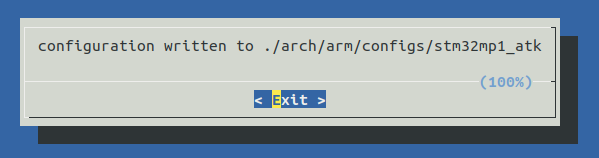

5. 保存后退出；


重新编译内核并启动后，没有任何错误提示。这时，根文件系统已经可以正常运行了。

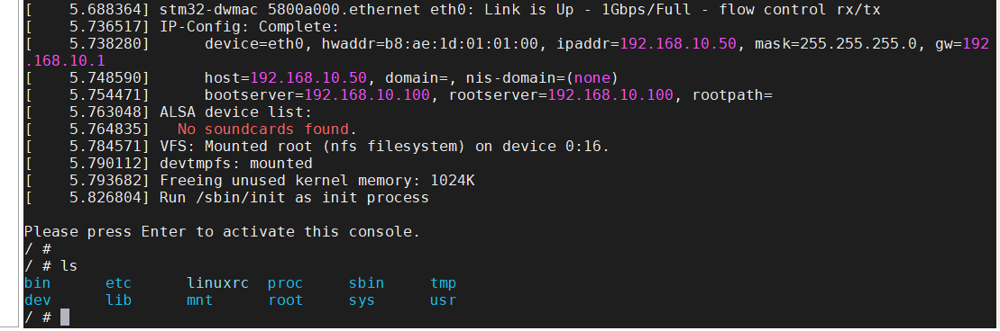

#### 根文件系统的测试

**有限的标C、UnixC的库测试**

编写一个 C 文件，里面的main函数调用 printf 函数（标准C库）、sleep 函数（UnixC库）。使用交叉编译器 arm-none-linux-gnueabihf-gcc 编译后输出可执行文件，启动开发板，运行此可执行文件。若现象正常，则OK。

```c
 #include <stdio.h>  //printf func involved
 #include <unistd.h> //sleep  func involved
 
 int main(void)
 {
         while (1)
         {
                 printf ("hello My First Linux rootfs test! OK!\r\n");
                 sleep (2);
         }
         return 0;
 }
```

编译：`/linux_space/tools/nfs/rootfs/test$ arm-none-linux-gnueabihf-gcc test1.c -o rootfs_test.out`

在开发板上，进入相应的路径，直接执行此输出文件。

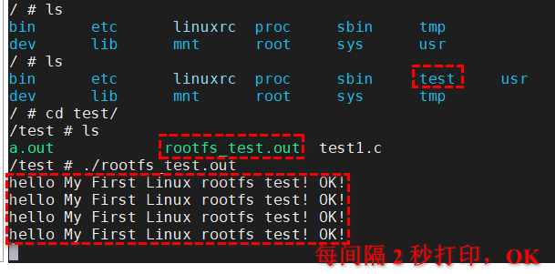

测试OK。

**中文测试**

新建一个中文名称的文件夹、文件名、文件内容，看看就行了。

测试文件夹 测试文件名 测试内容（时间2025年3月26日13:29:42）

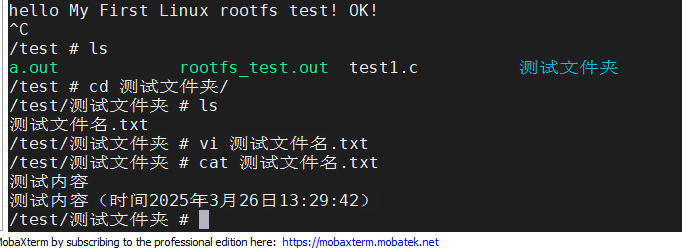

**开机自启动测试**

rootfs 里的 /etc/init.d/rcS 文件内，记录着开机启动项。可以不严谨地做个验证，将上节的 rootfs_test.out 文件设置为开机启动项，已作简单验证。

```shell
#!/bin/sh

PATH=/sbin:/bin:/usr/sbin:/usr/bin:$PATH
LD_LIBRARY_PATH=$LD_LIBRARY_PATH:/lib:/usr/lib
export PATH LD_LIBRARY_PATH

mount -a
mkdir /dev/pts
mount -t devpts devpts /dev/pts

echo /sbin/mdev > /proc/sys/kernel/hotplug
mdev -s

# auto run set by mapleay 时间2025年3月26日13:29:42
# 设置 10 秒后杀死整个进程组
(sleep 10; kill 0) &
# 主任务
echo "程序开始运行，PID: $$"
/test/rootfs_test.out # 替换为实际需要执行的命令
cd / # 最后切到主目录下
```

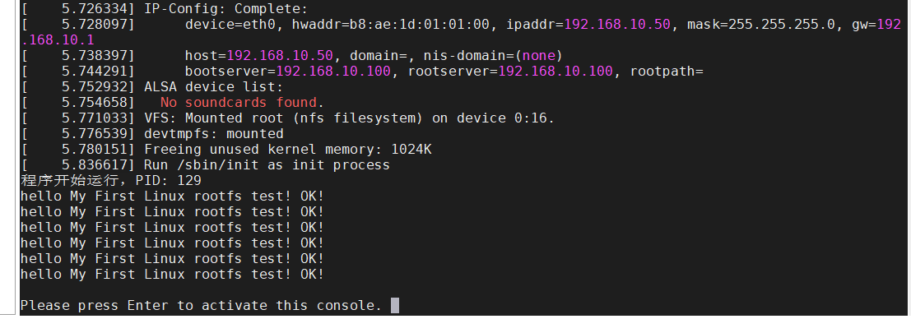

**连接英特网测试**

初次 `ping www.baidu.com` 应该是不通的。原因是域名解析失败，需要使用域名解析服务器的IP地址去连接该服务器，一般可设置为 114.114.114.114 这个运营商，可以设置为所处网络环境的网关IP地址。

在 rootfs 里新建 /etc/resolv.conf 文件，存入以下内容：

```
nameserver 114.114.114.114
nameserver 192.168.10.1 # 网关IP
```

测试完毕后，这是一份独立完整且运行正常的busybox根文件系统，建议将这个文件夹内容进行备份。


## 使用 buildroot 构建根文件系统

### 构建最简易的文件系统

```bash
# 1. 解压 buildroot 源码
cd  /home/ericedward/linux_space/file_system/buildroot  # 进入自定义的 busybox 位置
tar -xjvf buildroot-2020.02.6.tar.bz2                   # 解压

# 2. 打开图形化配置界面，配置 buildroot
/home/ericedward/linux_space/file_system/buildroot/buildroot-2020.02.6
make menuconfig
配置项如下：
Target options
  -> Target Architecture           = ARM (little endian)     
  -> Target Binary Format          = ELF 
  -> Target Architecture Variant   = cortex-A7 
  -> Target ABI                    = EABIhf 
  -> Floating point strategy       = NEON/VFPv4 
  -> ARM instruction set           = ARM 
Toolchain
  -> Toolchain type               = External toolchain 
  -> Toolchain                    = Custom toolchain     //用户自己的交叉编译器 
  -> Toolchain origin             = Pre-installed toolchain   //预装的编译器 
  -> Toolchain path               = /usr/local/arm/gcc-arm-9.2-2019.12-x86_64-arm-none-linux-gnueabihf  
  -> Toolchain prefix             = $(ARCH) -none-linux-gnueabihf    //前缀 
  -> External toolchain gcc version              = 9.x 
  -> External toolchain kernel headers series    = 4.20.x    //交叉编译器的 linux 版本号 
  -> External toolchain C library                = glibc/eglibc   
  -> [*] Toolchain has SSP support? (NEW)  //选中 
  -> [*] Toolchain has RPC support? (NEW)  //选中 
  -> [*] Toolchain has C++ support?        //选中 
  -> [*] Enable MMU support (NEW)          //选中 
System configuration
  -> System hostname    = ATK-stm32mp1       //平台名字，自行设置 
  -> System banner      = Welcome to alientek STM32MP157        //欢迎语 
  -> Init system        = BusyBox        //使用 busybox 
  -> /dev management    = Dynamic using devtmpfs + mdev  //使用 mdev 
  -> [*] Enable root login with password (NEW)         //使能登录密码 
  -> Root password    = 123456         //登录密码为 123456 
Filesystem images
  -> [*] ext2/3/4 root filesystem      //如果是 EMMC 或 SD 卡的话就用 ext3/ext4 
    -> ext2/3/4 variant     = ext4     //选择 ext4 格式 
  -> exact size      =1G               //ext4 格式根文件系统 1GB(根据实际情况修改) 
  -> [*] ubi image containing an ubifs root filesystem    //如果使用 NAND 的话就用 ubifs，我们使用的不是这个！

# 禁止编译 Linux 内核和 uboot   
Kernel
  ->[ ] Linux Kernel      //不要选择编译 Linux Kernel 选项！ 

# 禁止编译 uboot
Bootloaders
  -> [ ] U-Boot        //不要选择编译 U-Boot 选项！ 
  
Target packages
  -> System tools 
    -> [*] kmod      //使能内核模块相关命令   
    
# 最后将变更的配置另存为文件名为 stm32mp1_atk_defconfig 的文件，并：
# 保存的位置为： ./configs/stm32mp1_atk_defconfig ,注意位置别放错了！！！
# 设置位置的时候，使用绝对路径适配： xxxbuildroot-2020.02.6/configs/stm32mp1_atk_defconfig 
chmod 777 stm32mp1_atk_defconfig   # 赋予可执行权限
```

编译 buildroot 

```bash
make stm32mp1_atk_defconfig  # 将默认配置写入 .config 文件
make -j4    //多线程编译
# 检查 rootfs.tar 文件是否已更新？
ls -l /home/ericedward/linux_space/file_system/buildroot/buildroot-2020.02.6/output/images/rootfs.tar 
```

编译完成以后，输出是：

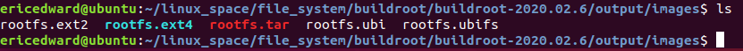

```
# 注意：若此文件系统无法正常运行，则重新操作一遍“构建最简易的文件系统”即可，已验证。
# 进入挂载的根文件系统的根目录,建议先对此文件夹内容做一次备份即可。 
cd /home/ericedward/linux_space/tools/nfs/rootfs
# 再删除清空此文件夹所有内容，用来放置由 buildroot 创建的文件系统。
sudo rm ** -rf 
# 最后将 rootfs.tar 拷贝到在 nfs 目录下的 rootfs 文件夹中并解压
cp /home/ericedward/linux_space/file_system/buildroot/buildroot-2020.02.6/output/images/rootfs.tar ./
tar -xvf rootfs.tar 
rm rootfs.tar 
```

重启系统，可以看到：

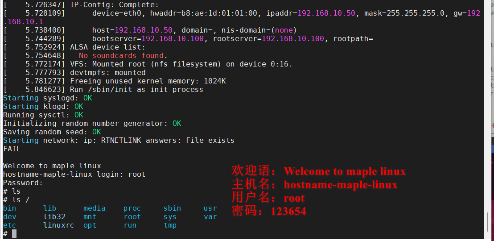

以上是一个最简单的根文件系统，还没有其他第三方库。版本是v1.31.1。

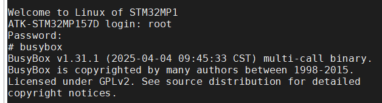

### 在buildroot下配置busybox

buildroot 在构建根文件系统过程中，也是会用到 busybox 的。他的使用方式有：

- buildroot 自行下载编译管理 busybox 
- buildroot 直接对接我们已经处理过的 standalone 版本的 busybox

#### buildroot下配置独立版本的 busybox

使用自己的 busybox 需要挂接操作，如何让 buildroot 知道这个 busybox 呢？需要在 buildroot 的 configs 目录下创建 "local.mk" 文件，在此文件中指定 busybox 的关联信息。

```
# 在“local.mk”里面输入如下格式内容：XXXXXX_OVERRIDE_SRCDIR=‘具体路径’ 
ericedward@ubuntu:~/linux_space/file_system/buildroot/buildroot-2020.02.6$ vi ./configs/local.mk 
# 比如指定 busybox 路径的时候就使用： 
BUSYBOX_OVERRIDE_SRCDIR=/home/ericedward/linux_space/file_system/busybox/busybox-1.32.0
```

创建好关联文件后，根据经验，还需要进一步关联这个文件，就是在 make menuconfig 里配置关联项：

```
-> Build options  # BR2_PACKAGE_OVERRIDE_FILE="$(CONFIG_DIR)/local.mk"
  -> location of a package override file  = ./configs/local.mk  指定 local.mk 所在目录

# 先保存一下到 .config 文件
xxxbuildroot-2020.02.6/.config
  
# 再保存一下默认配置：
xxxbuildroot-2020.02.6/configs/stm32mp1_atk_defconfig

# 编译
make stm32mp1_atk_defconfig  # 将默认配置写入 .config 文件
make -j4    //多线程编译

# 将 rootfs.tar 拷贝到在 nfs 目录下的 rootfs 文件夹中并解压
cd /home/ericedward/linux_space/tools/nfs/rootfs
cp /home/ericedward/linux_space/file_system/buildroot/buildroot-2020.02.6/output/images/rootfs.tar ./
tar -xvf rootfs.tar 
rm rootfs.tar 

# 重启验证
输入登录名 root
登录密码：123654
进入命令行后，输入 busybox 指令，得到如下显示：
```

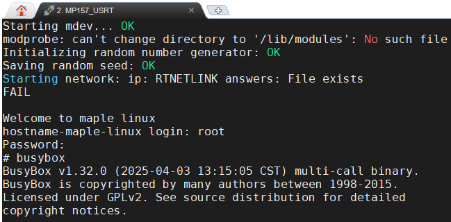

从上图可以看出，此时 buildroot 中的 busybox 版本号变为了 1.32.0。为了方便开发，建议大家使用 buildroot 自带的 busybox，也就是 1.31.0 版本，直接把之前的文件夹复制一份即可。

#### buildroot 下配置内置的 busybox 版本

buildroot 在构建根文件系统的时候也要用到 busybox。buildroot 会自动下载 busybox 压缩包，buildroot 下载的源码压缩包都存放在/dl 目录下，在 dl 目录下就有一个叫做“busybox”的文件夹，此目录下保存着 busybox 压缩包

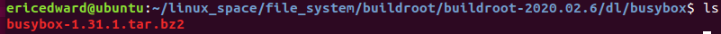

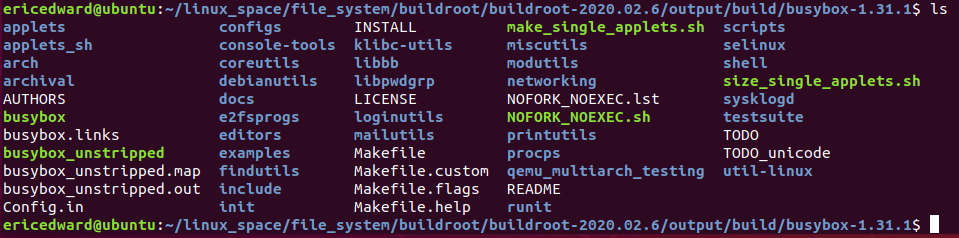

```
# 配置 buildroot 的内置 busybox 需要在源代码根目录下执行：
make busybox-menuconfig
# 进行配置
……
```

**busybox 中文字符的支持** 

参考之前的独立busybox配置过程部分即可。

**编译 busybox** 

```
#  在 buildroot 源码目录下
# 查看当前 buildroot 所有已配置的目标软件包
make show-targets 

# 单独编译 busybox
make busybox

# 重新编译 buildroot
make -j4

# 检查 rootfs.tar 文件是否已更新？
ls -l /home/ericedward/linux_space/file_system/buildroot/buildroot-2020.02.6/output/images/rootfs.tar 
```

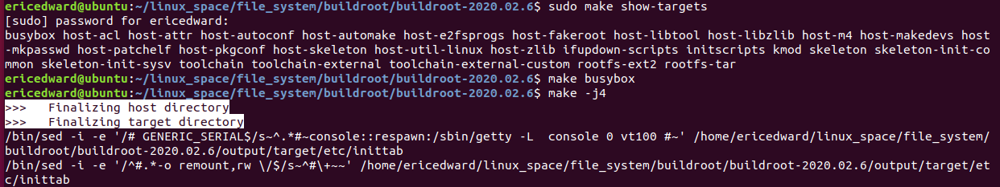

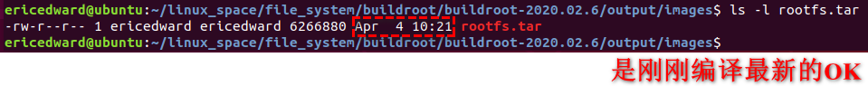

最后，重新部署下“这个 rootfs.tar 文件”即可。

```
# 注意：若此文件系统无法正常运行，则重新操作一遍“构建最简易的文件系统”即可，已验证。
# 进入挂载的根文件系统的根目录,建议先对此文件夹内容做一次备份即可。 
cd /home/ericedward/linux_space/tools/nfs/rootfs
# 再删除清空此文件夹所有内容，用来放置由 buildroot 创建的文件系统。
sudo rm ** -rf 
# 最后将 rootfs.tar 拷贝到在 nfs 目录下的 rootfs 文件夹中并解压
cp /home/ericedward/linux_space/file_system/buildroot/buildroot-2020.02.6/output/images/rootfs.tar ./
tar -xvf rootfs.tar 
rm rootfs.tar 
```

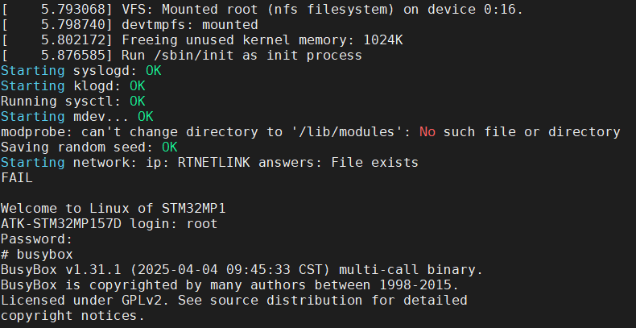

OK。至此，我们就成功使用 buildroot 制作了一个最基本的根文件系统。

###  buildroot 第三方软件和库的配置 

本节我们来学习一下如何配置 buildroot 使能一些第三放软件或库，比如 FTP 和 SSH 服务等。 

```
# 根目录下执行： make menuconfig
# 使能 VSFTPD 服务 
-> Target packages                                 
   -> Networking applications       
      -> [*] vsftpd        //使能 vsftpd 

# 使能 SSH 服务
-> Target packages
   -> Networking applications 
       -> [*] openssh      //使能 openssh 
```

```
# 根目录下执行： make busybox-menuconfig
-> Linux Module Utilities 
    -> [*] depmod          //使能 depmod 命令
# 提示：在 busybox-menuconfig 配置界面的变更，在退出此配置界面时，自动保存。
```

```
# 编译
make -j8

# 检查 rootfs.tar 文件是否已更新？
ls -l /home/ericedward/linux_space/file_system/buildroot/buildroot-2020.02.6/output/images/rootfs.tar 

# 最后部署
# 注意：若此文件系统无法正常运行，则重新操作一遍“构建最简易的文件系统”即可，已验证。
# 进入挂载的根文件系统的根目录,建议先对此文件夹内容做一次备份即可。 
cd /home/ericedward/linux_space/tools/nfs/rootfs
# 再删除清空此文件夹所有内容，用来放置由 buildroot 创建的文件系统。
sudo rm ** -rf 
# 最后将 rootfs.tar 拷贝到在 nfs 目录下的 rootfs 文件夹中并解压
cp /home/ericedward/linux_space/file_system/buildroot/buildroot-2020.02.6/output/images/rootfs.tar ./
tar -xvf rootfs.tar 
rm rootfs.tar 
```

### buildroot 根文件系统测试

#### **depmod 命令测试**

```
#  默认情况下 depmod 命令是使能了的，否则重新按照上面的方法使能配置 buildroot 下的 busybox depmod 配置即可。

# depmod 命令提示没有找到“lib/modules/5.4.31”目录，那么就创建该版本号的目录即可：
mkdir /lib/modules/5.4.31 -p  #注意：需要版本号对应，别写错了！

# 创建好以后在执行 depmod 命名就不会报错了，并且 depmod 命令会在 lib/modules/5.4.31 目录下生成三个文件：modules.alias、modules.dep、modules.symbols 文件。
```

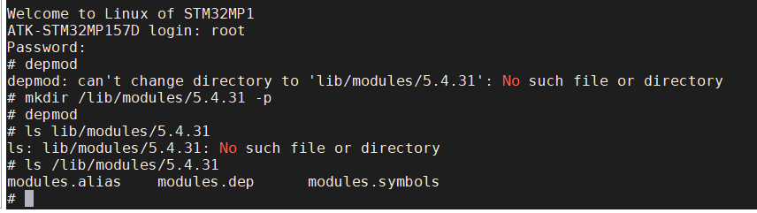

#### **vsftpd 测试**

```
vi /etc/vsftpd.conf
local_enable=YES    //取消掉前面的‘#’ 
write_enable=YES    //取消掉前面的‘#’

执行命令：
chown root:root /etc/vsftpd.conf  //修改 vsftpd.conf 文件所属用户

adduser maple
password 123456
```

创建完成以后，/home/ 的路径下会有：ftp 和 maple 文件夹。

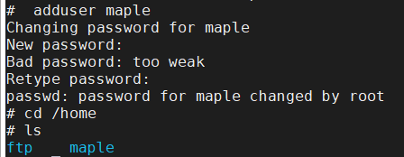

设置完成以后重启开发板，vsftpd 服务默认会使能！启动 log 信息如图

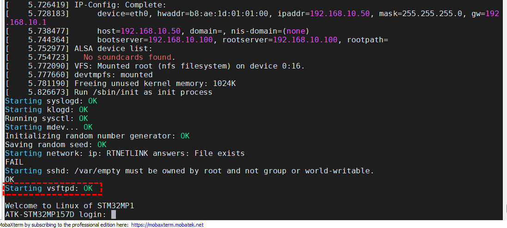

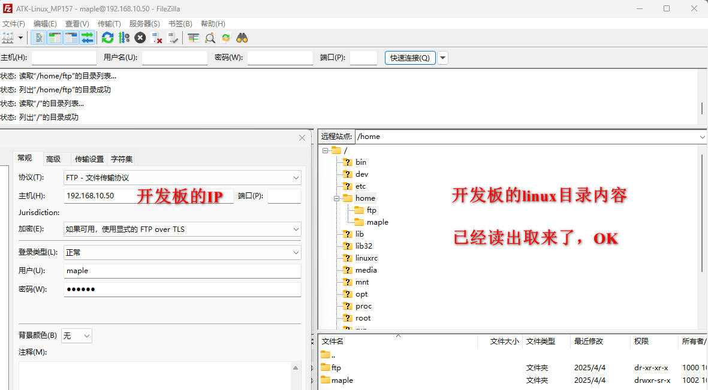

#### **sshd 测试** 

SSHD 默认会启动开启，然后在后台运行，开发板 linux 系统启动的时候会输出 SSHD 开启信息。因此，只需要一个登录用户就可以测试，这里使用之前创建好的maple用户。

SSHD 服务开机自启动，如果 SSHD 启动失败并且提示“sshd: /var/empty must be owned by root and not group or world-writable.”，

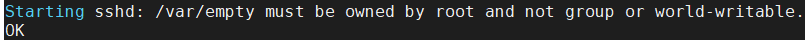

此时我们需要修改/var/empty目录所属用户以及用户组，输入如下命令： 

`chown root:root /var/empty `

测试 sshd 时，使用 MobaXterm 软件通过 SSH 服务登录即可。

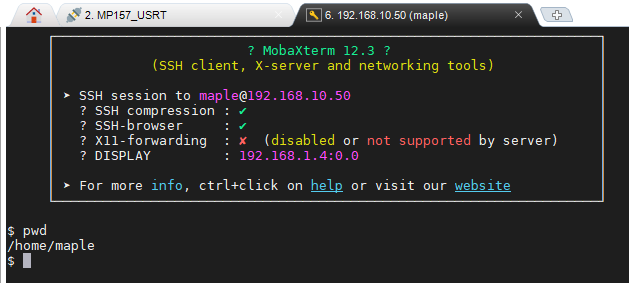

### buildroot 根文件系统的完善

#### 创建自启动文件

使用独立版本 busybox 制作出的根文件系统，需要配置 /etc/init.d/rcS 文件，在其中配置相关启动命令。

使用 buildroot 制作出的根文件系统里有默认的 /etc/init.d/rcS 文件，无需更改此文件。且此 rcS 文件会在/etc/init.d 目录下查找所有以‘S’开头的脚本，然后依次执行这些脚本。所以我们可以自己创建一个以‘S’开头的自启动脚本文件，比如我创建一个名为 Sautorun 的自启动文件，命令如下： 

```
cd /etc/init.d/         //进入/etc/init.d 目录 
touch Sautorun          //使用 touch 命令创建 Sautorun 脚本 
chmod 777 Sautorun      //给予 Aautorun 脚本可执行权限 
```

在 Sautorun 脚本里面输入要执行的命令，比如要开机自启动 test 这软件，那么 Sautorun 脚本内容为：

```bash
# /bin/sh

cd /
./test/test1.out # 需要执行的程序
cd /
```

```c
  /* test1.c */
  1 #include <stdio.h>  //printf func involved
  2 #include <unistd.h> //sleep  func involved
  3 
  4 int main(void)
  5 {
  6          for (int i = 0; i < 3; i++)
  7          {
  8                  printf ("hello My First Linux rootfs test! OK!\r\n");
  9                  printf ("maple-注释：/etc/init.d/rcS：正在执行Linux系统开机自动运行的程序！\r\n");
 10                  sleep (1);
 11          }
 12          return 0;
 13 }
//在主机上使用交叉编译器产出 test1.out 程序，复制到 rootfs 文件系统下的 /test/test1.out
```

此后，开机便会自动运行 /test/下的程序：

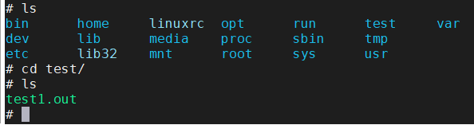

注意：保证/test/文件夹及其下的所有需要运行的程序具有可执行权限 `# chmod 777 ./test/ -R`

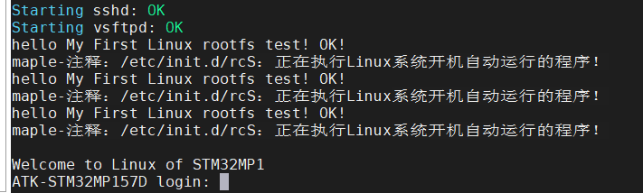


#### 控制台里显示提示信息

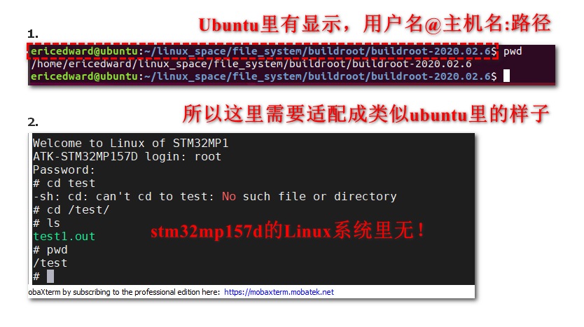

打开文件：vi /etc/profile

```bash
/* 示例代码 19.5.5.1 /etc/profile 文件要屏蔽的内容 */

export PATH="/bin:/sbin:/usr/bin:/usr/sbin" 
 
if [ "$PS1" ]; then 
        if [ "`id -u`" -eq 0 ]; then 
                export PS1='# ' 
        else 
                export PS1='$ ' 
        fi 
fi 
 
export EDITOR='/bin/vi' 
 
# Source configuration files from /etc/profile.d 
for i in /etc/profile.d/*.sh ; do 
        if [ -r "$i" ]; then 
                . $i 
        fi 
done 
unset i 
```

第 3~9 行就是设置 PS1 环境变量的值，我们可以直接修改这部分代码，但是不建议大家这么做，因为我们及时修改正常了，但是后续如果重新编译 buildroot 并解压以后，/etc/profile 文件又会被重新替换掉，我们又得修改/etc/profile。 

第 14~17 行，从这里可以看出，/etc/profile 文件执行的时候会遍历/etc/profile.d 目录下的所示.sh 脚本文件，然后执行这些.sh 脚本文件。所以我们可以在/etc/profile.d 目录下创建一个自定义的.sh 脚本文件，然后在此脚本文件里面添加 PS1 初始化代码就行了，这样即使后面重新编译了 buildroot 也不用担心此.sh 脚本会被替换掉。 

在/etc/profile.d 目录下新建一个名为“myprofile.sh”的 shell 脚本文件，并且给予此文件可执行权限，命令如下：

```bash
cd /etc/profile.d/        //进入/etc/profile.d 目录 
touch myprofile.sh        //创建 myprofile.sh 文件 
chmod 777 myprofile.sh     //给予 myprofile.sh 可执行权限 
```

最后在 myprofile.sh 里面添加如下所示内容：

```
/* 示例代码 19.5.5.2 /etc/profile 添加的内容 */
#!/bin/sh

PS1='[\u@\h]:\w$ '
export PS1
```

重点是第 3 行，也就是设置 PS1 环境变量，格式就是： 
[user@hostname]:currentpath$:
  user：用户名。 
  hostname：主机名。 
  currentpath：当前所处目录绝对路径。 
设置好以后的 myprofile.sh 文件，重启开发板如下图所示： 

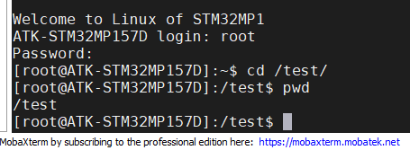

#### 使能 sysfs debug 目录 

后续调试驱动的时候我们可能要用到/sys/kernel/debug 目录，默认我们没有挂载 debugfs 文件系统，所以/sys/kernel/debug 目录下没有任何文件。挂载方法是，在/etc/init.d/Sautorun文件中添加如下代码：

```
# 挂载/sys/kernel/debug 目录，文件系统为 debugfs。
mount -t debugfs none /sys/kernel/debug 
```

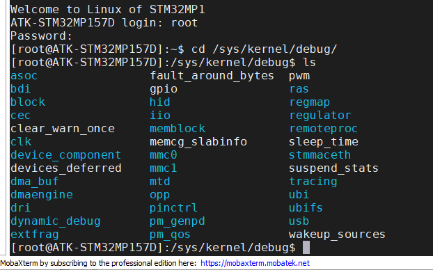

### 烧写根文件系统到 EMMC 

 至此，一个最基本的 buildroot 根文件系统就制作好了，我们可以将其打包烧写到开发板中。

我们需要打包的不是编译buildroot后产出的 rootfs.ext4！因为我们还基于此 rootfs 做了一些适配，所以需要打包整个测试文件夹 rootfs。

#### **根文件系统打包** 

1. 新建 ext4 格式磁盘

```
1. 首先对/home/ericedward/linux_space/tools/nfs/rootfs 目录下的根文件系统打包，
   创建新目录容纳 rootfs ：/home/ericedward/linux_space/file_system/rootfs_make/rootfs，并进入其中
mkdir /home/ericedward/linux_space/file_system/rootfs_make/rootfs
cd    /home/ericedward/linux_space/file_system/rootfs_make/rootfs

2. 使用 dd 命令创建一个名为 rootfs.ext4 的磁盘。count设为1024，也就是根文件系统空间大小为 1G ，此参数可调整，但不超过实际物理极限 8G （板载 8G）。
dd if=/dev/zero of=rootfs.ext4 bs=1M count=1024   

3. 使用 mkfs.ext4 将 rootfs.ext4 磁盘格式化为 ext4 格式。
mkfs.ext4 -L rootfs rootfs.ext4
```

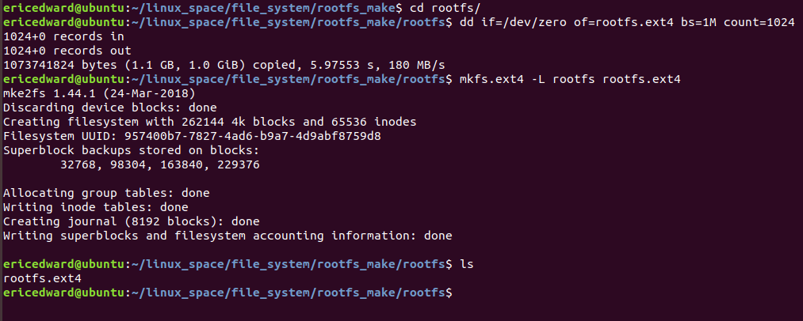

2. 将系统镜像拷贝到 ext4 磁盘中

   ```
   # 在 Ubuntu 主机上，创建一个用于挂载前面创建的 rootfs.ext4 文件的目录
   sudo mkdir /mnt/rootfs 
   
   # 用 mount 命令将 rootfs.ext4 挂载到/mnt/rootfs 目录下
   cd /home/ericedward/linux_space/file_system/rootfs_make/rootfs
   
   # 挂载成功后，将测试过的根文件系统 rootfs ，并拷贝其下所有文件，到挂载点路径下
   cd /home/ericedward/linux_space/tools/nfs/rootfs
   sudo cp * /mnt/rootfs/ -drf
   
   # 拷贝完成以后使用 umount 卸载/mnt/rootfs 即可，命令如下：
   sudo umount /mnt/rootfs
   ```

产出的根文件系统为： /home/ericedward/linux_space/file_system/rootfs_make/rootfs/rootfs.ext4。

至此，根文件系统就已经打包到了图 18.6.1.2中的rootfs.ext4中，稍后使用STM32CubeProgrammer 软件将其烧写到 EMMC 里面。

烧写之前最好在 Windows 下打开 rootfs.ext4 看一下，看看是否已经将根文件系统打包进去，如图 18.6.1.3 所示： 

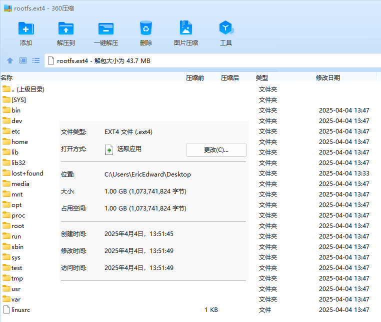


#### 烧写到 EMMC

使用 STM32CubeProgrammer 软件是将上一小节打包好的 ext4 格式的根文件系统 rootfs.ext4 烧写到开发板的 EMMC里面。

将 rootfs.ext4 拷贝到以前创建的 images 目录下：

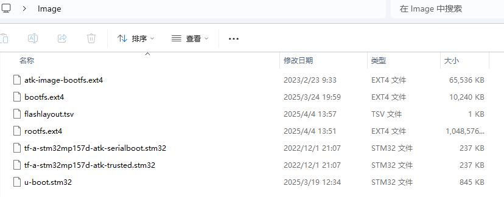

适配flashlayout文件 flashlayout.tsv 新增一行关于 rootfs 的烧写描述：

```
#Opt	Id		Name		Type		Device	Offset		Binary
-		0x01	fsbl1-boot	Binary		none	0x0			tf-a-stm32mp157d-atk-serialboot.stm32
-		0x03	ssbl-boot	Binary		none	0x0			u-boot.stm32
P		0x04	fsbl1		Binary		mmc1	boot1		tf-a-stm32mp157d-atk-trusted.stm32
P		0x05	fsbl2		Binary		mmc1	boot2		tf-a-stm32mp157d-atk-trusted.stm32
P		0x06	ssbl		Binary		mmc1	0x00080000	u-boot.stm32
P		0x21	boot		System		mmc1	0x00280000	bootfs.ext4
P		0x22	rootfs		FileSystem	mmc1	0x04280000	rootfs.ext4
```

使用 STM32CubeProgrammer 烧写系统。

烧写完成以后设置拨码开关从 EMMC 启动。

启动以后进入 uboot 的命令行，设置 bootcmd 和 bootargs 这两个环境变量：

```
# 设置 bootcmd 环境变量
setenv bootcmd 'ext4load mmc 1:2 c2000000 uImage;ext4load mmc 1:2 c4000000 stm32mp157d-atk.dtb;bootm c2000000 - c4000000'

# 设置 bootargs 环境变量
setenv bootargs 'console=ttySTM0,115200 root=/dev/mmcblk1p3 rootwait rw'

saveenv

boot
```

**回忆：**

- bootfs内容是 系统的镜像文件( uImage + stm32mp157d-atk.dtb)打包成.ext4格式文件。
- rootfs内容是 根文件系统。

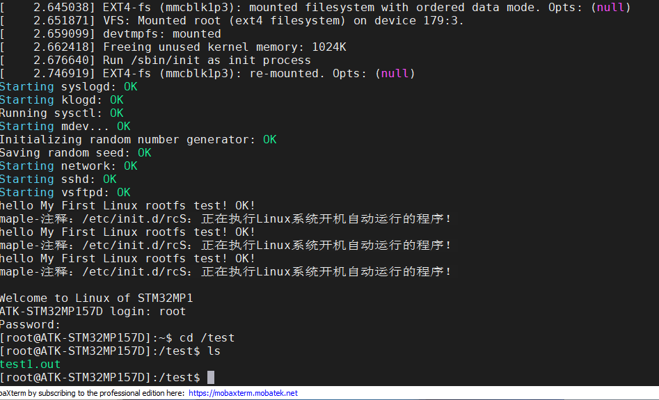

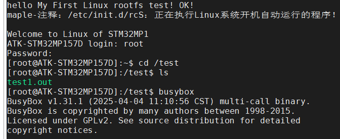

测试OK，可以进行 linux 驱动开发了！！！哈哈哈哈！！！！

2025年4月4日14:16:28


# Linux 驱动开发

### 切换到开发调试模式

重启Linux开发板，进入uboot的命令行模式，执行如下适配操作：

```bash
# 配置从网络加载 Linux 内核镜像文件，也就是需要配置 uboot 的 bootcmd 环境变量
setenv bootcmd 'tftp c2000000 uImage;tftp c4000000 stm32mp157d-atk.dtb;bootm c2000000 - c4000000'

# 配置加载挂接在 ubuntu 上的 nfs 根文件系统，也就是需要配置 uboot 的 bootargs 环境变量
setenv bootargs 'console=ttySTM0,115200 root=/dev/nfs nfsroot=192.168.10.100:/home/ericedward/linux_space/tools/nfs/rootfs,proto=tcp rw ip=192.168.10.50:192.168.10.100:192.168.10.1:255.255.255.0::eth0:off'

saveenv # 保存环境变量
boot    # 启动 linux 内核
```

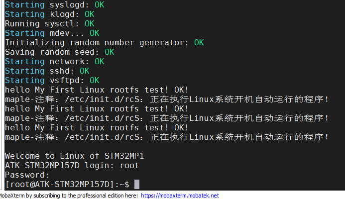

### 检测是否挂载 nfs 正常

```
查看 uboot 的 bootcmd 和 bootargs 环境变量的值：
printenv bootcmd
printenv bootargs
```

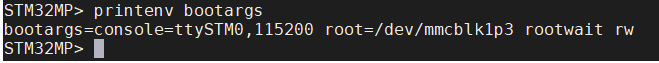

像这种，没有成功挂载网络 nfs 文件系统，这种情况应该是挂载到了 eMMC 的文件系统里了，需要做如下修正：

```bash
# 启动开发板，进入 uboot 命令行模式，重新设置 bootargs 环境变量
setenv bootargs 'console=ttySTM0,115200 root=/dev/nfs nfsroot=192.168.10.100:/home/ericedward/linux_space/tools/nfs/rootfs,proto=tcp rw ip=192.168.10.50:192.168.10.100:192.168.10.1:255.255.255.0::eth0:off'

saveenv # 保存环境变量
boot    # 启动 linux 内核

```

调整以后，成功挂载 网络 nfs 文件系统，OK 了！

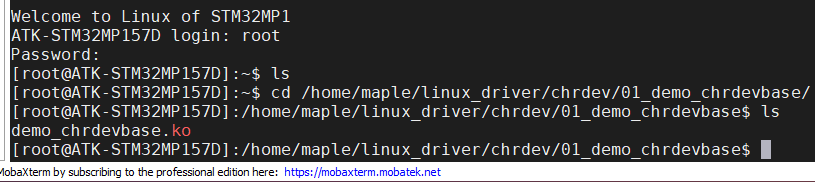

bootcmd 参数OK的，从网络加载 Linux 内核。

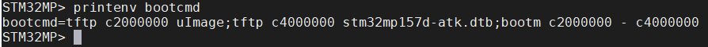

### 查看可执行文件的编译信息

```
# 使用 file 命令，可以查看可执行文件的编译信息，比如：
file demo_chrdevbase.ko
```

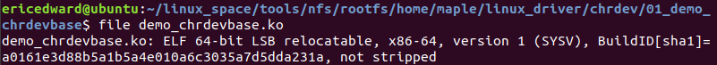

显然，这是x86架构编译器编译的，无法在 STM32MP157D 的 ARM 架构上执行。导致出现这种错误：

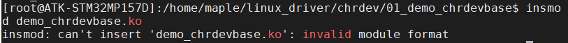

所以，是Makefile文件里的编译器指定错误，需要重新适配。

### 使用ssh协议登录开发板的linux系统

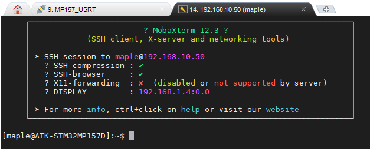

### 分配 Linux 系统权限

遵循 **最小权限原则**，避免滥用 `777` 或 `sudo`，只将 /home 目录改成 777

```
# root用户登录后，执行：
chmod 777 /home/ -R

# 平时开发使用常规用户，比如我创建的 maple 账户。
# 我目前按照上面意思执行了一遍，还是不行，那就先用root账户实验吧！上面的思路好麻烦！
```


### 第一个简易的驱动文件

#### 加载卸载和Makefile验证

编写 C 文件

```c
#include <linux/module.h>   // 必须包含的模块头文件
#include <linux/init.h>     // 初始化宏定义
#include <linux/kernel.h>   // 内核日志支持

// 模块初始化函数（加载时执行）
static int __init hello_init(void) {
    printk(KERN_INFO "注释-Maple:Hello Kernel! Module loaded.\n");  // 内核空间日志输出
    return 0;
}

// 模块清理函数（卸载时执行）
static void __exit hello_exit(void) {
    printk(KERN_INFO "注释-Maple:Goodbye Kernel! Module unloaded.\n");
}

// 注册初始化/清理函数
module_init(hello_init);    // 绑定加载入口
module_exit(hello_exit);    // 绑定卸载入口

// LICENSE 和作者信息
MODULE_LICENSE("GPL");               // 开源协议（必须声明）
MODULE_AUTHOR("Mapleay");            // 作者信息
MODULE_INFO(intree, "Y");            
MODULE_DESCRIPTION("Simple LKM Demo"); // 模块描述
```

编写 Makefile 文件

```makefile
# 临时禁用模块签名验证功能
CONFIG_MODULE_SIG = n  # 禁用模块签名验证

# KDIR 是开发板所使用的 Linux 内核源码的根目录
KDIR := /home/ericedward/linux_space/linux_kernel/my_linux_kernel/linux-stm32mp-5.4.31-r0/linux-5.4.31/
CURRENT_PATH := $(shell pwd)

obj-m += demo_chrdevbase.o   # 指定生成模块目标

all:
# modules 不是 Makefile 的关键字，通常为用户自定义目标（如用于模块化编译）。
	$(MAKE) -C $(KDIR) M=$(CURRENT_PATH) modules  # 调用内核构建系统

clean:
# clean不是关键字，但广泛用于伪目标声明，需配合 `.PHONY` 使用。
	$(MAKE) -C $(KDIR) M=$(CURRENT_PATH) clean
```

执行make

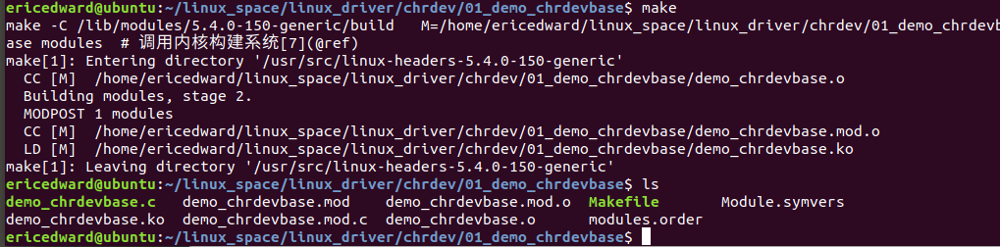

若网络 nfs 文件系统不能同步，请检查开发板是否已成功挂接Ubuntu主机上的nfs服务，一般是没挂接成功，挂接过程在上面有描述。挂接成功后，如下图：

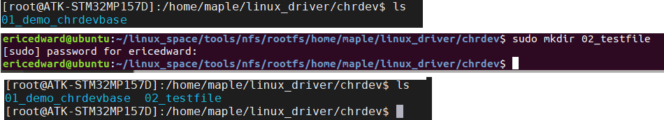

可以正常同步。

查看可执行文件的编译信息，防止用错编译器：

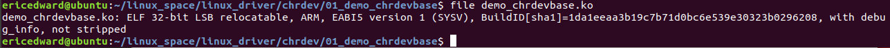

将输出文件放到开发板的根文件系统内：

```
# 在 Ubuntu 上执行交叉编译后，将产出文件放入开发板的文件系统内：
sudo cp /home/ericedward/linux_space/linux_driver/chrdev/01_demo_chrdevbase/demo_chrdevbase.ko /home/ericedward/linux_space/tools/nfs/rootfs/home/maple/linux_driver/chrdev/01_demo_chrdevbase/

# 加载模块 insmod 后，得到如下图所示：
insmod demo_chrdevbase.ko
```

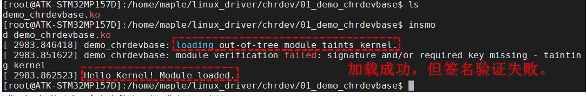

加载和卸载 ko 文件的 Linux 内核模块：

```
insmod xxx.ko #加载
rmmod  xxx.ko #卸载
```

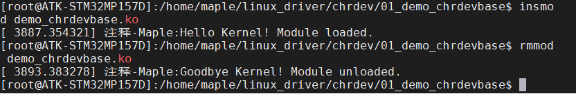

补充：也可以使用“modprobe -r”命令卸载驱动，但是它会将目的模块及其依赖的模块一起卸载，若其依赖模块被其他非目的模块占用，就不能成功卸载掉目的模块，不方便，所以，推荐使用 rmmod 命令去卸载。

至此，最简单的加载、卸载ko模块，成功。2025年4月4日18:03:59。

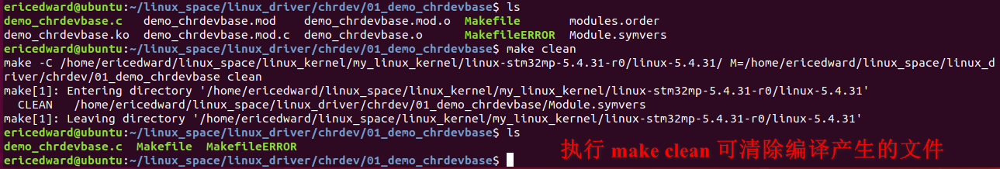


